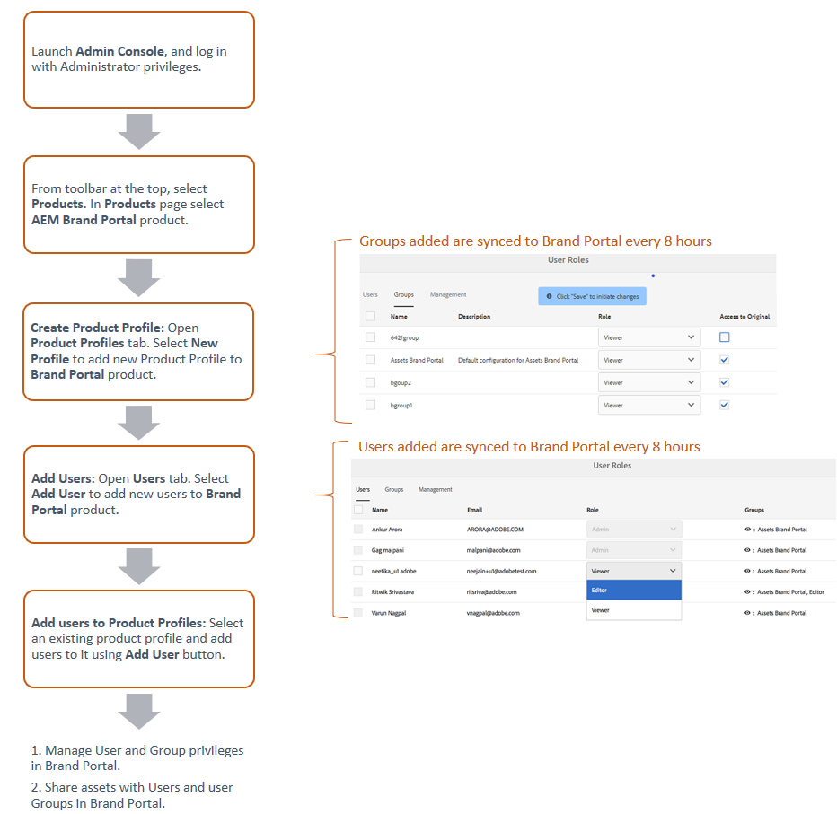
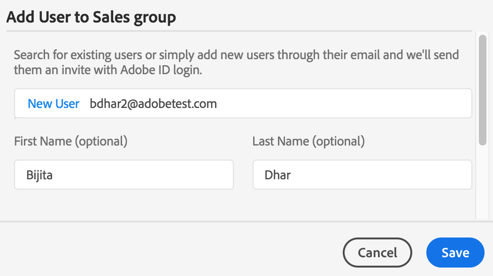
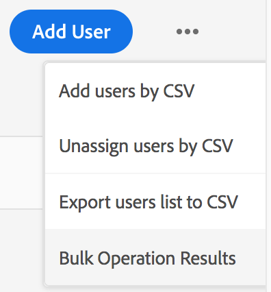
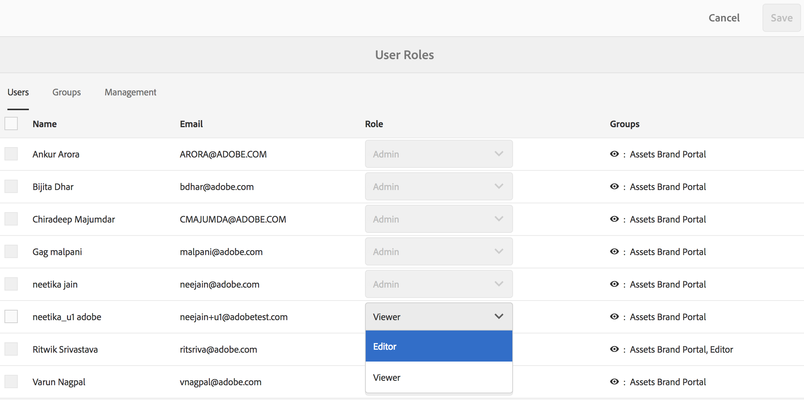

# Gestione di utenti, gruppi e ruoli utente {#manage-users-groups-and-user-roles}

Gli amministratori possono utilizzare Adobe Admin Console per creare utenti e profili di prodotto di Experience Manager Assets Brand Portal e gestirne i ruoli mediante l’interfaccia utente di Brand Portal. Questo privilegio non è disponibile per visualizzatori ed editor.

In [[!UICONTROL Admin Console]](https://adminconsole.adobe.com/enterprise/overview), puoi visualizzare tutti i prodotti associati alla tua organizzazione. Un prodotto può essere una qualsiasi soluzione di Experience Cloud, ad esempio Adobe Analytics, Adobe Target o Experience Manager Assets Brand Portal. Scegli il prodotto AEM Brand Portal e crea profili di prodotto.

<!--
Comment Type: draft

<note type="note">

Product profiles (formerly known as product configurations*). 

* The nomenclature has changed from product configurations to Product Profiles in the new Adobe Admin Console.

</note>
-->

Questi profili di prodotto vengono sincronizzati con l’interfaccia utente di Brand Portal ogni 8 ore e sono visibili come gruppi in Brand Portal. Dopo aver aggiunto gli utenti, creato i profili di prodotto e aggiunto gli utenti a tali profili di prodotto, puoi assegnare ruoli a utenti e gruppi in Brand Portal.

>[!NOTE]
>
>Per creare i gruppi in Brand Portal, dall&#39;Adobe [!UICONTROL Admin Console], utilizzare **[!UICONTROL Prodotti > Profili prodotto]**, anziché **[!UICONTROL Pagina utente > Gruppi utenti]**. I profili di prodotto nell&#39;Adobe [!UICONTROL Admin Console] vengono utilizzati per la creazione di gruppi in Brand Portal.

## Aggiungi un utente {#add-a-user}

Se sei un amministratore di prodotto, utilizza l&#39;Adobe [[!UICONTROL Admin Console]](https://adminconsole.adobe.com/enterprise/overview) per creare utenti e assegnarli ai profili di prodotto (*precedentemente noti come configurazioni di prodotto*), che vengono visualizzati come gruppi in Brand Portal. Puoi utilizzare i gruppi per eseguire operazioni in blocco, ad esempio la gestione dei ruoli e la condivisione delle risorse.

>[!NOTE]
>
>I nuovi utenti che non hanno accesso a Brand Portal possono richiedere l’accesso dalla schermata di accesso di Brand Portal. Per ulteriori informazioni, fare riferimento a [Richiedere l&#39;accesso a Brand Portal](../using/brand-portal.md#request-access-to-brand-portal). Dopo aver ricevuto le notifiche di richiesta di accesso nell&#39;area di notifica, fare clic sulla notifica pertinente e quindi su **[!UICONTROL Concedi l&#39;accesso]**. In alternativa, segui il collegamento nell’e-mail di richiesta di accesso ricevuta. Quindi, per aggiungere un utente tramite [Adobe [!UICONTROL Admin Console]](https://adminconsole.adobe.com/enterprise/overview), seguire i passaggi 4-7 nella procedura seguente.

>[!NOTE]
>
>Puoi accedere all&#39;[Adobe [!UICONTROL Admin Console]](https://adminconsole.adobe.com/enterprise/overview) direttamente o da Brand Portal. Se effettui l’accesso direttamente, segui i passaggi 4-7 seguenti per aggiungere un utente.

1. Dalla barra degli strumenti AEM in alto, fai clic sul logo dell’Adobe per accedere agli strumenti di amministrazione.

   

1. Nel pannello Strumenti di amministrazione, fare clic su **[!UICONTROL Utenti]**.

   

1. Nella pagina [!UICONTROL Ruoli utente], fai clic sulla scheda **[!UICONTROL Gestione]**, quindi su **[!UICONTROL Admin Console lancio]**.

   

1. Nell’Admin Console, per creare un nuovo utente, effettua una delle seguenti operazioni:

   * Dalla barra degli strumenti nella parte superiore, fare clic su **[!UICONTROL Panoramica]**. Nella pagina [!UICONTROL Panoramica], fai clic su **[!UICONTROL Assegna utenti]** dalla scheda del prodotto Brand Portal.

   

   * Dalla barra degli strumenti nella parte superiore, fai clic su **[!UICONTROL Utenti]**. Nella pagina [!UICONTROL Utenti], [!UICONTROL Utenti] nella barra a sinistra sono selezionati per impostazione predefinita. Fare clic su **[!UICONTROL Aggiungi utente]**.

   

1. Nella finestra di dialogo Aggiungi utente digitare l&#39;ID e-mail dell&#39;utente che si desidera aggiungere o selezionare l&#39;utente dall&#39;elenco di suggerimenti visualizzato durante la digitazione.

   

1. Assegna l’utente ad almeno un profilo di prodotto (precedentemente noto come configurazioni di prodotto) in modo che possa accedere a Brand Portal. Seleziona il profilo di prodotto appropriato dal campo **[!UICONTROL Seleziona un profilo per questo prodotto]**.
1. Fai clic su **[!UICONTROL Salva]**. Viene inviata un’e-mail di benvenuto al nuovo utente aggiunto. L’utente invitato può fare clic sul collegamento nell’e-mail di benvenuto per accedere a Brand Portal. L&#39;utente può accedere utilizzando l&#39;ID e-mail ([!UICONTROL Adobe ID], [!UICONTROL Enterprise ID] o [!UICONTROL Federated ID]) configurato nell&#39;Admin Console. Per ulteriori informazioni, vedere [Esperienza primo accesso](../using/brand-portal-onboarding.md).

   >[!NOTE]
   >
   >Se un utente non riesce ad accedere a Brand Portal, l&#39;amministratore dell&#39;organizzazione deve visitare l&#39;Adobe [!UICONTROL Admin Console]. Verifica se l’utente è presente ed è stato aggiunto ad almeno un profilo di prodotto.

   Per informazioni sulla concessione di privilegi amministrativi all&#39;utente, vedere [Fornire privilegi di amministratore agli utenti](../using/brand-portal-adding-users.md#provideadministratorprivilegestousers).

## Aggiungere un profilo di prodotto {#add-a-product-profile}

I profili di prodotto (precedentemente noti come configurazioni di prodotto) in [!UICONTROL Admin Console] vengono utilizzati per creare gruppi in Brand Portal in modo da poter eseguire operazioni in blocco, ad esempio la gestione dei ruoli e la condivisione di risorse in Brand Portal. **Brand Portal** è il profilo di prodotto predefinito disponibile. È possibile creare altri profili di prodotto e aggiungere utenti ai nuovi profili di prodotto.

>[!NOTE]
>
>Puoi accedere a [[!UICONTROL Admin Console]](https://adminconsole.adobe.com/enterprise/overview) direttamente o da Brand Portal. Se accedi direttamente all&#39;[!UICONTROL Admin Console], segui i passaggi 4-7 della procedura seguente per aggiungere un profilo di prodotto.

1. Dalla barra degli strumenti AEM in alto, fai clic sul logo dell’Adobe per accedere agli strumenti di amministrazione.

   

1. Nel pannello Strumenti di amministrazione, fare clic su **[!UICONTROL Utenti]**.

   

1. Nella pagina [!UICONTROL Ruoli utente], fai clic sulla scheda **[!UICONTROL Gestione]**, quindi su **[!UICONTROL Admin Console lancio]**.

   

1. Dalla barra degli strumenti nella parte superiore, fai clic su **[!UICONTROL Prodotti]**.
1. Nella pagina [!UICONTROL Prodotti], [!UICONTROL Profili prodotto] sono selezionati per impostazione predefinita. Fare clic su **[!UICONTROL Nuovo profilo]**.

   

1. Nella pagina [!UICONTROL Crea nuovo profilo], specificare il nome del profilo, il nome visualizzato e la descrizione del profilo. Scegli se far sì che gli utenti ricevano una notifica tramite e-mail quando vengono aggiunti o rimossi dal profilo.

   

1. Fai clic su **[!UICONTROL Fine]**. Il gruppo di configurazione del prodotto. Il **[!UICONTROL gruppo vendite]**, ad esempio, viene aggiunto a Brand Portal.

   

## Aggiungere utenti a un profilo di prodotto {#add-users-to-a-product-profile}

Per aggiungere utenti a un gruppo Brand Portal, aggiungerli al profilo di prodotto corrispondente (precedentemente noto come configurazioni di prodotto) nell&#39;[!UICONTROL Admin Console]. Puoi aggiungere gli utenti singolarmente o in blocco.

>[!NOTE]
>
>Puoi accedere a [[!UICONTROL Admin Console]](https://adminconsole.adobe.com/enterprise/overview) direttamente o da Brand Portal. Se accedi direttamente all’Admin Console, segui i passaggi 4-7 della procedura seguente per aggiungere utenti a un profilo di prodotto.

1. Dalla barra degli strumenti nella parte superiore, fai clic sul logo dell’Experience Manager per accedere agli strumenti di amministrazione.

   

1. Nel pannello Strumenti di amministrazione, fare clic su **[!UICONTROL Utenti]**.

   

1. Nella pagina [!UICONTROL Ruoli utente], fai clic sulla scheda **[!UICONTROL Gestione]**, quindi su **[!UICONTROL Admin Console lancio]**.

   ![Avvia [!DNL Admin Console]](assets/launch_admin_console.png)

1. Dalla barra degli strumenti nella parte superiore, fai clic su **[!UICONTROL Prodotti]**.
1. Nella pagina [!UICONTROL Prodotti], [!UICONTROL Profili prodotto] sono selezionati per impostazione predefinita. Aprire il profilo di prodotto a cui si desidera aggiungere un utente, ad esempio [!UICONTROL Gruppo vendite].

   

1. Per aggiungere singoli utenti al profilo di prodotto, effettua le seguenti operazioni:

   * Fare clic su **[!UICONTROL Aggiungi utente]**.

   

   * Nella pagina [!UICONTROL Aggiungi utente al gruppo vendite] digitare l&#39;ID e-mail dell&#39;utente che si desidera aggiungere o selezionare l&#39;utente dall&#39;elenco dei suggerimenti visualizzati durante la digitazione.

   

   * Fai clic su **[!UICONTROL Salva]**.

1. Per aggiungere utenti in blocco al profilo di prodotto, effettua le seguenti operazioni:

   * Scegli **[!UICONTROL puntini di sospensione (...) > Aggiungi utenti in base a CSV]**.

   

   * Nella pagina **[!UICONTROL Aggiungi utenti da CSV]**, scarica un modello CSV o trascina un file CSV.

   

   * Fai clic su **[!UICONTROL Carica]**.

   Quando aggiungi gli utenti al profilo di prodotto predefinito, Brand Portal, invia un’e-mail di benvenuto ai loro ID e-mail. Gli utenti invitati possono quindi accedere a Brand Portal facendo clic sul collegamento nell&#39;e-mail di benvenuto e accedendo con il proprio [!UICONTROL Adobe ID]. Consulta [Esperienza del primo accesso](../using/brand-portal-onboarding.md).

   Gli utenti aggiunti a un profilo di prodotto personalizzato o nuovo non ricevono le notifiche e-mail.

## Fornire privilegi di amministratore agli utenti {#provide-administrator-privileges-to-users}

È possibile concedere a un utente di Brand Portal i privilegi di amministratore di sistema o amministratore di prodotto. Tuttavia, evitare di assegnare altri ruoli amministrativi disponibili nell&#39;[!UICONTROL Admin Console]. Ad esempio, amministratore del profilo di prodotto, amministratore del gruppo di utenti e amministratore del supporto. Vedere [Ruoli amministrativi](https://helpx.adobe.com/enterprise/using/admin-roles.html).

>[!NOTE]
>
>Puoi accedere a [[!UICONTROL Admin Console]](https://adminconsole.adobe.com/enterprise/overview) direttamente o da Brand Portal. Se accedi direttamente all&#39;[!UICONTROL Admin Console], segui i passaggi 4-8 della procedura seguente per aggiungere un utente a un profilo di prodotto.

1. Dalla barra degli strumenti AEM in alto, fai clic sul logo dell’Adobe per accedere agli strumenti di amministrazione.

   

1. Nel pannello Strumenti di amministrazione, fare clic su **[!UICONTROL Utenti]**.

   

1. Nella pagina [!UICONTROL Ruoli utente], fai clic sulla scheda **[!UICONTROL Gestione]**, quindi su **[!UICONTROL Admin Console lancio]**.

   

1. Dalla barra degli strumenti nella parte superiore, fai clic su **[!UICONTROL Utenti]**.
1. Nella pagina [!UICONTROL Utenti], nella barra a sinistra, [!UICONTROL Utenti] sono selezionati per impostazione predefinita. Fare clic sul nome utente dell&#39;utente a cui si desidera assegnare i privilegi di amministratore.

   

1. Nella pagina del profilo utente, individua la sezione **[!UICONTROL Diritti amministrativi]** in basso e scegli **[!UICONTROL puntini di sospensione (...) > Modifica diritti amministratore]**.
   

1. Nella pagina [!UICONTROL Modifica amministratore], seleziona Amministratore di sistema o Amministratore di prodotto.

   

   >[!NOTE]
   >
   >Brand Portal supporta solo i ruoli Amministratore di sistema e Amministratore di prodotto.
   >
   >L&#39;Adobe consiglia di evitare di utilizzare il ruolo Amministratore di sistema, in quanto concede privilegi di amministratore a livello di organizzazione per tutti i prodotti di un&#39;organizzazione. Ad esempio, un amministratore di sistema di un’organizzazione che include tre prodotti cloud per il marketing dispone dell’intero set di privilegi per tutti e tre i prodotti. Solo un amministratore di sistema può configurare Experience Manager Assets in modo che le risorse possano essere pubblicate da Experience Manager Assets a Brand Portal. Per ulteriori informazioni, vedere [Configurare Experience Manager Assets con Brand Portal](../using/configure-aem-assets-with-brand-portal.md).
   >
   >Al contrario, il ruolo di amministratore di prodotto concede privilegi di amministratore solo per un prodotto specifico. Se desideri applicare un controllo di accesso più granulare in Brand Portal, utilizza il ruolo Amministratore prodotto e seleziona il prodotto come Brand Portal.

   >[!NOTE]
   >
   >Brand Portal non supporta i privilegi di amministratore del profilo di prodotto (precedentemente noto come amministratore di configurazione). Evita di assegnare a un utente i diritti di amministratore del profilo di prodotto.

1. Rivedi la selezione del tipo di amministratore e fai clic su **[!UICONTROL Salva]**.

   >[!NOTE]
   >
   >Per revocare i privilegi di amministratore per un utente, apportare le modifiche appropriate nella pagina **[!UICONTROL Modifica amministratore]**, quindi fare clic su **[!UICONTROL Salva]**.

## Gestire i ruoli utente {#manage-user-roles}

Un amministratore può modificare i ruoli per gli utenti in Brand Portal.

Oltre al ruolo Amministratore, Brand Portal supporta i seguenti ruoli:

* [!UICONTROL Visualizzatore]: gli utenti con questo ruolo possono visualizzare i file e le cartelle condivise da un amministratore. I visualizzatori possono anche cercare e scaricare le risorse. Tuttavia, i visualizzatori non possono condividere contenuti (file, cartelle, [!UICONTROL raccolte]) con altri utenti.
* [!UICONTROL Editor]: gli utenti con questo ruolo dispongono di tutti i privilegi di un visualizzatore. Inoltre, gli editor possono condividere contenuti (cartelle, [!UICONTROL raccolte], collegamenti) con altri utenti.

1. Dalla barra degli strumenti AEM in alto, fai clic sul logo dell’Adobe per accedere agli strumenti di amministrazione.

   

1. Nel pannello Strumenti di amministrazione, fare clic su **[!UICONTROL Utenti]**.

   

1. Nella pagina [!UICONTROL Ruoli utente], la scheda [!UICONTROL Utenti] è selezionata per impostazione predefinita. Per l&#39;utente di cui si desidera modificare il ruolo, selezionare **[!UICONTROL Editor]** o **[!UICONTROL Visualizzatore]** dal menu a discesa **[!UICONTROL Ruolo]**.

   

   Per modificare il ruolo di più utenti contemporaneamente, selezionare gli utenti e scegliere il ruolo appropriato dal menu a discesa **[!UICONTROL Ruolo]**.

   >[!NOTE]
   >
   >L&#39;elenco [!UICONTROL Ruolo] per gli utenti amministratori è disabilitato. Non puoi selezionare questi utenti per modificare i loro ruoli.

   >[!NOTE]
   >
   >Il ruolo utente è disabilitato anche se l&#39;utente è membro del gruppo Editor. Per revocare all&#39;utente i privilegi di modifica, rimuovere l&#39;utente dal gruppo Editor o modificare il ruolo dell&#39;intero gruppo in Visualizzatore.

1. Fai clic su **[!UICONTROL Salva]**. Il ruolo viene modificato per l&#39;utente corrispondente. Se hai selezionato più utenti, i ruoli di tutti gli utenti vengono modificati contemporaneamente.

   >[!NOTE]
   >
   >Le modifiche alle autorizzazioni utente vengono applicate alla pagina **[!UICONTROL Ruoli utente]** solo dopo che gli utenti hanno effettuato di nuovo l&#39;accesso a Brand Portal.

## Gestire ruoli e privilegi del gruppo {#manage-group-roles-and-privileges}

Un amministratore può associare privilegi specifici a un [gruppo](../using/brand-portal-adding-users.md#main-pars-title-278567577) di utenti in Brand Portal. La scheda **[!UICONTROL Gruppi]** nella pagina **[!UICONTROL Ruoli utente]** consente agli amministratori di:

* Assegnare ruoli a gruppi di utenti
* Limita i gruppi di utenti a scaricare le rappresentazioni originali dei file di immagine (.jpeg, .tiff, .png, .bmp, .gif, .pjpeg, x-portable-anymap, x-portable-bitmap, x-portable-graymap, x-portable-pixmap, x-rgb, x-xbitmap, x-xpixmap, x-icon, image/photoshop, .psd, image/vnd.adobe.photoshop) da Brand Portal.

>[!NOTE]
>
>Per le risorse condivise come collegamento, l’autorizzazione per accedere alle rappresentazioni originali dei file immagine si applica in base alle autorizzazioni dell’utente che condivide le risorse.

Per modificare il ruolo e il diritto di accesso alle rappresentazioni originali per membri specifici del gruppo, effettuare le seguenti operazioni:

1. Nella pagina **[!UICONTROL Ruoli utente]**, passa alla scheda **[!UICONTROL Gruppi]**.
1. Selezionare i gruppi per i quali si desidera modificare i ruoli.
1. Selezionare il ruolo appropriato dall&#39;elenco a discesa **[!UICONTROL Ruolo]**.

   Per consentire ai membri del gruppo di accedere alle rappresentazioni originali dei file immagine scaricati dal portale o dal collegamento condiviso, mantenere selezionata l&#39;opzione **[!UICONTROL Accesso all&#39;originale]** per il gruppo. Questo approccio include tipi di file come i seguenti:

   * .jpeg
   * .tiff
   * .png
   * bmp
   * gif
   * .pjpeg
   * .psd
   * x-portable-anymap
   * x-portable-bitmap
   * x-portable-graymap
   * x-portable-pixmap
   * x-rgb
   * x-xbitmap
   * x-xpixmap
   * icona x
   * image/photoshop
   * image/x-photoshop
   * image/vnd.adobe.photoshop

   Per impostazione predefinita, l&#39;opzione **[!UICONTROL Accesso all&#39;originale]** è selezionata per tutti gli utenti. Per impedire a un gruppo di utenti di accedere alle rappresentazioni originali, deseleziona l’opzione corrispondente a tale gruppo.

   

   >[!NOTE]
   >
   >Se un utente viene aggiunto a più gruppi e uno di questi ha delle restrizioni, le restrizioni si applicano a tale utente.
   >
   >Inoltre, le eventuali restrizioni per l&#39;accesso alle rappresentazioni originali dei file di immagine non vengono applicate agli amministratori anche se sono membri di gruppi con restrizioni.

1. Fai clic su **[!UICONTROL Salva]**. Il ruolo viene modificato per i gruppi corrispondenti.

   >[!NOTE]
   >
   >L’associazione utente-gruppo, o l’appartenenza al gruppo di un utente, viene sincronizzata in Brand Portal ogni 8 ore. Le modifiche ai ruoli utente o gruppo vengono applicate dopo l&#39;esecuzione del successivo processo di sincronizzazione.
