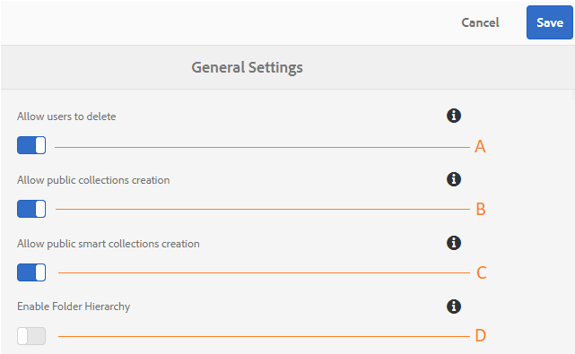

# Amministrare le configurazioni tenant generali {#administer-general-tenant-configurations}

Experience Manager Assets Brand Portal consente alle organizzazioni di configurare le seguenti funzionalità per tenant specifici:

* Eliminazione delle risorse da parte degli amministratori
* Creazione di raccolte pubbliche da parte di utenti non amministratori
* Creazione di raccolte avanzate pubbliche da parte di utenti non amministratori
* La gerarchia principale delle cartelle condivise è visibile agli utenti non amministratori

Queste configurazioni sono state fornite come **[!UICONTROL Configurazioni generali]** nel pannello Strumenti di amministrazione.

**A** - Configurazione per consentire agli amministratori di eliminare le risorse da Brand Portal. (Impostazione predefinita abilitata)

**B** - Configurazione per consentire agli utenti non amministratori di creare raccolte pubbliche. (Impostazione predefinita abilitata)

**C** - Configurazione per consentire agli utenti non amministratori di creare raccolte avanzate pubbliche. (Impostazione predefinita abilitata)

**D** - Configurazione per visualizzare la gerarchia di cartelle (dalla radice) delle cartelle condivise agli utenti non amministratori (editor, visualizzatori, utenti ospiti). Impostazione predefinita disabilitata

## Abilita o disabilita le configurazioni generali {#enable-disable-general-configurations}

Per attivare o disattivare ognuna di queste configurazioni:

1. Accedi con privilegi di amministratore.
1. Seleziona il logo di Experience Manager per accedere agli strumenti di amministrazione dalla barra degli strumenti nella parte superiore.
1. Dal pannello Strumenti di amministrazione, selezionare **[!UICONTROL Generale]** per aprire la pagina **[!UICONTROL Impostazioni generali]**.
1. Utilizza il rispettivo interruttore per attivare o disattivare una delle configurazioni Generali.
1. **[!UICONTROL Salva]** le modifiche.
1. Esci per rendere effettive le modifiche.

## Consenti agli utenti amministratori di eliminare risorse da Brand Portal {#allow-admin-users-to-delete-assets-from-brand-portal}

**[!UICONTROL Consenti agli utenti di eliminare]** la configurazione consente alle organizzazioni di consentire (o limitare) agli utenti con privilegi di amministratore di eliminare risorse e cartelle da Brand Portal.

## Consenti la creazione di raccolte pubbliche da parte di non amministratori {#allow-public-collections-creation-by-non-admins}

[[!UICONTROL Consenti creazione raccolte pubbliche]](../using/brand-portal-share-collection.md#main-pars-text-1915052376) la configurazione controlla se gli utenti non amministratori possono creare raccolte pubbliche in Brand Portal. La configurazione è attivata per impostazione predefinita. Disattivando la configurazione, le organizzazioni possono evitare di disporre di numerose raccolte pubbliche sul portale, in modo da poter salvare lo spazio di sistema.

## Consenti la creazione di raccolte avanzate pubbliche da parte di non amministratori {#allow-public-smart-collections-creation-by-non-admins}

[[!UICONTROL Consenti creazione raccolte avanzate pubbliche]](../using/brand-portal-searching.md#main-pars-header-500620467) la configurazione controlla se gli utenti non amministratori possono salvare le ricerche come raccolte avanzate e renderle pubbliche per tale tenant. La configurazione è attivata per impostazione predefinita. Disabilitando la configurazione, le organizzazioni possono evitare di avere un numero enorme di raccolte avanzate pubbliche create da utenti non amministratori sul Brand Portal dell’organizzazione.

<!-- 
## Allow download acceleration {#allow-download-acceleration}

[[!UICONTROL Allow download acceleration]](../using/accelerated-download.md) configuration lets the organizations to allow accelerated downloads of assets from Brand Portal and shared links, by integrating with IBM Aspera Connect that is an install-on-demand application. The application uses proprietary technology to remove TCP overheads.
-->

## Abilita gerarchia cartelle {#enable-folder-hierarchy}

[[!UICONTROL Abilita gerarchia cartelle]](../using/brand-portal-sharing-folders.md#non-admin-user-access-to-shared-folders) consente agli amministratori di controllare il modo in cui gli utenti non amministratori (editor, visualizzatori e utenti guest) visualizzano le cartelle condivise dopo l&#39;accesso.
