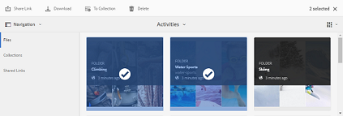
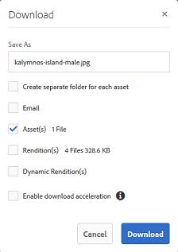

# Applicare predefiniti immagine o rappresentazioni dinamiche {#apply-image-presets-or-dynamic-renditions}

Analogamente a una macro, un predefinito immagine è un insieme predefinito di comandi di ridimensionamento e formattazione salvati con un nome. I predefiniti per immagini consentono a Experience Manager Assets Brand Portal di distribuire dinamicamente immagini di diverse dimensioni, formati e proprietà.

Un predefinito per immagini viene utilizzato per generare rappresentazioni dinamiche di immagini che possono essere visualizzate in anteprima e scaricate. Quando visualizzi l’anteprima delle immagini e delle relative rappresentazioni, puoi scegliere un predefinito per riformattare le immagini in base alle specifiche impostate dall’amministratore.

(*Se l&#39;istanza Autore Experience Manager Assets è in esecuzione in **modalità ibrida Dynamic Medie***). Per visualizzare le rappresentazioni dinamiche di una risorsa in Brand Portal, accertati che la relativa rappresentazione di Pyramid TIFF esista nell’istanza di authoring di Experience Manager Assets da dove pubblichi in Brand Portal. Quando pubblichi la risorsa, anche la relativa rappresentazione PTIFF viene pubblicata in Brand Portal.

>[!NOTE]
>
>Quando si scaricano le immagini e le relative rappresentazioni, non è possibile scegliere tra i predefiniti esistenti. È invece possibile specificare le proprietà di un predefinito immagine personalizzato. Per ulteriori informazioni, consulta [Applicare predefiniti immagine durante il download di immagini](../using/brand-portal-image-presets.md#main-pars-text-1403412644).

Per ulteriori informazioni sui parametri necessari per la creazione dei predefiniti immagine, vedere [Gestione dei predefiniti immagine](../using/brand-portal-image-presets.md).

## Creare un predefinito immagine {#create-an-image-preset}

Gli amministratori di Experience Manager Assets possono creare predefiniti per immagini da visualizzare come rappresentazioni dinamiche nella pagina dei dettagli della risorsa. Potete creare un predefinito immagine da zero o salvarne uno esistente con un nuovo nome. Quando crei un predefinito immagine, scegli una dimensione per la consegna delle immagini e i comandi di formattazione. Quando un’immagine viene distribuita per la visualizzazione, il suo aspetto viene ottimizzato in base ai comandi scelti.

>[!NOTE]
>
>Le rappresentazioni dinamiche di un’immagine vengono create utilizzando il relativo Pyramid TIFF. Se Pyramid TIFF non è disponibile per alcuna risorsa, non è possibile recuperare le relative rappresentazioni dinamiche in Brand Portal.
>
>Se l&#39;istanza di Experience Manager Assets Author è in esecuzione in modalità **Dynamic Medie TIFF Hybrid**, le rappresentazioni piramidali delle risorse immagine vengono create e salvate nell&#39;archivio Experience Manager Assets.
>
>Se invece l&#39;istanza di Experience Manager Assets Author è in esecuzione in **modalità Dynamic Medie Scene7**, nel server Scene7 esistono rappresentazioni delle immagini in Pyramid TIFF.
>
>Quando tali risorse vengono pubblicate in Brand Portal, vengono applicati i predefiniti immagine e vengono visualizzate le rappresentazioni dinamiche.

1. Dalla barra degli strumenti nella parte superiore, fai clic sul logo dell’Experience Manager per accedere agli strumenti di amministrazione.

1. Nel pannello Strumenti di amministrazione, fai clic su **[!UICONTROL Predefiniti immagine]**.

   

1. Nella pagina dei predefiniti immagine, fai clic su **[!UICONTROL Crea]**.

   

1. Nella pagina **[!UICONTROL Modifica predefinito immagine]**, immetti i valori desiderati nelle schede **[!UICONTROL Base]** e **[!UICONTROL Avanzate]**, compreso un nome. I predefiniti vengono visualizzati nel riquadro a sinistra e possono essere usati all’istante con altre risorse.

   

   >[!NOTE]
   >
   >È inoltre possibile utilizzare la pagina **[!UICONTROL Modifica predefinito immagine]** per modificare le proprietà di un predefinito immagine esistente. Per modificare un predefinito immagine, selezionalo dalla pagina dei predefiniti immagine e fai clic su **[!UICONTROL Modifica]**.

1. Fai clic su **[!UICONTROL Salva]**. Il predefinito immagine viene creato e visualizzato nella pagina dei predefiniti immagine.
1. Per eliminare un predefinito immagine, selezionalo dalla pagina dei predefiniti immagine e fai clic su **[!UICONTROL Elimina]**. Nella pagina di conferma, fai clic su **[!UICONTROL Elimina]** per confermare l&#39;eliminazione. Il predefinito immagine viene rimosso dalla pagina dei predefiniti immagine.

## Applicare predefiniti immagine durante l&#39;anteprima delle immagini {#apply-image-presets-when-previewing-images}

Quando visualizzate l&#39;anteprima delle immagini e delle relative rappresentazioni, scegliete uno dei predefiniti esistenti per riformattare le immagini in base alle specifiche impostate dall&#39;amministratore.

1. Dall’interfaccia di Brand Portal, fai clic su un’immagine per aprirla.
1. Fai clic sull&#39;icona di sovrapposizione a sinistra e scegli **[!UICONTROL Rappresentazioni]**.

   

1. Dall&#39;elenco **[!UICONTROL Rappresentazioni]**, selezionare la rappresentazione dinamica appropriata, ad esempio **[!UICONTROL Miniatura]**. Il rendering dell’immagine di anteprima viene eseguito in base alla scelta della rappresentazione.

   

## Applicare predefiniti immagine durante il download di immagini {#apply-image-presets-when-downloading-images}

Quando scarichi le immagini e le relative rappresentazioni da Brand Portal, non puoi scegliere tra i predefiniti immagine esistenti. Tuttavia, potete personalizzare le proprietà dei predefiniti immagine in base alle quali desiderate riformattare le immagini.

1. Dall’interfaccia di Brand Portal, effettua una delle seguenti operazioni:

   * Passa il puntatore sull&#39;immagine da scaricare. Dalle miniature delle azioni rapide disponibili, fai clic sull&#39;icona **[!UICONTROL Scarica]**.

   

   * Seleziona l’immagine da scaricare. Dalla barra degli strumenti nella parte superiore, fai clic sull&#39;icona **[!UICONTROL Scarica]**.

   

1. Dalla finestra di dialogo **[!UICONTROL Scarica]**, seleziona le opzioni richieste a seconda che desideri scaricare la risorsa con o senza le relative rappresentazioni.

   

1. Per scaricare le rappresentazioni dinamiche della risorsa, seleziona l&#39;opzione **[!UICONTROL Rappresentazioni dinamiche]**.
1. Personalizza le proprietà del predefinito immagine per riformattare l’immagine e le relative rappresentazioni in modo dinamico durante il download. Specificate le dimensioni, il formato, lo spazio colore, la risoluzione e il modificatore immagine.

   

1. Fai clic su **[!UICONTROL Scarica]**. Le rappresentazioni dinamiche personalizzate vengono scaricate in un file ZIP insieme all’immagine e alle rappresentazioni che hai scelto di scaricare. Tuttavia, se viene scaricata una singola risorsa, non viene creato alcun file zip, il che assicura un download rapido.
