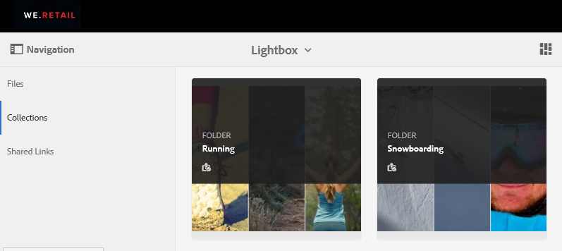

# Gestire la raccolta Lightbox {#manage-the-lightbox-collection}

**[!UICONTROL Lightbox]** è un tipo speciale di raccolta che fornisce un facile accesso alle risorse. Ogni utente dispone di un **[!UICONTROL Lightbox]** esclusivo creato automaticamente al primo accesso a Brand Portal. Impossibile eliminare la raccolta **[!UICONTROL Lightbox]**.

## Aggiungere risorse a lightbox {#add-assets-to-lightbox}

Per aggiungere risorse a **[!UICONTROL Lightbox]**, eseguire le operazioni seguenti:

1. Passa alla posizione delle risorse da aggiungere a **[!UICONTROL Lightbox]** e seleziona le risorse.

   

1. Dalla barra degli strumenti nella parte superiore, fai clic sull&#39;icona **Aggiungi alla raccolta**.

   

1. Nella pagina **[!UICONTROL Aggiungi a raccolta]**, la raccolta **[!UICONTROL Lightbox]** è selezionata per impostazione predefinita.

   Fare clic su **[!UICONTROL Aggiungi]**. Le risorse selezionate vengono aggiunte a **[!UICONTROL Lightbox]**.

   

1. Per esaminare le risorse aggiunte a **[!UICONTROL Lightbox]**, fai clic su **[!UICONTROL Raccolte]** nella barra a sinistra, quindi fai clic sulla raccolta **[!UICONTROL Lightbox]**.

   

   Le risorse aggiunte a **[!UICONTROL Lightbox]** vengono visualizzate nella pagina **[!UICONTROL Lightbox]**.

   

## Rimuovere risorse da Lightbox {#remove-assets-from-lightbox}

1. Per rivedere le risorse in [!UICONTROL Lightbox], fai clic su **[!UICONTROL Raccolte]** nella barra a sinistra, quindi fai clic sulla raccolta [!UICONTROL Lightbox].

   

1. Seleziona la cartella da rimuovere dalla raccolta, quindi fai clic su **[!UICONTROL Rimuovi]** nella barra degli strumenti nella parte superiore.

   

1. Nella finestra del messaggio di avviso, fare clic su **[!UICONTROL Rimuovi]** per confermare la rimozione.

Cartella eliminata dalla raccolta **[!UICONTROL Lightbox]**.
