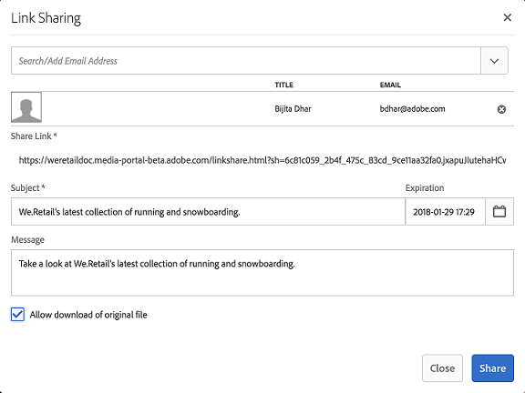

# Condividere le risorse come collegamento {#share-assets-as-a-link}

Gli amministratori Adobe Experience Manager Assets Brand Portal possono condividere collegamenti di più risorse con utenti interni ed entità esterne autorizzati, inclusi partner e fornitori. Gli editor possono visualizzare e condividere solo le risorse condivise con loro.

La condivisione delle risorse tramite un collegamento è un modo pratico per renderle disponibili a terzi, in quanto i destinatari non devono accedere a Brand Portal per accedere alle risorse.

<!-- Link sharing access is restricted to editors and administrators. 
-->

Per ulteriori informazioni, vedere [Gestione di utenti, gruppi e ruoli utente](../using/brand-portal-adding-users.md#manage-user-roles).

Di seguito sono riportati i passaggi per condividere le risorse come collegamento:

1. Accedi al tuo tenant Brand Portal. Per impostazione predefinita, viene aperta la visualizzazione **[!UICONTROL File]** che contiene tutte le risorse e le cartelle pubblicate.

1. Seleziona le risorse o le cartelle da condividere oppure passa alla visualizzazione **[!UICONTROL Raccolte]** per condividere le raccolte create.

   

1. Dalla barra degli strumenti nella parte superiore, fai clic sull&#39;icona **[!UICONTROL Condividi collegamento]**.

   Viene visualizzata la finestra di dialogo **[!UICONTROL Condivisione collegamenti]**.

   

   * Nella casella dell’indirizzo e-mail digita l’ID e-mail dell’utente con cui vuoi condividere il collegamento. Puoi condividere il collegamento con più utenti. Se l’utente è membro dell’organizzazione, seleziona il proprio ID e-mail dai suggerimenti visualizzati nell’elenco a discesa. Se l&#39;utente è esterno, digitare l&#39;ID e-mail completo e premere **[!UICONTROL Invio]**. L&#39;ID e-mail verrà aggiunto all&#39;elenco degli utenti.

     

   * Nella casella **[!UICONTROL Oggetto]**, digita un oggetto per la risorsa da condividere.
   * Nella casella **[!UICONTROL Messaggio]** digitare un messaggio, se necessario.
   * Nel campo **[!UICONTROL Scadenza]**, utilizza il selettore data per specificare una data e un&#39;ora di scadenza per il collegamento. Per impostazione predefinita, la data di scadenza è impostata su 7 giorni dalla data in cui condividi il collegamento.
   * Abilitare la casella di controllo **[!UICONTROL Consenti download del file originale]** per consentire ai destinatari di scaricare la copia trasformata originale.

   Le risorse condivise tramite il collegamento scadono dopo aver superato la data e l&#39;ora specificate nel campo **[!UICONTROL Scadenza]**. Per informazioni dettagliate sul comportamento delle risorse scadute e sulle modifiche delle attività basate sui ruoli in Brand Portal, consulta [Gestire i diritti digitali delle risorse](../using/manage-digital-rights-of-assets.md#asset-expiration).

   >[!NOTE]
   >
   >La scadenza predefinita del collegamento è di 7 giorni. Il collegamento deve essere inviato tramite e-mail agli utenti tramite la finestra di dialogo **[!UICONTROL Condivisione collegamenti]**. Non copiare e condividere il collegamento separatamente.

1. Fai clic su **[!UICONTROL Condividi]**. Un messaggio conferma che il collegamento è condiviso con gli utenti. Gli utenti ricevono un’e-mail contenente il collegamento condiviso.

   

   >[!NOTE]
   >
   >Gli amministratori possono personalizzare la messaggistica e-mail, che include la personalizzazione di logo, descrizione e piè di pagina con la funzionalità [Branding](../using/brand-portal-branding.md).

## Scaricare risorse dai collegamenti condivisi {#download-assets-from-shared-links}

Fai clic sul collegamento nell’e-mail per accedere alla risorsa condivisa. Viene visualizzata la pagina Condivisione collegamenti AEM.

Per scaricare le risorse condivise:

1. Fai clic sulle risorse o cartelle, quindi fai clic sull&#39;icona **[!UICONTROL Scarica]** nella barra degli strumenti.

   

   >[!NOTE]
   >
   >Attualmente, è possibile generare un’anteprima e una miniatura solo per determinate risorse, a seconda del formato del file. Per ulteriori informazioni sui formati di file supportati, vedere [Anteprima e supporto miniature per i formati di risorse](#preview-thumbnail-support).

1. Viene visualizzata la finestra di dialogo **[!UICONTROL Scarica]**.

   

1. Per impostazione predefinita, l&#39;impostazione **[!UICONTROL Download rapido]** è abilitata nelle **[!UICONTROL Impostazioni download]**. Pertanto, viene visualizzata una casella di conferma per continuare il download tramite IBM® Aspera Connect.

   Per continuare a utilizzare **[!UICONTROL Download rapido]**, fare clic su **[!UICONTROL Consenti]**.

   Tutte le rappresentazioni selezionate vengono scaricate in una cartella zip contenente una cartella separata per ogni risorsa.

   >[!NOTE]
   >
   >Per ogni risorsa viene creata una cartella separata durante il download delle risorse da un collegamento condiviso.
   >
   >Se sono selezionate una cartella, una raccolta o più di 20 risorse, la finestra di dialogo **[!UICONTROL Scarica]** verrà ignorata. Inoltre, tutte le rappresentazioni di risorse accessibili (escluse quelle dinamiche) vengono scaricate in una cartella zip con cartelle separate per ogni risorsa.

   >[!NOTE]
   >
   >Se l’amministratore non ha autorizzato l’utente che ha condiviso le risorse, il collegamento condiviso non scarica le rappresentazioni originali. Vedi anche [autorizzato dall&#39;amministratore ad accedere alle rappresentazioni originali](../using/brand-portal-adding-users.md#manage-group-roles-and-privileges).

>[!NOTE]
>
>Brand Portal limita il download di cartelle o risorse di dimensioni superiori a 5 GB tramite la condivisione di collegamenti.

<!--
1. The **[!UICONTROL Download]** dialog box appears.

   

    * To speed up the download of asset files shared as the link, select **[!UICONTROL Enable download acceleration]** option and [follow the wizard](../using/accelerated-download.md#download-workflow-using-file-accelerator). To know more about the fast download of assets on Brand Portal refer [Guide to accelerate downloads from Brand Portal](../using/accelerated-download.md).
    
1. To download the renditions of assets in addition to the assets from the shared link, select **[!UICONTROL Rendition(s)]** option. When you do so, **[!UICONTROL Exclude System Renditions]** option appears that is selected by default. This prevents the download of out-of-the-box renditions along with approved assets or their custom renditions.

   However, to allow auto-generated renditions to download along with custom renditions, deselect the **[!UICONTROL Exclude System Renditions]** option.

   >[!NOTE]
   >
   >Original renditions are not downloaded using the shared link if the user who shared the assets as a link is not [authorized by the administrator to have access to the original renditions](../using/brand-portal-adding-users.md#manage-group-roles-and-privileges).

   

1. Click **[!UICONTROL Download]**. The assets (and renditions if selected) are downloaded as a ZIP file to your local folder. However, no zip file is created if a single asset is downloaded without any of the renditions, thereby ensuring speedy download.

-->

## Supporto di anteprime e miniature per i formati delle risorse {#preview-thumbnail-support}

La matrice seguente elenca i formati di risorse per i quali Brand Portal supporta le miniature e l’anteprima:

| Formato risorsa | Supporto miniature | Supporto anteprima |
|--------------|-------------------|-----------------|
| PNG | ✓ | ✓ |
| GIF | ✓ | ✓ |
| TIFF | ✓ | ✕ |
| JPEG | ✓ | ✓ |
| BMP | ✓ | ✕ |
| PNM* | ND | ND |
| PGM* | ND | ND |
| PBM* | ND | ND |
| PPM* | ND | ND |
| PSD | ✓ | ✕ |
| EPS | ND | ✕ |
| DNG | ✓ | ✕ |
| PICT | ✓ | ✕ |
| PSB* | ✓ | ✕ |
| JPG- | ✓ | ✓ |
| AI | ✓ | ✕ |
| DOC | ✕ | ✕ |
| DOCX | ✕ | ✕ |
| ODT* | ✕ | ✕ |
| PDF | ✓ | ✕ |
| HTML | ✕ | ✕ |
| RTF | ✕ | ✕ |
| TXT | ✓ | ✕ |
| XLS | ✕ | ✕ |
| XLSX | ✕ | ✕ |
| ODS | ✕ | ✕ |
| PPT | ✓ | ✕ |
| PPTX | ✕ | ✕ |
| ODP | ✕ | ✕ |
| INDD | ✓ | ✕ |
| PS | ✕ | ✕ |
| QXP | ✕ | ✕ |
| EPUB | ✓ | ✕ |
| AAC | ✕ | ✕ |
| MIDI | ✕ | ✕ |
| 3GP | ✕ | ✕ |
| MP3 | ✕ | ✕ |
| MP4 | ✕ | ✕ |
| OGA | ✕ | ✕ |
| OGG | ✕ | ✕ |
| RA | ✕ | ✕ |
| WAV | ✕ | ✕ |
| WMA | ✕ | ✕ |
| DVI | ✕ | ✕ |
| FLV | ✕ | ✕ |
| M4V | ✕ | ✕ |
| MPG | ✕ | ✕ |
| OGV | ✕ | ✕ |
| MOV | ✕ | ✕ |
| WMV | ✕ | ✕ |
| SWF | ✕ | ✕ |
| TGZ | ND | ✕ |
| JAR | ✓ | ✕ |
| RAR | ND | ✕ |
| TAR | ND | ✕ |
| ZIP | ✓ | ✕ |

La legenda seguente spiega i simboli utilizzati nella matrice:

| Simbolo | Significato |
|---|---|
| ✓ | Questo formato di file supporta questa funzione |
| ✕ | Questo formato di file non supporta questa funzione |
| ND | Questa funzione non è applicabile a questo formato di file |
| &#42; | Questa funzione richiede il supporto dei componenti aggiuntivi per questo formato di file nell’istanza di authoring AEM, ma non in Brand Portal, dopo la pubblicazione delle risorse in Brand Portal |

## Annullare la condivisione delle risorse condivise come collegamento {#unshare-assets-shared-as-a-link}

Per annullare la condivisione di risorse condivise in precedenza come collegamento, effettua le seguenti operazioni:

1. Quando si accede a Brand Portal, per impostazione predefinita viene aperta la visualizzazione **[!UICONTROL File]**. Per visualizzare le risorse condivise come collegamenti, passa alla visualizzazione **[!UICONTROL Collegamenti condivisi]**.

1. Controlla i collegamenti condivisi dall’elenco visualizzato.

   

1. Per annullare la condivisione di un collegamento dall&#39;elenco, selezionalo e fai clic sull&#39;icona **[!UICONTROL Annulla condivisione]** nella barra degli strumenti nella parte superiore.

   

   >[!NOTE]
   >
   >La visualizzazione dei collegamenti condivisi è specifica dell’utente. Questa funzione non visualizza tutti i collegamenti condivisi da tutti gli utenti di un tenant.

1. Nella finestra di messaggio di avviso, fare clic su **[!UICONTROL Continua]** per confermare l&#39;annullamento della condivisione. La voce relativa al collegamento viene rimossa dall&#39;elenco dei collegamenti condivisi.
