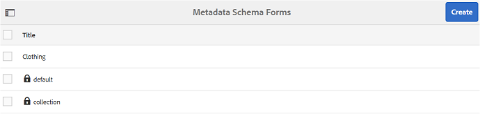

# Utilizzare il modulo schema metadati {#use-the-metadata-schema-form}

Uno schema di metadati descrive il layout della pagina Proprietà e le proprietà dei metadati visualizzate per le risorse che utilizzano lo schema specifico. Lo schema applicato a una risorsa determina i campi di metadati che vengono visualizzati nella relativa pagina Proprietà.

La pagina **[!UICONTROL Proprietà]** per ogni risorsa include proprietà di metadati predefinite che dipendono dal tipo MIME della risorsa. Gli amministratori possono utilizzare l’Editor schema metadati per modificare schemi esistenti o aggiungere schemi di metadati personalizzati. Experience Manager Assets Brand Portal fornisce moduli predefiniti per risorse di vari tipi MIME. Tuttavia, puoi anche aggiungere moduli personalizzati per tali risorse.

## Aggiungere un modulo schema metadati {#add-a-metadata-schema-form}

Per creare un nuovo modulo schema metadati, effettuare le seguenti operazioni:

1. Dalla barra degli strumenti nella parte superiore, fai clic sul logo dell’Experience Manager per accedere agli strumenti di amministrazione.

   

1. Nel pannello Strumenti di amministrazione, fare clic su **[!UICONTROL Schemi metadati]**.

   

1. Nella pagina **[!UICONTROL Schema metadati Forms]** fare clic su **[!UICONTROL Crea]**.

   

1. Nella finestra di dialogo **[!UICONTROL Crea modulo schema]**, specifica il titolo del modulo schema, quindi fai clic su **[!UICONTROL Crea]** per completare il processo di creazione del modulo.

   

## Modificare un modulo schema metadati {#edit-a-metadata-schema-form}

È possibile modificare qualsiasi modulo di schema di metadati aggiunto o esistente. Il modulo schema metadati contiene contenuto derivato dal relativo elemento padre, incluse schede ed elementi modulo all’interno di schede. Puoi mappare o configurare questi elementi modulo su un campo all’interno di un nodo di metadati.

È possibile aggiungere nuove schede o elementi del modulo al modulo schema metadati. Le schede e gli elementi modulo derivati (dall&#39;elemento padre) sono nello stato bloccato. Non è possibile modificarli a livello di elemento secondario.

Per modificare un modulo schema metadati, effettuare le seguenti operazioni:

1. Dalla barra degli strumenti nella parte superiore, fai clic sul logo dell’Experience Manager per accedere agli strumenti di amministrazione.

   

1. Nel pannello Strumenti di amministrazione, fare clic su **[!UICONTROL Schemi metadati]**.
1. Dalla pagina **[!UICONTROL Schema metadati Forms]**, selezionare un modulo schema per modificarne le proprietà, ad esempio **[!UICONTROL raccolta]**.

   

   >[!NOTE]
   >
   >I modelli non modificati presentano prima un simbolo di blocco. Se personalizzi uno dei modelli, il simbolo Blocca prima del modello scompare.

1. Dalla barra degli strumenti nella parte superiore, fai clic su **[!UICONTROL Modifica]**.

   Viene aperta la pagina **[!UICONTROL Editor schema metadati]** con la scheda **[!UICONTROL Base]** aperta a sinistra. Sulla destra è aperta la scheda **[!UICONTROL Genera modulo]**.

1. Nella pagina **[!UICONTROL Editor schema metadati]**, personalizza la pagina **[!UICONTROL Proprietà]** della risorsa. Trascina uno o più componenti da un elenco di tipi di componenti nella scheda **[!UICONTROL Genera modulo]**. Trascinali nella scheda **[!UICONTROL Base]**.

   

1. Per configurare un componente, selezionarlo e modificarne le proprietà nella scheda **[!UICONTROL Impostazioni]**.

### Componenti nella scheda Genera modulo {#components-in-the-build-form-tab}

Nella scheda **[!UICONTROL Genera modulo]** sono elencati gli elementi che è possibile utilizzare nel modulo schema. La scheda **[!UICONTROL Impostazioni]** fornisce gli attributi di ogni elemento selezionato nella scheda **[!UICONTROL Genera modulo]**. Nella tabella seguente sono elencati gli elementi modulo disponibili nella scheda **[!UICONTROL Genera modulo]**:

| Nome componente | Descrizione |
|---------------------|--------------------------------------------------------------------------------------------------------------------------------------------------------------------------------------------------------------------------------------------------------------------------------------------|
| **[!UICONTROL Intestazione sezione]** | Aggiungi un’intestazione di sezione per un elenco di componenti comuni. |
| **[!UICONTROL Testo su riga singola]** | Aggiungi una proprietà di testo a riga singola. Viene memorizzato come stringa. |
| **[!UICONTROL Testo con più valori]** | Aggiungi una proprietà di testo con più valori. Viene memorizzato come array di stringhe. |
| **[!UICONTROL Numero]** | Aggiungi un componente numero. |
| **[!UICONTROL Data]** | Aggiungi un componente data. |
| **[!UICONTROL Elenco a discesa]** | Aggiungi un elenco a discesa. |
| **[!UICONTROL Tag standard]** | Aggiungi un tag. Gli amministratori possono dover modificare il valore del percorso. Ad esempio, `/etc/tags/mac/<tenant_id>/<custom_tag_namespace>`, se pubblicano il modulo schema metadati da Experience Manager Assets, dove il percorso non include informazioni sul tenant, ad esempio `/etc/tags/<custom_tag_namespace>`. |
| **[!UICONTROL Tag avanzati]** | Se hai acquistato e configurato il componente aggiuntivo smart tag di Experience Manager Assets, vengono rilevati automaticamente i tag. |
| **[!UICONTROL Campo nascosto]** | Aggiungi un campo nascosto. Viene inviato come parametro POST al salvataggio della risorsa. |
| **[!UICONTROL Risorsa A Cui Fa Riferimento]** | Aggiungi questo componente per visualizzare un elenco delle risorse a cui fa riferimento la risorsa. |
| **[!UICONTROL Riferimento a risorsa]** | Aggiungi per visualizzare un elenco di risorse che fanno riferimento alla risorsa. |
| **[!UICONTROL Valutazione risorse]** | Valutazione media di una risorsa aggiunta da Experience Manager Assets prima che venga pubblicata in Brand Portal. |
| **[!UICONTROL Metadati contestuali]** | Aggiungi per controllare la visualizzazione di altre schede di metadati nella pagina Proprietà delle risorse. |

>[!NOTE]
>
>Non utilizzare **[!UICONTROL Riferimenti prodotto]**, poiché non funziona.

#### Modificare il componente metadati {#edit-the-metadata-component}

Per modificare le proprietà di un componente metadati nel modulo, fare clic sul componente e modificarne le proprietà nella scheda **[!UICONTROL Impostazioni]**.

* **[!UICONTROL Etichetta campo]**: nome della proprietà dei metadati visualizzata nella pagina Proprietà della risorsa.

* **[!UICONTROL Mappa su proprietà]**: il valore di questa proprietà fornisce il nome o il percorso relativo al nodo della risorsa in cui viene salvato nell&#39;archivio CRX. Inizia con &quot;**./**&quot; perché indica che il percorso si trova sotto il nodo della risorsa.

Di seguito sono riportati i valori validi per questa proprietà:

— `./jcr:content/metadata/dc:title`: memorizza il valore nel nodo di metadati della risorsa come proprietà `dc:title`.

— `./jcr:created`: visualizza la proprietà jcr nel nodo della risorsa. Se hai configurato queste proprietà nelle proprietà della visualizzazione, l’Adobe consiglia di contrassegnarle come Disattiva modifica, in quanto sono protette. In caso contrario, quando si salvano le proprietà della risorsa si verifica l’errore &quot;Assets failed to modify&quot; (Impossibile modificare la risorsa).

* **[!UICONTROL Segnaposto]**: utilizzare questa proprietà per fornire all&#39;utente tutte le informazioni relative alla proprietà dei metadati.
* **[!UICONTROL Obbligatorio]**: utilizzare questa proprietà per contrassegnare una proprietà di metadati come obbligatoria nella pagina Proprietà.
* **[!UICONTROL Disabilita modifica]**: utilizzare questa proprietà per impedire la modifica di una proprietà di metadati nella pagina Proprietà.
* **[!UICONTROL Mostra campo vuoto in sola lettura]**: contrassegnare questa proprietà per visualizzare una proprietà dei metadati nella pagina Proprietà anche se non contiene alcun valore. Per impostazione predefinita, quando una proprietà di metadati non ha un valore, non viene elencata nella pagina Proprietà.
* **[!UICONTROL Descrizione]**: utilizzare questa proprietà per aggiungere una breve descrizione del componente metadati.
* **[!UICONTROL Icona Elimina]**: fare clic su questa icona per eliminare un componente dal modulo schema.

>[!NOTE]
>
>Tutti i campi di metadati sono di sola lettura nel modulo dell’editor di metadati di una risorsa. Poiché i metadati della risorsa devono essere modificati in Experience Manager Assets prima che una risorsa venga pubblicata in Brand Portal.

#### Aggiungere o eliminare una scheda nel modulo schema {#add-or-delete-a-tab-in-the-schema-form}

Il modulo schema predefinito include le schede **[!UICONTROL Basic]** e **[!UICONTROL Advanced]**. L’editor dello schema ti consente di aggiungere o eliminare una scheda.

* Per aggiungere una nuova scheda a un modulo schema, fare clic su **[!UICONTROL +]**. Per impostazione predefinita, la nuova scheda è denominata &quot;Unnamed-1&quot;. Puoi modificare il nome dalla scheda **[!UICONTROL Impostazioni]**.

* Per eliminare una scheda, fare clic su **[!UICONTROL x]**. Fai clic su **[!UICONTROL Salva]** per salvare le modifiche.

## Applicare uno schema di metadati a una cartella {#apply-a-metadata-schema-to-a-folder}

Brand Portal ti consente di personalizzare e controllare lo schema metadati in modo che nella pagina **[!UICONTROL Proprietà]** di una risorsa vengano visualizzate solo le informazioni specifiche che scegli di visualizzare. Per controllare i metadati visualizzati nella pagina **[!UICONTROL Proprietà]**, rimuovere i metadati richiesti dal modulo schema metadati e applicarli alla cartella specifica.

Per applicare un modulo schema metadati a una cartella, effettua le seguenti operazioni:

1. Dalla barra degli strumenti nella parte superiore, fai clic sul logo dell’Experience Manager per accedere agli strumenti di amministrazione.

   

1. Nel pannello Strumenti di amministrazione, fare clic su **[!UICONTROL Schemi metadati]**.

1. Dalla pagina **[!UICONTROL Schema metadati Forms]**, seleziona il modulo schema da applicare a una risorsa, ad esempio **[!UICONTROL abbigliamento]**.

   

1. Dalla barra degli strumenti nella parte superiore, fare clic su **[!UICONTROL Applica alle cartelle]**.

1. Dalla pagina **[!UICONTROL Seleziona cartelle]**, passa alla cartella alla quale desideri applicare lo schema di metadati **[!UICONTROL abbigliamento]**, ad esempio **[!UICONTROL Guanti]**.

   

1. Fai clic su **[!UICONTROL Applica]** per applicare alla cartella il modulo schema metadati.

   I metadati disponibili nel modulo schema metadati **[!UICONTROL abbigliamento]** vengono applicati alla cartella **[!UICONTROL Gloves]** ed è visibile nella pagina **[!UICONTROL Properties]** della cartella.

   

>[!NOTE]
>
>Se applichi uno schema che include schemi nidificati a una cartella contenente file video, le proprietà dei metadati per i file video potrebbero non essere riprodotte correttamente. Per garantire il corretto rendering delle proprietà dei metadati, rimuovi gli schemi nidificati e applica alla cartella solo lo schema principale.

## Eliminare un modulo schema metadati {#delete-a-metadata-schema-form}

Brand Portal consente di eliminare solo i moduli schema personalizzati. Non consente di eliminare i moduli/modelli di schema predefiniti. Tuttavia, è possibile eliminare qualsiasi modifica personalizzata in questi moduli.

Per eliminare un modulo, selezionarlo e fare clic sull&#39;icona **[!UICONTROL Elimina]**.

>[!NOTE]
>
>Dopo aver eliminato le modifiche personalizzate apportate a un modulo predefinito, il simbolo **[!UICONTROL Blocca]** viene nuovamente visualizzato prima del nome del modulo nell&#39;interfaccia dello schema metadati per indicare che il modulo è tornato al suo stato predefinito.

## Moduli schema per TIPI MIME {#schema-forms-for-mime-types}

### Aggiunta di nuovi moduli per tipi MIME {#adding-new-forms-for-mime-types}

Oltre ai moduli predefiniti, è possibile aggiungere moduli personalizzati per risorse di vari tipi MIME o creare un nuovo modulo in un tipo di modulo appropriato. Ad esempio, per aggiungere un nuovo modello per il sottotipo **[!UICONTROL image/png]**, crea il modulo sotto i moduli “image”. Il titolo del modulo schema è il nome del sottotipo. In questo caso, il titolo è &quot;png&quot;.

#### Utilizzo di un modello di schema esistente per vari tipi MIME {#using-an-existing-schema-template-for-various-mime-types}

Puoi utilizzare un modello esistente per un tipo MIME diverso. Ad esempio, utilizza il modulo **image/jpeg** per le risorse di tipo MIME **image/png**.

In questo caso, creare un nuovo nodo in [!UICONTROL `/etc/dam/metadataeditor/mimetypemappings`] nell&#39;archivio CRX. Specifica un nome per il nodo e definisci le seguenti proprietà:

| **Nome** | **Tipo** | **Valore** |
|---|---|---|
| exposedmimetype | Stringa | image/jpeg |
| tipi mime | Stringa[] | image/png |

* **exposedmimetype**: nome del modulo esistente da mappare
* **tipi mime**: elenco di tipi MIME che utilizzano il modulo definito nell&#39;attributo **exposedmimetype**

Brand Portal mappa i seguenti tipi MIME e moduli schema:

| **Modulo schema** | **Tipi MIME** |
|---|---|
| image/jpeg | image/pjpeg |
| image/tiff | image/x-tiff |
| application/pdf | application/postscript |
| application/x-ImageSet | Multipart/Related; type=application/x-ImageSet |
| application/x-SpinSet | Multipart/Related; type=application/x-SpinSet |
| application/x-MixedMediaSet | Multipart/Related; type=application/x-MixedMediaSet |
| video/quicktime | video/x-quicktime |
| video/mpeg4 | video/mp4 |
| video/avi | video/avi, video/msvideo, video/x-msvideo |
| video/wmv | `video/x-ms-wmv` |
| video/flv | video/x-flv |

Di seguito è riportato un elenco delle proprietà dei metadati predefinite:

* `jcr:content/metadata/cq:tags`
* `jcr:content/metadata/dc:format`
* `jcr:content/metadata/dam:status`
* `jcr:content/metadata/videoCodec`
* `jcr:content/metadata/audioCodec`
* `jcr:content/metadata/dc:title`
* `jcr:content/metadata/dc:description`
* `jcr:content/metadata/xmpMM:InstanceID`
* `jcr:content/metadata/xmpMM:DocumentID`
* `jcr:content/metadata/dam:sha1`
* `jcr:content/metadata/dam:solutionContext`
* `jcr:content/metadata/videoBitrate`
* `jcr:content/metadata/audioBitrate`
* `jcr:content/usages/usedBy`
* `jcr:content/jcr:lastModified`
* `jcr:content/metadata/prism:expirationDate`
* `jcr:content/onTime`
* `jcr:content/offTime`
* `jcr:content/metadata/dam:size`
* `jcr:content/metadata/tiff:ImageWidth`
* `jcr:content/metadata/tiff:ImageLength`
