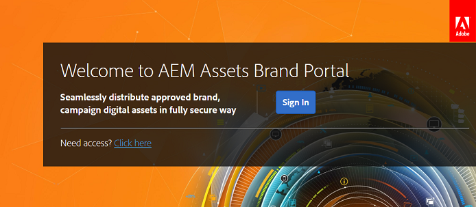

# Esperienza del primo accesso {#first-time-login-experience}

Tutti i nuovi utenti di Experience Manager Assets Brand Portal, inclusi gli amministratori, hanno la stessa esperienza di primo accesso. Dopo che un amministratore ti ha aggiunto all’account Brand Portal della tua organizzazione, verrai incluso automaticamente senza dover accettare un invito. Ricevi un’e-mail di benvenuto con un collegamento per accedere all’account Brand Portal della tua organizzazione.

Di seguito sono riportati i passaggi da eseguire per gli utenti che accedono a Brand Portal per la prima volta:

1. Apri l&#39;e-mail di benvenuto e fai clic su **[!UICONTROL Inizia]**.

1. Nella pagina di registrazione, specifica i tuoi dettagli (tra cui nome, cognome, password e paese).

   >[!NOTE]
   >
   >Se sei un utente Adobe Experience Cloud esistente, viene visualizzata una pagina di accesso invece della pagina di accesso. Per accedere a Adobe Experience Cloud, immetti l’Adobe ID e la password.

   >[!NOTE]
   >
   >Se la tua organizzazione utilizza Enterprise ID, invece di visualizzare questa pagina di registrazione verrai reindirizzato alla pagina di accesso Enterprise. Per ulteriori informazioni, vedere [Enterprise ID, accedere e visualizzare la Guida dell&#39;account](https://helpx.adobe.com/in/enterprise/kb/enterprise-id-faq.html).

1. Fai clic su **[!UICONTROL Continua]** per passare alla pagina Brand Portal della tua organizzazione.
1. Dalla pagina di accesso di Brand Portal, fai clic su **[!UICONTROL Accedi]** per accedere a Brand Portal.

   

   >[!NOTE]
   >
   >Per accedere a Brand Portal, è necessario disporre di almeno un profilo di prodotto Experience Manager Assets.
