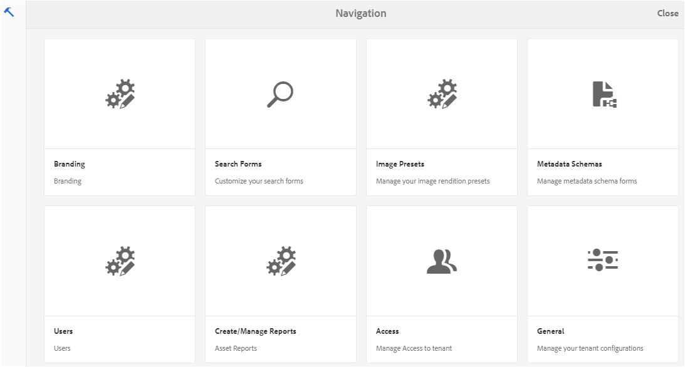
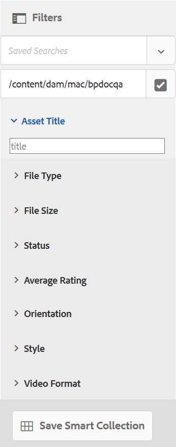

# Usa facet di ricerca personalizzati {#use-custom-search-facets}

Gli amministratori possono aggiungere predicati di ricerca al pannello [!UICONTROL Filtri] per personalizzare la ricerca e renderla versatile.

Brand Portal supporta la [ricerca sfaccettata](../using/brand-portal-searching.md#search-using-facets-in-filters-panel) per ricerche granulari di risorse del brand approvate, possibile a causa del pannello [**Filtri**](../using/brand-portal-searching.md#search-using-facets-in-filters-panel). I facet di ricerca sono disponibili nel pannello Filtri tramite **[!UICONTROL Modulo di ricerca]** negli strumenti di amministrazione. Nella pagina Cerca in Forms degli strumenti di amministrazione è presente un modulo di ricerca predefinito denominato Barra di ricerca amministrazione risorse. Tuttavia, gli amministratori possono personalizzare il pannello Filtri predefinito. Possono modificare il modulo di ricerca predefinito (Barra di ricerca amministrazione risorse) aggiungendo, modificando o rimuovendo predicati di ricerca, rendendo la funzionalità di ricerca versatile.

Puoi utilizzare vari predicati di ricerca per personalizzare il pannello **[!UICONTROL Filtri]**. Ad esempio, aggiungi il predicato proprietà per cercare le risorse che corrispondono a una singola proprietà specificata in questo predicato. Aggiungi il predicato options per cercare le risorse che corrispondono a uno o più valori specificati per una particolare proprietà. Aggiungi il predicato dell’intervallo di date per cercare le risorse create all’interno di un intervallo di date specificato.

>[!NOTE]
>
>Experience Manager Assets consente alle organizzazioni di [pubblicare i moduli di ricerca personalizzati da AEM Author](../using/publish-schema-search-facets-presets.md#publish-search-facets-to-brand-portal) a Brand Portal, invece di ricreare lo stesso modulo su Brand Portal.

## Aggiungere un predicato di ricerca al pannello Filtri {#add-a-search-predicate}

1. Per accedere agli strumenti di amministrazione, fai clic sul logo dell’Experience Manager nella barra degli strumenti in alto.

   

1. Nel pannello Strumenti di amministrazione, fare clic su **[!UICONTROL Cerca in Forms]**.

   

1. Nella pagina **[!UICONTROL Cerca in Forms]**, seleziona **[!UICONTROL Barra di ricerca amministrazione Assets]**.

   

1. Sulla barra degli strumenti visualizzata nella parte superiore, fare clic su **[!UICONTROL Modifica]** per aprire il modulo di ricerca e modificarlo.

   

1. Nella pagina [!UICONTROL Modifica modulo di ricerca], trascina un predicato dalla scheda [!UICONTROL Seleziona predicato] al riquadro principale. Trascinare ad esempio **[!UICONTROL Predicato proprietà]**.

   Il campo **[!UICONTROL Proprietà]** viene visualizzato nel riquadro principale e la scheda **[!UICONTROL Impostazioni]** a destra visualizza i predicati delle proprietà.

   

   >[!NOTE]
   >
   >L&#39;etichetta dell&#39;intestazione nella scheda **[!UICONTROL Impostazioni]** identifica il tipo di predicato selezionato.

1. Nella scheda **[!UICONTROL Impostazioni]** immettere un&#39;etichetta, un testo segnaposto e una descrizione per il predicato proprietà.

   * Selezionare **[!UICONTROL Ricerca parziale]** se si desidera consentire la ricerca parziale per frase (e con caratteri jolly) delle risorse in base al valore di proprietà specificato. Per impostazione predefinita, il predicato supporta la ricerca full-text.
   * Seleziona **[!UICONTROL Ignora maiuscole/minuscole]** se vuoi che la ricerca delle risorse basata sul valore della proprietà non faccia distinzione tra maiuscole e minuscole. Per impostazione predefinita, la ricerca dei valori delle proprietà nel filtro di ricerca fa distinzione tra maiuscole e minuscole.

   >[!NOTE]
   >
   >Quando si seleziona la casella di controllo **[!UICONTROL Ricerca parziale]**, **[!UICONTROL Ignora maiuscole/minuscole]** è selezionato per impostazione predefinita.

1. Nel campo **[!UICONTROL Nome proprietà]**, apri il selettore delle proprietà e seleziona la proprietà in base alla quale viene eseguita la ricerca. In alternativa, immettere un nome per la proprietà. Ad esempio, inserisci `jcr :content/metadata/dc:title` o `./jcr:content/metadata/dc:title`.

   >[!NOTE]
   >
   >In Brand Portal, tutte le proprietà String (tranne quelle che iniziano con `xmp`) in `jcrcontent/metadata` di `dam:asset` sono indicizzate per impostazione predefinita. Per impostazione predefinita, tutte le altre proprietà personalizzate di qualsiasi tipo non sono indicizzate.
   >
   >Qualsiasi proprietà indicizzata può essere utilizzata durante la creazione di un predicato di proprietà. Se è configurata una proprietà non indicizzata, la query di ricerca su una proprietà non indicizzata potrebbe non fornire alcun risultato.

   

1. Fai clic su **[!UICONTROL Fine]** per salvare le impostazioni.
1. Nell&#39;interfaccia utente di [!UICONTROL Assets], fare clic sull&#39;icona di sovrapposizione e scegliere **[!UICONTROL Filtro]** per passare al pannello **[!UICONTROL Filtri]**. Il predicato **[!UICONTROL Property]** è stato aggiunto al pannello.

   

1. Immettere un titolo per la risorsa da cercare nella casella di testo **[!UICONTROL Proprietà]**. Ad esempio, &quot;Adobe&quot;. Quando esegui una ricerca, nei risultati vengono visualizzate le risorse il cui titolo corrisponde a &quot;Adobe&quot;.

## Elenco dei predicati di ricerca {#list-of-search-predicates}

Analogamente all&#39;aggiunta di un predicato **[!UICONTROL Property]**, è possibile aggiungere i predicati seguenti al pannello **[!UICONTROL Filters]**:

| **Nome predicato** | **Descrizione** | **Proprietà** |
|-------|-------|----------|
| **[!UICONTROL Browser Percorsi]** | Predicato di ricerca per cercare le risorse in una posizione particolare. **Nota:** *Per un utente connesso, il browser percorsi su filtro mostra solo la struttura del contenuto delle cartelle (e dei relativi predecessori) condivise con l&#39;utente.*   Gli utenti amministratori possono cercare le risorse in qualsiasi cartella navigando in tale cartella utilizzando il browser percorsi.   Mentre gli utenti non amministratori possono cercare le risorse in una cartella (accessibile) passando a tale cartella nel browser percorsi. | <ul><li>Etichetta campo</li><li>Percorso</li><li>Descrizione</li></ul> |
| **[!UICONTROL Proprietà]** | Cerca le risorse in base a una particolare proprietà di metadati. **Nota:** *Quando si seleziona Ricerca parziale, Ignora maiuscole/minuscole è selezionato per impostazione predefinita*. | <ul><li>Etichetta campo</li><li>Segnaposto</li><li>Nome proprietà</li><li>Ricerca parziale</li><li>Ignora maiuscole/minuscole</li><li> Descrizione</li></ul> |
| **[!UICONTROL Proprietà con più valori]** | Simile a un predicato di proprietà ma consente più valori di input, separati da un delimitatore (l’impostazione predefinita è una virgola). Le risorse che corrispondono a uno qualsiasi dei valori di input vengono restituite nei risultati. | <ul><li>Etichetta campo</li><li>Segnaposto</li><li>Nome proprietà</li><li>Supporto delimitatore</li><li>Ignora maiuscole/minuscole</li><li>Descrizione</li></ul> |
| **[!UICONTROL Tag]** | Predicato di ricerca per cercare le risorse in base ai tag. È possibile configurare la proprietà Path per compilare vari tag nell&#39;elenco Tag. Gli amministratori potrebbero dover modificare il valore del percorso, ad esempio [!UICONTROL /`etc/tags/mac/<tenant_id>/<custom_tag_namespace>`]. È necessario se pubblicano il modulo di ricerca da AEM, in cui il percorso non include informazioni sul tenant, ad esempio [!UICONTROL `/etc/tags/<custom_tag_namespace>`]. | <ul><li>Etichetta campo</li><li>Nome proprietà</li><li>Percorso</li><li>Descrizione</li></ul> |
| **[!UICONTROL Percorso]** | Predicato di ricerca per cercare le risorse in una posizione particolare. | <ul><li>Etichetta campo</li><li>Percorso</li><li>Descrizione</li></ul> |
| **[!UICONTROL Data relativa]** | Predicato di ricerca per cercare le risorse in base alla data relativa di creazione. | <ul><li>Etichetta campo</li><li>Nome proprietà</li><li>Data relativa</li></ul> |
| **[!UICONTROL Intervallo]** | Predicato di ricerca per cercare le risorse che si trovano all’interno di un intervallo specificato di valori di proprietà. Nel pannello Filtri, potete specificare i valori minimi e massimi delle proprietà per l&#39;intervallo. | <ul><li>Etichetta campo</li><li>Nome proprietà</li><li>Descrizione</li></ul> |
| **[!UICONTROL Intervallo date]** | Predicato di ricerca per cercare le risorse create all’interno di un intervallo specificato per una proprietà data. Nel pannello Filtri puoi specificare le date di inizio e fine. | <ul><li>Etichetta campo</li><li>Segnaposto</li><li>Nome proprietà</li><li>Testo intervallo (Da)</li><li>Testo intervallo (A)</li><li>Descrizione</li></ul> |
| **[!UICONTROL Data]** | Predicato di ricerca per una ricerca di risorse basata su cursore e basata su una proprietà data. | <ul><li>Etichetta campo</li><li>Nome proprietà</li><li>Descrizione</li></ul> |
| **[!UICONTROL Dimensione file]** | Predicato di ricerca per cercare le risorse in base alle loro dimensioni. | <ul><li>Etichetta campo</li><li>Nome proprietà</li><li>Percorso</li><li>Descrizione</li></ul> |
| **[!UICONTROL Ultima modifica risorsa]** | Predicato di ricerca per cercare le risorse in base alla data dell’ultima modifica. | <ul><li>Etichetta campo</li><li>Nome proprietà</li><li>Descrizione</li></ul> |
| **[!UICONTROL Stato approvazione]** | Predicato di ricerca per cercare le risorse in base alla proprietà dei metadati di approvazione. Il nome predefinito della proprietà è **`dam:status`**. | <ul><li>Etichetta campo</li><li>Nome proprietà</li><li>Descrizione</li></ul> |
| **[!UICONTROL Stato estrazione]** | Predicato di ricerca per cercare le risorse in base allo stato di check-out di una risorsa quando è stata pubblicata da AEM Assets. | <ul><li>Etichetta campo</li><li>Nome proprietà</li><li>Descrizione</li></ul> |
| **[!UICONTROL Estratto da]** | Predicato di ricerca per cercare le risorse in base all&#39;utente che ha estratto la risorsa. | <ul><li>Etichetta campo</li><li>Nome proprietà</li><li>Descrizione</li></ul> |
| **[!UICONTROL Stato scadenza]** | Predicato di ricerca per cercare le risorse in base allo stato di scadenza. | <ul><li>Etichetta campo</li><li>Nome proprietà</li><li>Descrizione</li></ul> |
| **[!UICONTROL Membro della raccolta]** | Predicato di ricerca per cercare le risorse in base al fatto che una risorsa appartenga o meno a una raccolta. | Descrizione |
| **[!UICONTROL Nascosto]** | Questo predicato non è visibile in modo esplicito agli utenti finali e viene utilizzato per qualsiasi vincolo nascosto in genere per limitare il tipo di risultati di ricerca a **`dam:Asset`**. | <ul><li>Etichetta campo</li><li>Nome proprietà</li><li>Descrizione</li></ul> |

>[!NOTE]
>
>* Non utilizzare **[!UICONTROL Predicato opzioni]**, **[!UICONTROL Predicato di stato Publish]** e **[!UICONTROL Predicato di valutazione]** poiché questi predicati non sono funzionanti in Brand Portal.
>* Il predicato del tipo di cartella `(nt:folder type)` non è supportato in Brand Portal e potrebbe causare problemi di prestazioni. Se è presente in un modulo di ricerca personalizzato pubblicato, è possibile eliminarlo modificando il modulo di ricerca.

## Eliminare un predicato di ricerca {#delete-a-search-predicate}

Per eliminare un predicato di ricerca, eseguire la procedura seguente:

1. Fai clic sul logo dell’Adobe per accedere agli strumenti di amministrazione.

   

1. Nel pannello Strumenti di amministrazione, fare clic su **[!UICONTROL Cerca in Forms]**.

   

1. Nella pagina **[!UICONTROL Cerca in Forms]**, seleziona **[!UICONTROL Barra di ricerca amministrazione Assets]**.

   

1. Sulla barra degli strumenti visualizzata nella parte superiore, fare clic su **[!UICONTROL Modifica]** per aprire il modulo di ricerca e modificarlo.

   

1. Nella pagina [!UICONTROL Modifica modulo di ricerca], dal riquadro principale, selezionare il predicato che si desidera eliminare. Selezionare ad esempio **[!UICONTROL Predicato proprietà]**.

   Nella scheda **[!UICONTROL Impostazioni]** a destra vengono visualizzati i campi del predicato delle proprietà.

1. Per eliminare il predicato della proprietà, fai clic sull’icona del raccoglitore. Nella finestra di dialogo **[!UICONTROL Elimina campo]** fare clic su **[!UICONTROL Elimina]** per confermare l&#39;azione di eliminazione.

   Il campo **[!UICONTROL Predicato proprietà]** è stato rimosso dal riquadro principale e la scheda **[!UICONTROL Impostazioni]** diventa vuota.

   

1. Per salvare le modifiche, fare clic su **[!UICONTROL Fine]** nella barra degli strumenti.
1. Nell&#39;interfaccia utente di **[!UICONTROL Assets]**, fare clic sull&#39;icona di sovrapposizione e scegliere **[!UICONTROL Filtro]** per passare al pannello **[!UICONTROL Filtri]**. Il predicato **[!UICONTROL Property]** è stato rimosso dal pannello.

   
