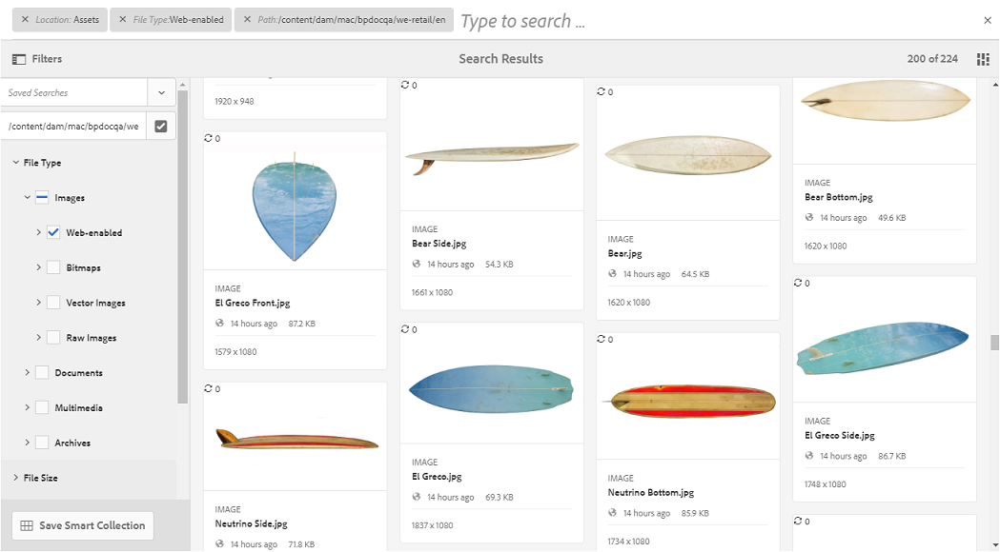

# Cercare risorse in Brand Portal {#search-assets-on-brand-portal}

La funzionalità di ricerca di Brand Portal consente di cercare rapidamente le risorse rilevanti tramite omnisearch e la ricerca per facet che utilizza i filtri per restringere ulteriormente la ricerca. Puoi cercare le risorse a livello di file o cartella e salvare i risultati della ricerca come raccolte avanzate.

>[!NOTE]
>
>Brand Portal non supporta la ricerca di raccolte mediante omnisearch.
>
>È tuttavia possibile utilizzare [filtri di ricerca per ottenere l&#39;elenco delle raccolte rilevanti](#search-collection).

## Cercare risorse con Omnisearch {#search-assets-using-omnisearch}

Per cercare le risorse in Brand Portal:

1. Dalla barra degli strumenti, fai clic sull&#39;icona **[!UICONTROL Cerca]** oppure premi il tasto &quot;**[!UICONTROL /]**&quot; per avviare Omnisearch.

   

1. Nella casella di ricerca, digita una parola chiave per le risorse da cercare.

   

   >[!NOTE]
   >
   >* Per visualizzare i suggerimenti di ricerca in omnisearch sono necessari almeno 3 caratteri.
   >* Quando si cerca `mountain biking`, omnisearch restituisce tutte le risorse nei risultati di ricerca che hanno sia `mountain` che `biking` disponibili nei campi di metadati. Ad esempio, `mountain` nel campo `Title` e `biking` nel campo `Description`. Entrambi i termini devono essere disponibili nei campi di metadati per essere visualizzati nei risultati della ricerca. Tuttavia, omnisearch restituisce la risorsa nei risultati della ricerca anche se nel campo dei metadati Tag avanzati è disponibile solo uno dei due termini. Ad esempio, se una risorsa contiene `mountain` come uno dei tag avanzati e non contiene `biking` in nessun altro campo di metadati e si cerca `mountain biking`, omnisearch restituisce comunque la risorsa nei risultati della ricerca.

1. Seleziona dai suggerimenti correlati visualizzati nell’elenco a discesa per accedere rapidamente alle risorse rilevanti.

   

   *Ricerca risorse tramite omnisearch*

Per informazioni sul comportamento di ricerca con le risorse con tag avanzati, consulta [comprendere i risultati e il comportamento della ricerca](https://experienceleague.adobe.com/docs/experience-manager-65/assets/using/search-assets.html).

## Ricerca tramite facet nel pannello Filtri {#search-using-facets-in-filters-panel}

I facet di ricerca nel pannello Filtri aggiungono granularità all’esperienza di ricerca e rendono efficiente la funzionalità di ricerca. I facet di ricerca utilizzano più dimensioni (predicati) che consentono di eseguire ricerche complesse. Per una ricerca più mirata, è possibile eseguire facilmente un drill-down al livello di dettaglio desiderato.

Ad esempio, se si sta cercando un&#39;immagine, è possibile scegliere se si desidera una bitmap o un&#39;immagine vettoriale. Puoi ridurre ulteriormente l’ambito della ricerca specificando il tipo MIME per l’immagine nel facet di ricerca Tipo file. Analogamente, durante la ricerca di documenti, è possibile specificare il formato, ad esempio PDF o MS® Word.

Il pannello **[!UICONTROL Filtri]** include alcuni facet standard, ad esempio: **[!UICONTROL Browser percorso]**, **[!UICONTROL Tipo file]**, **[!UICONTROL Dimensione file]**, **[!UICONTROL Stato]** e **[!UICONTROL Orientamento]**. È tuttavia possibile [aggiungere facet di ricerca personalizzati](../using/brand-portal-search-facets.md) o rimuovere facet di ricerca specifici dal pannello **[!UICONTROL Filtri]** aggiungendo o rimuovendo predicati nel modulo di ricerca sottostante. Visualizza l&#39;elenco dei predicati di ricerca [disponibili e utilizzabili in Brand Portal](../using/brand-portal-search-facets.md#list-of-search-predicates).

Per applicare i filtri alla ricerca, utilizzare i [facet di ricerca](../using/brand-portal-search-facets.md) disponibili:

1. Fai clic sull&#39;icona di sovrapposizione e seleziona **[!UICONTROL Filtro]**.

   

1. Dal pannello **[!UICONTROL Filtri]** a sinistra, seleziona le opzioni appropriate per applicare i filtri rilevanti.
Ad esempio, utilizza i seguenti filtri standard:

   * **[!UICONTROL Browser del percorso]** per cercare le risorse in una directory specifica. Il percorso di ricerca predefinito del predicato per Browser percorsi è `/content/dam/mac/<tenant-id>/`, che può essere configurato modificando il modulo di ricerca predefinito.

   >[!NOTE]
   >
   >Per gli utenti non amministratori, [!UICONTROL Browser percorsi] nel pannello [!UICONTROL Filtro] mostra solo la struttura del contenuto delle cartelle (e delle relative cartelle precedenti) condivise con loro.\
   >Per gli utenti amministratori, il browser Percorsi consente di accedere a qualsiasi cartella in Brand Portal.

   * **[!UICONTROL Tipo di file]** per specificare il tipo (immagine, documento, file multimediali, archivio) del file di risorse che si sta cercando. Inoltre, è possibile limitare l&#39;ambito della ricerca, ad esempio specificare il tipo MIME (Tiff, Bitmap, Immagini GIMP) per l&#39;immagine o il formato (PDF o MS® Word) per i documenti.
   * **[!UICONTROL Dimensione file]** per cercare le risorse in base alle loro dimensioni. È possibile specificare i limiti inferiore e superiore per l&#39;intervallo di dimensioni per limitare la ricerca e specificare l&#39;unità di misura da cercare.
   * **[!UICONTROL Stato]** per cercare le risorse in base allo stato delle risorse, ad esempio Approvazione (Approvata, Modifiche richieste, Rifiutata, In sospeso) e Scadenza.
   * **[!UICONTROL Valutazione media]** per cercare le risorse in base alla valutazione delle risorse.
   * **[!UICONTROL Orientamento]** per cercare le risorse in base all&#39;orientamento (orizzontale, verticale, quadrato) delle risorse.
   * **[!UICONTROL Stile]** per cercare le risorse in base allo stile (colorato, monocromatico) delle risorse.
   * **[!UICONTROL Formato video]** per cercare risorse video in base al formato (DVI, Flash, MPEG4, MPEG, OGG Theora, QuickTime, Windows Media, WebM).

   Puoi utilizzare [facet di ricerca personalizzati](../using/brand-portal-search-facets.md) nel pannello Filtri modificando il modulo di ricerca sottostante.

   * **[!UICONTROL Predicato proprietà]** se utilizzato nel modulo di ricerca, consente di cercare le risorse che corrispondono a una proprietà di metadati a cui è mappato il predicato.\
     Ad esempio, se il predicato Proprietà è mappato a [!UICONTROL `jcr:content /metadata/dc:title`], puoi cercare le risorse in base al loro titolo.\
     Il predicato [!UICONTROL Property] supporta ricerche di testo per:

     **Frasi parziali**
Per consentire la ricerca delle risorse utilizzando frasi parziali nel predicato delle proprietà, abilita la casella di controllo **[!UICONTROL Ricerca parziale]** in Modulo di ricerca. Questo consente di cercare le risorse desiderate anche senza specificare le parole o espressioni precise usate nei metadati della risorsa.

     >[!NOTE]
     >
     > Brand Portal supporta i campi seguenti per la ricerca parziale:
     >* jcr:content/metadata/dc:title
     >* jcr:content/jcr:title
     >* jcr:content/metadata/dam:search_promote
     >* jcr:content/metadata/dc:format

     Operazioni disponibili:
      * Specifica una parola presente nella frase cercata nel facet nel pannello Filtri. Ad esempio, se cerchi il termine **climb** (e il predicato Proprietà è mappato alla proprietà [!UICONTROL `dc:title`]), vengono restituite tutte le risorse il cui titolo contiene la parola **climb**.
      * Specificare una parte della parola, che si trova nella frase cercata, insieme al carattere jolly (&#42;) per riempire gli spazi.
Ad esempio, se cerchi:
         * **climb&#42;** restituisce tutte le risorse con parole che iniziano con i caratteri &quot;climb&quot; nella frase del titolo.
         * **&#42;climb** restituisce tutte le risorse con parole che terminano con i caratteri &quot;climb&quot; nella frase del titolo.
         * **&#42;climb&#42;** restituisce tutte le risorse contenenti parole contenenti i caratteri &quot;climb&quot; nella frase del titolo.

     **Testo senza distinzione tra maiuscole e minuscole**
Per consentire la ricerca senza distinzione tra maiuscole e minuscole nel predicato delle proprietà, abilitare la casella di controllo **[!UICONTROL Ignora maiuscole/minuscole]** nel modulo di ricerca. Per impostazione predefinita, la ricerca di testo nel predicato delle proprietà distingue tra maiuscole e minuscole.

   >[!NOTE]
   >
   >Quando si seleziona la casella di controllo **[!UICONTROL Ricerca parziale]**, **[!UICONTROL Ignora maiuscole/minuscole]** è selezionato per impostazione predefinita.

   

   I risultati della ricerca vengono visualizzati in base ai filtri applicati, insieme al conteggio dei risultati della ricerca.

   

   Risultato di ricerca risorsa con conteggio dei risultati di ricerca.

1. Puoi passare facilmente a un elemento dal risultato della ricerca e tornare allo stesso risultato utilizzando il pulsante Indietro nel browser senza dover rieseguire la query di ricerca.

## Salvare le ricerche come raccolta avanzata {#save-your-searches-as-smart-collection}

Puoi salvare le impostazioni di ricerca come raccolta avanzata per poter ripetere rapidamente la stessa ricerca senza dover ripetere le stesse impostazioni in un secondo momento. Tuttavia, non è possibile applicare filtri di ricerca a una raccolta.

Per salvare le impostazioni di ricerca come raccolta avanzata:

1. Tocca o fai clic su **[!UICONTROL Salva raccolta avanzata]** e specifica un nome per la raccolta avanzata.

   Per rendere accessibile la raccolta avanzata a tutti gli utenti, selezionare **[!UICONTROL Pubblico]**. Un messaggio conferma che la raccolta avanzata è stata creata e aggiunta all’elenco delle ricerche salvate.

   >[!NOTE]
   >
   >Agli utenti non amministratori può essere impedito di rendere pubbliche le raccolte avanzate, per evitare di avere un numero enorme di raccolte avanzate pubbliche create da utenti non amministratori sul Brand Portal dell’organizzazione. Le organizzazioni possono disabilitare la configurazione di **[!UICONTROL Consenti creazione di raccolte avanzate pubbliche]** dalle impostazioni **[!UICONTROL Generali]** disponibili nel pannello Strumenti di amministrazione.

   

1. Per salvare la raccolta avanzata con un nome diverso e selezionare o deselezionare la casella di controllo **[!UICONTROL Pubblico]**, fare clic su **[!UICONTROL Modifica raccolta avanzata]**.

   

1. Nella finestra di dialogo **[!UICONTROL Modifica raccolta avanzata]**, seleziona **[!UICONTROL Salva con nome]** e immetti un nome per la raccolta avanzata. Fai clic su **[!UICONTROL Salva]**.

   

## Cerca raccolta {#search-collection}

Omnisearch non è supportato per le raccolte. Tuttavia, puoi applicare i filtri di ricerca per elencare le raccolte rilevanti dall&#39;interfaccia [!UICONTROL Raccolte].

Dall&#39;interfaccia [!UICONTROL Raccolte], fai clic sull&#39;icona di sovrapposizione per aprire il pannello dei filtri nella barra a sinistra. Applicare uno o più filtri di ricerca dai filtri disponibili (`modified date`, `access type` e `tags`). Elenca il set di raccolte più rilevante in base ai filtri applicati.

