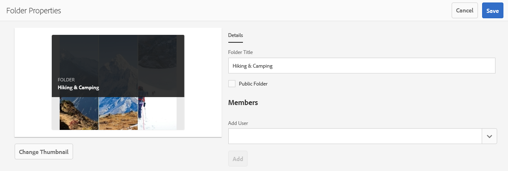
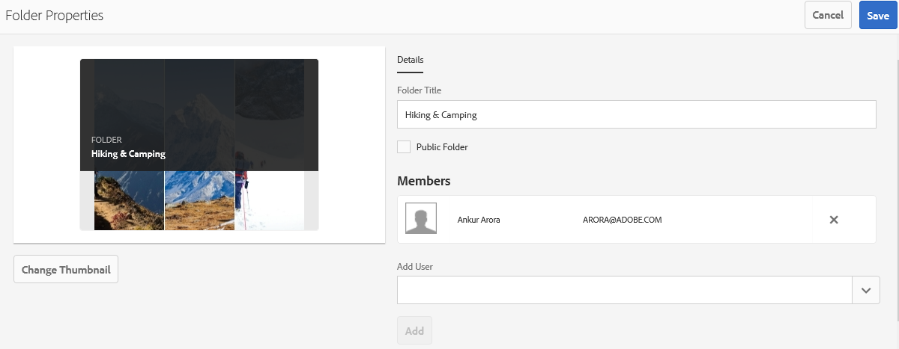

# Condividere cartelle su Brand Portal {#share-folders}

Assets deve essere pubblicato in Brand Portal da un’istanza Experience Manager Author preconfigurata, in quanto Brand Portal non supporta l’acquisizione di risorse.

## Flusso di lavoro di condivisione cartelle in Brand Portal {#folder-sharing-workflow-in-brand-portal}

Di seguito sono descritti il flusso di lavoro di condivisione cartelle e l&#39;accesso utente:

* Per impostazione predefinita, tutte le cartelle pubblicate da Experience Manager Assets a Brand Portal sono visibili solo all’amministratore di Brand Portal, a meno che non siano contrassegnate come pubbliche durante la configurazione della replica.
* L&#39;amministratore utilizza la console **[!UICONTROL Proprietà cartella]** per condividere una cartella con utenti o gruppi selettivi. Solo gli utenti o i gruppi con cui è condivisa la cartella potranno visualizzarla dopo l&#39;accesso a Brand Portal. La cartella non è visibile ad altri utenti.
* L&#39;amministratore può anche scegliere di rendere pubblica una cartella tramite la casella di controllo **[!UICONTROL Cartella pubblica]** nella console **[!UICONTROL Proprietà cartella]**. Una cartella pubblica è visibile a tutti gli utenti.

* Indipendentemente dai ruoli utente e dai privilegi, quando gli utenti accedono a Brand Portal, visualizzano tutte le cartelle pubbliche e le cartelle condivise direttamente con loro o con un gruppo a cui appartengono. Le cartelle private o condivise con altri utenti non sono visibili a tutti gli utenti.

### Condividere cartelle con gruppi di utenti su Brand Portal {#sharing-folders-with-user-groups-on-brand-portal}

I diritti di accesso alle risorse di una cartella dipendono dai diritti di accesso della relativa cartella principale, indipendentemente dalle impostazioni delle cartelle secondarie. Questo comportamento è gestito da [ACL](https://experienceleague.adobe.com/docs/experience-manager-65/administering/security/security.html) in AEM, in quanto le cartelle secondarie ereditano gli ACL dalle cartelle padre. Ad esempio, se una cartella A contiene la cartella B che contiene la cartella C, anche un gruppo di utenti (o utenti) con diritti di accesso alla cartella A dispone degli stessi diritti di accesso per la cartella B e la cartella C. La cartella B, che è la cartella secondaria di A, eredita i propri ACL, mentre la cartella C, che è la cartella secondaria di B, ne eredita gli ACL.

Analogamente, i gruppi di utenti (o gli utenti) che dispongono delle autorizzazioni per accedere solo alla cartella B dispongono delle stesse autorizzazioni di accesso per la cartella C ma non per la cartella A. È consigliabile, pertanto, che le organizzazioni dispongano i propri contenuti in modo che la maggior parte delle risorse esposte vengano posizionate nella cartella secondaria e che l’accesso dalle cartelle secondarie a quelle principali possa essere limitato.

### Pubblicazione cartella pubblica {#public-folder-publish}

A meno che l&#39;opzione **[!UICONTROL Cartella pubblica Publish]** non sia selezionata durante la configurazione della replica di Brand Portal, gli utenti non amministratori (ad esempio Editor e Visualizzatori) non hanno accesso alle risorse pubblicate da AEM Assets a Brand Portal.

Se l&#39;opzione **[!UICONTROL Cartella pubblica Publish]** è disabilitata, gli amministratori devono condividere queste risorse con utenti non amministratori che utilizzano la funzionalità di condivisione.

>[!NOTE]
>
>L&#39;opzione per abilitare **[!UICONTROL Publish delle cartelle pubbliche]** è disponibile da AEM 6.3.2.1 in poi.

## Accesso alle cartelle condivise {#access-to-shared-folders}

La matrice seguente illustra i diritti di accesso e i diritti di condivisione/annullamento della condivisione delle risorse per vari ruoli utente:

|               | Accesso a tutte le cartelle pubblicate da AEM Assets a Brand Portal | Accesso alle cartelle condivise | Condividere/annullare la condivisione dei diritti della cartella |
|---------------|-----------|-----------|------------|
| Amministratore | Sì | Sì | Sì |
| Editor | No* | Sì, solo se condiviso con loro o con il gruppo a cui appartengono | Sì, solo per le cartelle condivise con loro o con il gruppo a cui appartengono |
| Visualizzatore | No* | Sì, solo se condiviso con loro o con il gruppo a cui appartengono | No |
| Utente ospite | No* | Sì, solo se condiviso con loro o con il gruppo a cui appartengono | No |

>[!NOTE]
>
>Per impostazione predefinita, l&#39;opzione **[!UICONTROL Cartella pubblica Publish]** è disabilitata durante la configurazione della replica di Brand Portal con AEM Author. Se l’opzione è abilitata, le cartelle pubblicate in Brand Portal saranno accessibili a tutti gli utenti (anche a quelli non amministratori) per impostazione predefinita.

### Accesso degli utenti non amministratori alle cartelle condivise {#non-admin-user-access-to-shared-folders}

Gli utenti non amministratori possono accedere solo alle cartelle condivise con loro su Brand Portal. Tuttavia, la modalità di visualizzazione di queste cartelle nel portale al momento dell&#39;accesso dipende dalle impostazioni della configurazione di **[!UICONTROL Abilita gerarchia cartelle]**.

**Se la configurazione è disabilitata**

Gli utenti non amministratori visualizzano tutte le cartelle condivise con loro nella pagina di destinazione al momento dell’accesso a Brand Portal.

**Se la configurazione è abilitata**

Al momento dell’accesso a Brand Portal, gli utenti non amministratori visualizzano la struttura delle cartelle (a partire dalla cartella principale) e le cartelle condivise organizzate all’interno delle rispettive cartelle principali.

Queste cartelle principali sono le cartelle virtuali e non è possibile eseguire alcuna azione su di esse. È possibile riconoscere queste cartelle virtuali con un&#39;icona di blocco.

Nessuna attività di azione visibile al passaggio del mouse o alla selezione in **[!UICONTROL Vista a schede]**, a differenza delle cartelle condivise. Il pulsante **[!UICONTROL Panoramica]** viene visualizzato quando si seleziona una cartella virtuale in **[!UICONTROL Vista a colonne]** e **[!UICONTROL Vista a elenco]**.

>[!NOTE]
>
>La miniatura predefinita delle cartelle virtuali è l&#39;immagine miniatura della prima cartella condivisa.

   

## Condividere le cartelle {#how-to-share-folders}

Per condividere una cartella con gli utenti su Brand Portal, effettua le seguenti operazioni:

1. Fai clic sull&#39;icona di sovrapposizione a sinistra e scegli **[!UICONTROL Navigazione]**.

   

1. Dalla barra laterale a sinistra, selezionare **[!UICONTROL File]**.

   

1. Dall’interfaccia di Brand Portal, seleziona la cartella da condividere.

   

1. Dalla barra degli strumenti nella parte superiore, seleziona **[!UICONTROL Condividi]**.

   

   Viene visualizzata la console [!UICONTROL Proprietà cartella].

   

1. Nella console **[!UICONTROL Proprietà cartella]**, specifica il titolo della cartella nel campo **[!UICONTROL Titolo cartella]** se non desideri che il nome predefinito venga visualizzato agli utenti.
1. Dall&#39;elenco **[!UICONTROL Aggiungi utente]**, selezionare gli utenti o i gruppi con cui si desidera condividere la cartella e fare clic su **[!UICONTROL Aggiungi]**.
Per condividere la cartella solo con utenti guest e nessun altro utente, selezionare **[!UICONTROL Utenti anonimi]** dal menu a discesa **[!UICONTROL Membri]**.

   

   >[!NOTE]
   >
   >Per rendere la cartella disponibile a tutti gli utenti indipendentemente dall&#39;appartenenza al gruppo e dal ruolo, renderla pubblica selezionando la casella di controllo **[!UICONTROL Cartella pubblica]**.

1. Se necessario, fare clic su **[!UICONTROL Cambia miniatura]** per modificare l&#39;immagine miniatura per la cartella.
1. Fai clic su **[!UICONTROL Salva]**.

1. Per accedere alla cartella condivisa, accedi a Brand Portal con le credenziali dell’utente con cui hai condiviso la cartella. Controlla la cartella condivisa nell’interfaccia.

## Annullare la condivisione delle cartelle {#unshare-the-folders}

Per annullare la condivisione di una cartella condivisa in precedenza, effettua le seguenti operazioni:

1. Dall’interfaccia di Brand Portal, seleziona la cartella di cui vuoi annullare la condivisione.

   

1. Dalla barra degli strumenti nella parte superiore, fai clic su **[!UICONTROL Condividi]**.
1. Nella console **[!UICONTROL Proprietà cartella]**, in **[!UICONTROL Membri]**, fai clic sul simbolo **[!UICONTROL x]** accanto a un utente per rimuoverlo dall&#39;elenco degli utenti con cui hai condiviso la cartella.

   

1. Nella finestra del messaggio di avviso, fare clic su **[!UICONTROL Conferma]** per confermare l&#39;annullamento della condivisione.
Fai clic su **[!UICONTROL Salva]**.

1. Accedi a Brand Portal con le credenziali dell’utente rimosso dall’elenco condiviso. La cartella non è più disponibile per l’utente nell’interfaccia di Brand Portal.
