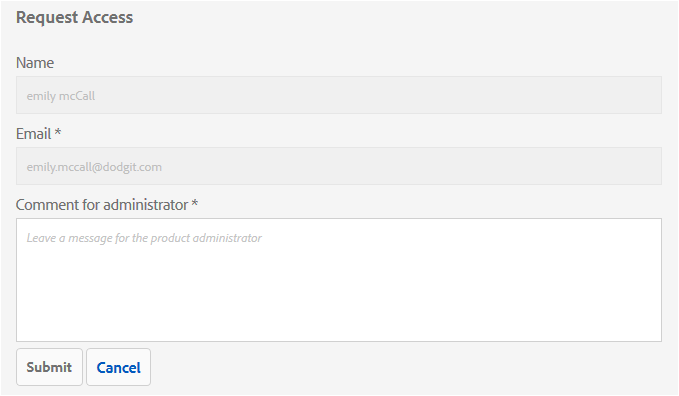
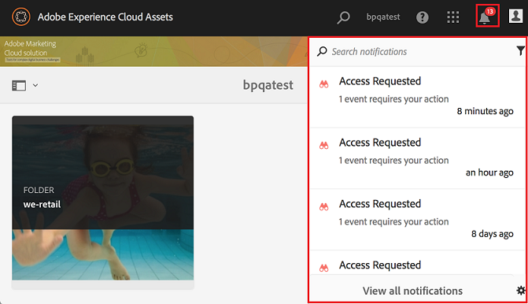

# Panoramica di Experience Manager Assets Brand Portal {#overview-of-aem-assets-brand-portal}

In qualità di addetto al marketing, talvolta è necessario collaborare con partner di canale e utenti aziendali interni per creare, gestire e distribuire rapidamente contenuti digitali rilevanti ai clienti. La distribuzione tempestiva dei contenuti rilevanti all&#39;interno dell&#39;intero percorso di clienti è fondamentale per incrementare la domanda, la conversione, il coinvolgimento e la fedeltà dei clienti.

Tuttavia, lo sviluppo di soluzioni che supportino la condivisione efficiente e sicura di elementi quali loghi dei marchi approvati, risorse delle campagne o riprese di prodotti con team, partner e rivenditori è una sfida. Per garantire efficienza e sicurezza in questo processo è necessario pianificare ed eseguire con attenzione.

**Adobe Experience Manager (AEM) Assets Brand Portal** si concentra sulla necessità dell&#39;addetto al marketing di collaborare in modo efficace con gli utenti di Brand Portal distribuiti a livello globale fornendo funzionalità di distribuzione delle risorse e di contributo alle risorse.

La distribuzione delle risorse consente di acquisire, controllare e distribuire in modo sicuro le risorse creative approvate a parti esterne e utenti aziendali interni tra i dispositivi. Tuttavia, il contributo di Asset consente agli utenti di Brand Portal di caricare le risorse in Brand Portal e pubblicarle in Experience Manager Assets, senza dover accedere all’ambiente di authoring. La funzione di contributo è denominata **Assets Sourcing in Brand Portal**. L&#39;unione di questi elementi migliora l&#39;esperienza complessiva di Brand Portal nella distribuzione delle risorse e nel contributo degli utenti Brand Portal (agenzie/team esterni), velocizza il time-to-market delle risorse e riduce il rischio di non conformità e di accesso non autorizzato.
Vedi [Origine risorse in Brand Portal](brand-portal-asset-sourcing.md).

L’ambiente del portale basato su browser consente di caricare, sfogliare, cercare, visualizzare in anteprima ed esportare facilmente le risorse in formati approvati.

## Configurare Experience Manager Assets con Brand Portal {#configure-brand-portal}

La configurazione di Adobe Experience Manager Assets con Brand Portal consente agli utenti di Brand Portal di pubblicare risorse, distribuirle e usufruire delle funzioni di contributo alle risorse.

>[!NOTE]
>
>La configurazione di Experience Manager Assets con Brand Portal è supportata in Experience Manager Assets as a Cloud Service, Experience Manager Assets 6.3 e versioni successive.

>[!IMPORTANT]
>
> * Brand Portal è in modalità di manutenzione. Tutte le innovazioni dei nuovi prodotti sono disponibili su [Content Hub](https://experienceleague.adobe.com/it/docs/experience-manager-cloud-service/content/assets/content-hub/product-overview).
> * Se hai ancora bisogno di attivare Brand Portal, contatta il rappresentante Adobe con i dettagli del caso d’uso e altri requisiti specifici.
> * Brand Portal non è disponibile con [Assets Prime](https://experienceleague.adobe.com/en/docs/experience-manager-cloud-service/content/assets/assets-prime) o [Assets Ultimate](https://experienceleague.adobe.com/it/docs/experience-manager-cloud-service/content/assets/assets-ultimate-overview). Tuttavia, i clienti Assets as a Cloud Service esistenti che già hanno accesso a Brand Portal possono continuare a utilizzarlo quando passano ad Assets Ultimate.

<!--Experience Manager Assets as a Cloud Service is automatically configured with Brand Portal by activating Brand Portal from the Cloud Manager. The activation workflow creates the required configurations at the backend and activates Brand Portal on the same IMS org as of the Experience Manager Assets as a Cloud Service instance.-->

Tuttavia, Experience Manager Assets (on-premise e managed service) viene configurato manualmente con Brand Portal utilizzando Adobe Developer Console, che fornisce un token Adobe Identity Management Services (IMS) per l’autorizzazione del tenant Brand Portal.

Per ulteriori informazioni, vedere [configurazione di Experience Manager Assets con Brand Portal](../using/configure-aem-assets-with-brand-portal.md).

## Utenti tipo in Brand Portal {#Personas}

Brand Portal supporta i seguenti ruoli utente:

* Utente ospite
* Visualizzatore
* Editor
* Amministratore

Nella tabella seguente sono elencate le attività che gli utenti di questi ruoli possono eseguire:

|  | **Sfogliare** | **Ricerca** | **Download** | **Condividere le cartelle** | **Condividere una raccolta** | **Condividere le risorse come collegamento** | **Accesso agli strumenti di amministrazione** |
|--- |--- |--- |--- |--- |--- |--- |--- |
| **Utente ospite** | ✓* | ✓* | ✓* | x | x | x | x |
| **Visualizzatore** | ✓ | ✓ | ✓ | x | x | x | x |
| **Editor** | ✓ | ✓ | ✓ | ✓ | ✓ | ✓ | x |
| **Amministratore** | ✓ | ✓ | ✓ | ✓ | ✓ | ✓ | ✓ |

>[!NOTE]
>
>Gli utenti guest possono sfogliare, accedere e cercare le risorse solo nelle cartelle e raccolte pubbliche.

<!--
&#42; Viewer users can access and download the public assets shared with them, and can add these assets to create their own collections.

>[!NOTE]
>
>There is a known issue that the share link for collections is currently visible to the viewer users. The viewer users does not have the privilege to add users to create a share link. This issue will be fixed in the upcoming release, the option to share link for the collections will not be available to the viewer users.
-->

### Utente ospite {#guest-user}

Experience Manager Assets Brand Portal consente a [guest access](#request-access-to-brand-portal) di accedere a Brand Portal. Un utente guest non ha bisogno di credenziali per accedere al portale e ha accesso alle cartelle e alle raccolte pubbliche. In qualità di utente guest, puoi sfogliare i dettagli delle risorse e avere una visualizzazione completa delle risorse dei membri delle cartelle e raccolte pubbliche. Puoi cercare, scaricare e aggiungere risorse pubbliche alla raccolta [!UICONTROL Lightbox].

Tuttavia, la sessione ospite non consente di creare raccolte e ricerche salvate e di condividerle ulteriormente. Gli utenti di una sessione guest non possono accedere alle impostazioni di cartelle e raccolte e non possono condividere le risorse come collegamenti. Di seguito è riportato un elenco di attività che un utente guest può eseguire:

* [Sfogliare e accedere alle risorse pubbliche](browse-assets-brand-portal.md)

* [Cercare risorse pubbliche](brand-portal-searching.md)

* [Scaricare risorse pubbliche](brand-portal-download-assets.md)

* [Aggiungi risorse a [!UICONTROL Lightbox]](brand-portal-light-box.md#add-assets-to-lightbox)

Per ulteriori informazioni, passare a [Accesso guest a Brand Portal](../using/guest-access.md).

### Visualizzatore {#viewer}

Utente Brand Portal definito in [!DNL Admin Console] che ha accesso a Brand Portal con il ruolo di Visualizzatore. Un utente con questo ruolo può accedere a Brand Portal e accedere a cartelle, raccolte e risorse consentite. L’utente può anche sfogliare, visualizzare in anteprima, scaricare ed esportare le risorse (rappresentazioni originali o specifiche), configurare le impostazioni dell’account e cercare le risorse. Di seguito è riportato un elenco di attività che un visualizzatore può eseguire:

* [Sfoglia risorse](browse-assets-brand-portal.md)

* [Cercare le risorse](brand-portal-searching.md)

* [Scaricare le risorse](brand-portal-download-assets.md)

### Editor {#editor}

Un utente con il ruolo di Editor può eseguire tutte le attività che un Visualizzatore può eseguire. Inoltre, un editor può visualizzare i file e le cartelle condivisi da un amministratore. L’utente con il ruolo di editor può anche condividere contenuti (file, cartelle, raccolte) con altri utenti.

Oltre alle attività che un visualizzatore può eseguire, un editor può eseguire le seguenti attività aggiuntive:

* [Condividere cartelle](brand-portal-sharing-folders.md)

* [Condividere una raccolta](brand-portal-share-collection.md)

* [Condividere risorse come collegamento](brand-portal-link-share.md)

### Amministratore {#administrator}

Un amministratore include un utente contrassegnato come amministratore di sistema o amministratore di prodotto Brand Portal in [!UICONTROL Admin Console]. Un amministratore può aggiungere e rimuovere amministratori di sistema e utenti, definire predefiniti, inviare messaggi di posta elettronica agli utenti e visualizzare i report sull&#39;utilizzo del portale e sullo storage.

>[!NOTE]
>
>In Brand Portal, un utente contrassegnato con il ruolo di amministratore del supporto in [!UICONTROL Admin Console] ha gli stessi privilegi di un amministratore di sistema.

Un amministratore può eseguire tutte le attività che possono essere eseguite da un editor. Di seguito sono riportate le attività aggiuntive che un amministratore può eseguire:

* [Gestire utenti, gruppi e ruoli utente](brand-portal-adding-users.md)
* [Personalizzare sfondo, intestazioni di pagina ed e-mail](brand-portal-branding.md)
* [Utilizzare i facet di ricerca personalizzati](brand-portal-search-facets.md)
* [Utilizzare lo schema metadati](brand-portal-metadata-schemas.md)
* [Applicare i predefiniti immagine o le rappresentazioni dinamiche](brand-portal-image-presets.md)
* [Utilizzare i rapporti](brand-portal-reports.md)

Oltre alle attività di cui sopra, un autore in AEM Assets può eseguire le seguenti attività:

* [Configurare AEM Assets con Brand Portal](../using/configure-aem-assets-with-brand-portal.md)
* [Pubblicare cartelle su Brand Portal](https://experienceleague.adobe.com/it/docs/experience-manager-65/content/assets/brandportal/brand-portal-publish-folder)
* [Pubblicare raccolte su Brand Portal](https://experienceleague.adobe.com/it/docs/experience-manager-65/content/assets/brandportal/brand-portal-publish-collection)

## Alias alternativo per URL Brand Portal {#tenant-alias-for-portal-url}

A partire da Brand Portal 6.4.3, le organizzazioni possono disporre di un URL alternativo (alias) per ogni URL esistente del tenant Brand Portal. L&#39;URL dell&#39;alias può essere creato inserendo un prefisso alternativo nell&#39;URL.\
Se il nome del tenant supera i 32 caratteri, è necessario creare un alias tenant.
Tieni presente che solo il prefisso dell’URL di Brand Portal può essere personalizzato e non l’intero URL. Ad esempio, un&#39;organizzazione con il dominio esistente `geomettrix.brand-portal.adobe.com` può ottenere `geomettrixinc.brand-portal.adobe.com` creato su richiesta.

Tuttavia, l&#39;istanza di AEM Author può essere [configurata](../using/configure-aem-assets-with-brand-portal.md) solo con l&#39;URL dell&#39;ID tenant e non con l&#39;URL dell&#39;alias (alternativo) tenant.

>[!NOTE]
>
>Per ottenere un alias per il nome tenant in un URL portale esistente, le organizzazioni devono contattare l’Assistenza clienti per richiedere una nuova creazione di alias tenant. Verificare innanzitutto che l&#39;alias sia disponibile, quindi creare l&#39;alias per elaborare la richiesta.
>
>Per sostituire il vecchio alias o eliminare il vecchio alias, è necessario seguire lo stesso processo.

## Richiedere l’accesso a Brand Portal {#request-access-to-brand-portal}

Gli utenti possono richiedere l’accesso a Brand Portal dalla schermata di accesso. Queste richieste vengono inviate agli amministratori di Brand Portal, che concedono l&#39;accesso agli utenti tramite Adobe [!UICONTROL Admin Console]. Una volta concesso l’accesso, gli utenti ricevono un’e-mail di notifica.

Per richiedere l&#39;accesso, effettuare le seguenti operazioni:

1. Dalla pagina di accesso di Brand Portal, selezionare **[!UICONTROL Fare clic qui]** corrispondente a **[!UICONTROL Accesso necessario?]**. Tuttavia, per accedere alla sessione guest, selezionare **[!UICONTROL Fare clic qui]** corrispondente a **[!UICONTROL Accesso guest?]**.

   

   Viene aperta la pagina [!UICONTROL Richiedi accesso].

1. Per richiedere l&#39;accesso al Brand Portal di un&#39;organizzazione, è necessario disporre di un [!UICONTROL Adobe ID], [!UICONTROL Enterprise ID] o [!UICONTROL Federated ID] valido.

   Nella pagina [!UICONTROL Richiedi accesso], effettua l&#39;accesso con il tuo ID (scenario 1) o crea un [!UICONTROL Adobe ID] (scenario 2):

   ![[!UICONTROL Richiedi accesso]](assets/bplogin_request_access_2.png)

   **Scenario 1**

   1. Se hai un [!UICONTROL Adobe ID], [!UICONTROL Enterprise ID] o [!UICONTROL Federated ID], fai clic su **[!UICONTROL Accedi]**.
Verrà aperta la pagina [!UICONTROL Accedi].

   1. Fornisci le tue credenziali di [!UICONTROL Adobe ID] e fai clic su **[!UICONTROL Accedi]**.

      

   Sei stato reindirizzato alla pagina [!UICONTROL Richiedi accesso].

   **Scenario 2**

   1. Se non disponi di un [!UICONTROL Adobe ID], per crearne uno fai clic su **[!UICONTROL Ottieni un Adobe ID]** dalla pagina [!UICONTROL Richiedi accesso].
Verrà aperta la pagina [!UICONTROL Accedi].
   1. Fai clic su **[!UICONTROL Ottieni un Adobe ID]**.
Verrà aperta la pagina [!UICONTROL Iscrizione].
   1. Immetti nome e cognome, ID e-mail e password.
   1. Seleziona **[!UICONTROL Registrati]**.

      

   Sei stato reindirizzato alla pagina [!UICONTROL Richiedi accesso].

1. Nella pagina successiva vengono visualizzati il nome e l’ID e-mail utilizzati per richiedere l’accesso. Lascia un commento per l&#39;amministratore e fai clic su **[!UICONTROL Invia]**.

   

## Gli amministratori di prodotto concedono l’accesso {#grant-access-to-brand-portal}

Gli amministratori dei prodotti Brand Portal ricevono le richieste di accesso nella propria area di notifica Brand Portal e tramite e-mail nella propria casella in entrata.

Per concedere l&#39;accesso, gli amministratori di prodotto devono fare clic sulla notifica pertinente nell&#39;area di notifica di Brand Portal e quindi fare clic su **[!UICONTROL Concedi l&#39;accesso]**.
In alternativa, gli amministratori di prodotto possono seguire il collegamento fornito nell&#39;e-mail di richiesta di accesso per visitare l&#39;Adobe [!UICONTROL Admin Console] e aggiungere l&#39;utente alla relativa configurazione di prodotto.

Sei stato reindirizzato alla [home page di Adobe [!UICONTROL Admin Console]](https://adminconsole.adobe.com/enterprise/overview). Utilizza Adobe [!UICONTROL Admin Console] per creare utenti e assegnarli a profili di prodotto (precedentemente noti come configurazioni di prodotto), che vengono visualizzati come gruppi in Brand Portal. Per ulteriori informazioni sull&#39;aggiunta di utenti in [!UICONTROL Admin Console], vedere [Aggiungere un utente](brand-portal-adding-users.md#add-a-user) (seguire i passaggi 4-7 della procedura per aggiungere un utente).

## Lingue Brand Portal {#brand-portal-language}

È possibile cambiare la lingua di Brand Portal da Adobe [!UICONTROL Experience Cloud Settings].

Per modificare la lingua:

1. Seleziona [!UICONTROL Utente] > [!UICONTROL Modifica profilo] dal menu principale.

   

1. Nella pagina [!UICONTROL Impostazioni Experience Cloud], seleziona una lingua dal menu a discesa [!UICONTROL Lingua].

## Notifica della manutenzione di Brand Portal {#brand-portal-maintenance-notification}

Prima che Brand Portal sia pianificato per l’interruzione della manutenzione, viene visualizzata una notifica come banner dopo l’accesso a Brand Portal. Una notifica di esempio:

Puoi ignorare questa notifica e continuare a utilizzare Brand Portal. Questa notifica viene visualizzata in ogni nuova sessione.

## Informazioni sulla versione e sul sistema {#release-and-system-information}

* [Novità](whats-new.md)
* [Note sulla versione](brand-portal-release-notes.md)
* [Formati di file supportati](brand-portal-supported-formats.md)

## Risorse correlate {#related-resources}

<!--
* [Adobe Customer Support]()
-->

* [Forum AEM](https://experienceleaguecommunities.adobe.com/t5/adobe-experience-manager/ct-p/adobe-experience-manager-community?lang=it)
