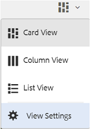
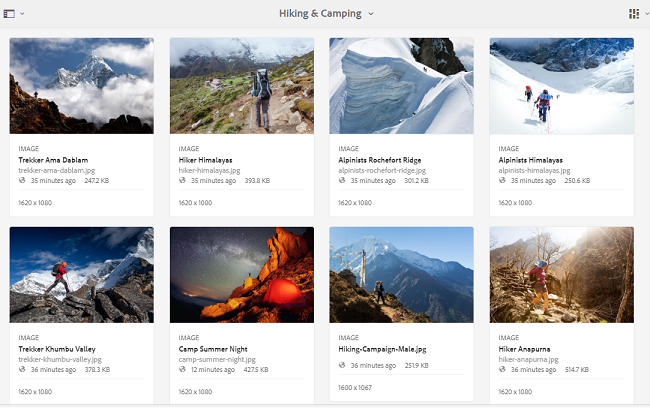

# Sfogliare le risorse in Brand Portal {#browsing-assets-on-brand-portal}

Experience Manager Assets Brand Portal offre varie funzioni ed elementi dell’interfaccia utente che semplificano la navigazione delle risorse, la navigazione nelle gerarchie di risorse e la ricerca di risorse utilizzando diverse opzioni di visualizzazione.

Il logo di Experience Manager nella barra degli strumenti nella parte superiore facilita l’accesso degli utenti amministratori al pannello degli strumenti di amministrazione.

Il selettore della barra in alto a sinistra nell’elenco a discesa di Brand Portal mostra le opzioni per navigare nelle gerarchie di risorse, semplificare la ricerca e visualizzare le risorse.

Puoi visualizzare, navigare e selezionare le risorse utilizzando una qualsiasi delle viste disponibili (Scheda, Colonna ed Elenco) nel selettore di visualizzazione di Brand Portal.

## Visualizzazione e selezione delle risorse {#viewing-and-selecting-resources}

La visualizzazione, la navigazione e la selezione di ciascuna vista sono concettualmente le stesse in tutte le viste, ma presentano piccole variazioni nella gestione, a seconda della vista in uso.

Puoi visualizzare, navigare e selezionare (per ulteriori azioni) le risorse in una qualsiasi delle viste disponibili:

* Vista a colonne
* Vista a schede
* Vista a elenco 

### Vista a schede

La vista a schede mostra le schede informative per ogni elemento al livello corrente, Queste schede forniscono i seguenti dettagli:

* Una rappresentazione visiva della risorsa/cartella.
* Tipo
* Titolo
* Nome
* Data e ora in cui la risorsa è stata pubblicata su Brand Portal dall’AEM
* Dimensione
* Dimensioni

Puoi spostarti verso il basso nella gerarchia facendo clic sulle schede (facendo attenzione a evitare le azioni rapide) o verso l&#39;alto utilizzando le [breadcrumb nell&#39;intestazione](https://experienceleague.adobe.com/it/docs/experience-manager-65/content/sites/authoring/essentials/basic-handling).

#### Vista a schede per utenti non amministratori

Le schede di cartelle, in Vista a schede, visualizzano le informazioni sulla gerarchia delle cartelle per gli utenti non amministratori (editor, visualizzatore e utente ospite). Questa funzionalità consente agli utenti di conoscere la posizione delle cartelle a cui accedono, rispetto alla gerarchia principale.

Le informazioni sulla gerarchia delle cartelle sono particolarmente utili per distinguere le cartelle con nomi simili ad altre cartelle condivise da una gerarchia di cartelle diversa. Se gli utenti non amministratori non sono a conoscenza della struttura delle cartelle delle risorse condivise con loro, le risorse o cartelle con nomi simili sembrano confuse.

* I percorsi mostrati sulle rispettive schede vengono troncati per adattarsi alle dimensioni delle schede. Tuttavia, gli utenti possono vedere il percorso completo come una descrizione passando con il mouse sopra il percorso troncato.

**Opzione Panoramica per visualizzare le proprietà della risorsa**

L’opzione Panoramica è disponibile per gli utenti non amministratori (Editor, Visualizzatori, Utenti ospiti) che possono visualizzare le proprietà delle risorse e cartelle selezionate. L’opzione Panoramica è visibile:

* Nella barra degli strumenti, nella parte superiore, seleziona una risorsa o una cartella.
* Nel menu a discesa, seleziona il selettore della barra.

Quando si seleziona l&#39;opzione **[!UICONTROL Panoramica]** mentre è selezionata una risorsa o una cartella, gli utenti possono visualizzare il titolo, il percorso e l&#39;ora di creazione della risorsa. Nella pagina dei dettagli della risorsa, invece, la selezione dell’opzione Panoramica consente agli utenti di visualizzare i metadati della risorsa.

#### Visualizza impostazioni nella vista a schede

Viene visualizzata la finestra di dialogo **[!UICONTROL Visualizza impostazioni]** selezionando **[!UICONTROL Visualizza impostazioni]** dal selettore di visualizzazione. Consente di ridimensionare le miniature delle risorse nella vista a schede. In questo modo è possibile personalizzare la visualizzazione e controllare il numero di miniature visualizzate.

### Vista a elenco

Nella vista a elenco vengono visualizzate le informazioni per ogni risorsa al livello corrente. La vista Elenco fornisce i dettagli riportati di seguito.

* Miniatura delle risorse
* Nome
* Titolo
* Lingua
* Tipo
* Dimensione
* Dimensione
* Valutazione
* Percorso cartella che mostra la gerarchia delle risorse
* Data di pubblicazione della risorsa su Brand Portal

La colonna del percorso consente di identificare facilmente la posizione della risorsa nella gerarchia delle cartelle. Per spostarti verso il basso nella gerarchia, fai clic sul nome della risorsa ed effettua un backup utilizzando le [breadcrumb nell&#39;intestazione](https://experienceleague.adobe.com/it/docs/experience-manager-65/content/sites/authoring/essentials/basic-handling).

<!--
Comment Type: draft lastmodifiedby="mgulati" lastmodifieddate="2018-08-17T03:12:05.096-0400" type="annotation">Removed:- "Selecting assets in list view To select all items in the list, use the checkbox at the upper left of the list. When all items in the list are selected, this check box appears checked. To deselect all, click the checkbox. When only some items are selected, it appears with a minus sign. To select all, click the checkbox. To deselect all, click the checkbox again. You can change the order of items using the dotted vertical bar at the far right of each item in the list. Click the vertical selection bar and drag the item to a new position in the list."
 -->

### Visualizza impostazioni nella vista a elenco

Nella vista a elenco, per impostazione predefinita, la risorsa **[!UICONTROL Name]** è la prima colonna. Vengono inoltre visualizzate informazioni aggiuntive, ad esempio la risorsa **[!UICONTROL Titolo]**, **[!UICONTROL Impostazioni locali]**, **[!UICONTROL Tipo]**, **[!UICONTROL Dimension]**, **[!UICONTROL Dimensioni]**, **[!UICONTROL Valutazione]**, stato di pubblicazione. È tuttavia possibile selezionare le colonne da visualizzare utilizzando **[!UICONTROL Impostazioni visualizzazione]**.

### Vista a colonne

Utilizzare la vista a colonne per spostarsi in una struttura del contenuto attraverso una serie di colonne a catena. Questa vista consente di visualizzare e scorrere la gerarchia delle risorse.

Selezionando una risorsa nella prima colonna (all’estrema sinistra), le risorse figlie vengono visualizzate nella seconda colonna a destra. Selezionando una risorsa nella seconda colonna vengono visualizzate le risorse figlie nella terza colonna a destra e così via.

Puoi spostarti verso l’alto o il basso nella struttura. Fai clic sul nome della risorsa o sulla freccia a destra del nome della risorsa.

* Il nome della risorsa e la freccia sono evidenziati quando si fa clic su di essa.
* Toccando o facendo clic sulla miniatura viene selezionata la risorsa.
* Se questa opzione è selezionata, sulla miniatura viene visualizzato un segno di spunta e il nome della risorsa viene evidenziato.
* I dettagli della risorsa selezionata sono visualizzati nella colonna finale.

Quando una risorsa viene selezionata nella vista a colonne, nella colonna finale viene visualizzata una sua rappresentazione visiva con i seguenti dettagli:

* Titolo
* Nome
* Dimensioni
* Data e ora in cui la risorsa è stata pubblicata su Brand Portal dall’AEM
* Dimensione
* Tipo
* Opzione Maggiori dettagli abbinata alla pagina dei dettagli della risorsa

<!--
Comment Type: draft

<h3>Selecting Resources</h3>
-->

<!--
Comment Type: draft

Selecting a specific resource depends on a combination of the view and the device:

-->

<!--
Comment Type: draft

<table border="1" cellpadding="1" cellspacing="0" width="100%">
<tbody>
<tr>
<td> </td>
<td>Select</td>
<td>Deselect</td>
</tr>
<tr>
<td>Column View  </td>
<td>
<ul>
<li>Desktop:  Mouseover, then use the check mark quick action</li>
<li>Mobile device:  Tap the thumbnail</li>
</ul> </td>
<td>
<ul>
<li>Desktop:  Click the thumbnail</li>
<li>Mobile device:  Tap the thumbnail</li>
</ul> </td>
</tr>
<tr>
<td>Card View  </td>
<td>
<ul>
<li>Desktop:  Mouseover, then use the check mark quick action</li>
<li>Mobile device:  Tap-and-hold the card</li>
</ul> </td>
<td>
<ul>
<li>Desktop:  Click the card</li>
<li>Mobile device:  Tap the card</li>
</ul> </td>
</tr>
<tr>
<td>List View</td>
<td>
<ul>
<li>Desktop:  Mouseover, then use the check mark quick action</li>
<li>Mobile device:  Tap the thumbnail</li>
</ul> </td>
<td>
<ul>
<li>Desktop:  Click the thumbnail</li>
<li>Mobile device:  Tap the thumbnail</li>
</ul> </td>
</tr>
</tbody>
</table>
-->

<!--
Comment Type: draft

Deselecting All
-->

<!--
Comment Type: draft

In all cases, as you select items the count of the items selected is displayed at the upper right of the toolbar.

You can deselect all items and exit selection mode by clicking the X next to the count.

-->

<!--
Comment Type: draft

In all views, all items can be deselected by clicking escape on the keyboard if you are using a desktop device.

-->

## Struttura contenuto {#content-tree}

Oltre a queste visualizzazioni, utilizza la struttura ad albero per espandere la gerarchia delle risorse mentre visualizzi e selezioni le risorse o le cartelle desiderate.

Per aprire la visualizzazione struttura, fare clic sul selettore della barra in alto a sinistra e selezionare **[!UICONTROL Struttura contenuto]** dal menu.

Dalla gerarchia dei contenuti, individua la risorsa desiderata.

## Dettagli risorsa {#asset-details}

La pagina dei dettagli della risorsa consente di visualizzare una risorsa, scaricarla, condividerne il collegamento, spostarla in una raccolta o visualizzarne la pagina delle proprietà. Consente inoltre di navigare nella pagina dei dettagli di altre risorse della stessa cartella in successione.

Per visualizzare i metadati della risorsa o le varie rappresentazioni, utilizza il selettore della barra nella pagina dei dettagli della risorsa.

Puoi visualizzare tutte le rappresentazioni disponibili della risorsa nella pagina dei dettagli della risorsa e selezionare una rappresentazione dal pannello **[!UICONTROL Rappresentazioni]** per visualizzarne l&#39;anteprima.

<!-- removed as it is fixed in 2022.02.0 release
>[!CAUTION]
>
>(**Experience Manager Assets as a Cloud Service** only) The following known issues will be fixed in the upcoming release:
>
>The **[!UICONTROL Renditions]** panel does not list all the static renditions of the assets that are published to Brand Portal after December 16, 2021.
>
>The **[!UICONTROL Renditions]** panel lists the smart crop renditions of the asset, however, the user cannot preview or download the smart crop renditions.
-->

Per aprire la pagina delle proprietà della risorsa, utilizza l&#39;opzione **[!UICONTROL Proprietà (p)]** nella barra superiore.

È inoltre possibile visualizzare un elenco di tutte le risorse correlate (risorse di origine o derivate su AEM) nella pagina delle proprietà di una risorsa, in quanto anche la relazione tra risorse viene pubblicata da AEM a Brand Portal.
