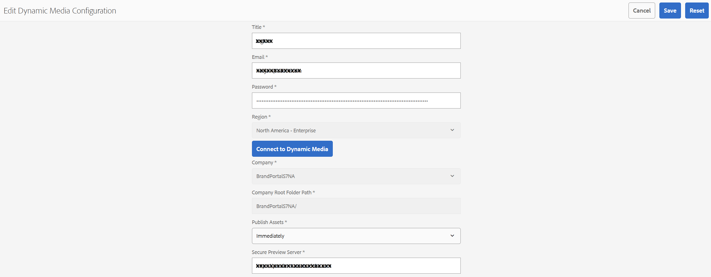

# Supporto per video dinamico su Brand Portal {#dynamic-video-support-on-brand-portal}

Anteprima e riproduzione adattiva di video su Brand Portal con supporto Dynamic Media. Scarica anche le rappresentazioni dinamiche dal portale e dai collegamenti condivisi.
Gli utenti di Brand Portal possono:

* Visualizza l’anteprima dei video nelle pagine Dettagli risorsa, Vista a schede e Anteprima condivisione collegamenti.
* Riproduci le codifiche video nella pagina Dettagli risorsa.
* Visualizza le rappresentazioni dinamiche nella scheda Rappresentazioni della pagina Dettagli risorsa.
* Scarica le codifiche video e le cartelle contenenti i video.

>[!NOTE]
>
>Per utilizzare i video e pubblicarli in Brand Portal, accertati che l’istanza Autore Experience Manager sia impostata in modalità ibrida Dynamic Media o in modalità Dynamic Media **[!DNL Scene7]**.

Per visualizzare in anteprima, riprodurre e scaricare i video, Brand Portal espone agli amministratori le due configurazioni seguenti:

* [Configurazione ibrida per elementi multimediali dinamici](#configure-dm-hybrid-settings)
Se l’istanza Autore Experience Manager è in esecuzione in Dynamic Media, la modalità ibrida.
* Configurazione di [Dynamic Media [!DNL Scene7] ](#configure-dm-scene7-settings)
Se l&#39;istanza Autore Experience Manager è in esecuzione in Dynamic Media - modalità **[!DNL Scene7]**.
Imposta una di queste configurazioni in base alle configurazioni impostate nell’istanza Autore di Experience Manager con cui viene replicato il tenant Brand Portal.

>[!NOTE]
>
>I video dinamici non sono supportati nei tenant di Brand Portal configurati con Experience Manager Author in esecuzione in modalità di esecuzione **[!UICONTROL Scene7 Connect]**.

## Come vengono riprodotti i video dinamici? {#how-are-dynamic-videos-played}

Se le configurazioni di Dynamic Media ([Ibrido](../using/dynamic-video-brand-portal.md#configure-dm-hybrid-settings) o [[!DNL Scene7]](../using/dynamic-video-brand-portal.md#configure-dm-scene7-settings)) sono impostate in Brand Portal, le rappresentazioni dinamiche vengono recuperate dal server **[!DNL Scene7]**. Le codifiche video vengono quindi visualizzate in anteprima e riprodotte senza ritardi e con una distorsione della qualità.

L&#39;archivio Brand Portal non memorizza le codifiche video e le recupera dal server **[!DNL Scene7]**. Assicurati che le configurazioni di Dynamic Media sia nell’istanza di authoring di Adobe Experience Manager che in Brand Portal siano le stesse.

>[!NOTE]
>
>I visualizzatori video e i predefiniti visualizzatore non sono supportati in Brand Portal. I video vengono visualizzati in anteprima e riprodotti sui visualizzatori predefiniti in Brand Portal.

## Prerequisiti {#prerequisites}

Per lavorare con i video dinamici su Brand Portal, assicurati di:

* **Avvia Experience Manager Author in modalità Dynamic Media**

  Avvia l&#39;istanza di Experience Manager Author (con cui è configurato Brand Portal) in [Dynamic Media - [!DNL Scene7] modalità](https://experienceleague.adobe.com/en/docs/experience-manager-65/content/assets/dynamic/config-dms7#enabling-dynamic-media-in-scene-mode) o in [Dynamic Media - modalità ibrida](https://experienceleague.adobe.com/en/docs/experience-manager-65/content/assets/dynamic/config-dynamic) oppure

* **Configura i servizi cloud per elementi multimediali dinamici nell&#39;istanza Autore Experience Manager**

  In base alla modalità Dynamic Media (modalità Scene7 o ibrida) su cui è in esecuzione Experience Manager Author, imposta [Dynamic Media Cloud Services ([!DNL Scene7] mode)](https://experienceleague.adobe.com/en/docs/experience-manager-65/content/assets/dynamic/config-dms7#configuring-dynamic-media-cloud-services) o [Dynamic Media Cloud Services (modalità ibrida)](https://experienceleague.adobe.com/en/docs/experience-manager-65/content/assets/dynamic/config-dms7#configuring-dynamic-media-cloud-services) su Experience Manager Author da **Strumenti** | **Servizi cloud** | **Elemento multimediale dinamico**.

* **Configura Dynamic Media in Brand Portal**

  In base alle configurazioni di Dynamic Media Cloud in Experience Manager Author, configura [le impostazioni di Dynamic Media](#configure-dm-hybrid-settings) o [[!DNL Scene7] le impostazioni](#configure-dm-scene7-settings) dagli strumenti di amministrazione di Brand Portal.

  Assicurati che [tenant Brand Portal separati](#separate-tenants) siano utilizzati per le istanze di Experience Manager Author configurate in Dynamic Media - modalità **[!UICONTROL Scene7]** e Dynamic Media - modalità ibrida. Questo approccio è particolarmente importante se utilizzi le funzionalità di Dynamic Media **[!UICONTROL S7]** e Dynamic Media Hybrid.

* **Pubblica cartelle con codifiche video applicate a Brand Portal**

  Applica [codifiche video](https://experienceleague.adobe.com/en/docs/experience-manager-65/content/assets/dynamic/video-profiles) e pubblica in Brand Portal la cartella contenente le risorse rich media dall&#39;istanza di Experience Manager Author.

* **Inserisce nell&#39;elenco Consentiti IP in uscita in SPS se l&#39;anteprima protetta è abilitata**

  Se si utilizza Dynamic Media-**[!DNL Scene7]** (con [anteprima protetta abilitata](https://experienceleague.adobe.com/en/docs/dynamic-media-classic/using/upload-publish/testing-assets-making-them-public) per una società), si consiglia all&#39;amministratore della società **[!DNL Scene7]** [elenco Consentiti di  gli IP pubblici in uscita](https://experienceleague.adobe.com/en/docs/dynamic-media-classic/using/upload-publish/testing-assets-making-them-public#testing-the-secure-testing-service) per le rispettive aree tramite l&#39;interfaccia utente flash di SPS (**[!UICONTROL Scene7]** Publishing System).

  Gli IP in uscita sono i seguenti:

  | **Area** | **IP in uscita** |
  |--- |--- |
  | ND | 130.248.160.68, 20.94.203.130 |
  | EMEA | 185.34.189.3, 51.132.146.75 |
  | APAC | 172.82.240.74, 172.82.240.75 |

  Per uno di questi IP in uscita, consulta [Preparare il tuo account per un servizio di test sicuro](https://experienceleague.adobe.com/en/docs/dynamic-media-classic/using/upload-publish/testing-assets-making-them-public#testing-the-secure-testing-service).

## Best practice

Assicurati che le risorse video dinamiche siano state visualizzate in anteprima, riprodotte e scaricate correttamente da Brand Portal (e dai collegamenti condivisi), segui queste procedure:

### Tenant separati per Dynamic Media - Scene7 e Dynamic Media - Modalità ibride {#separate-tenants}

Se si utilizzano entrambe le funzionalità Dynamic Media - modalità **[!DNL Scene7]** e Dynamic Media - modalità ibrida, utilizzare tenant diversi per le istanze di authoring Experience Manager configurate con le modalità Dynamic Media - **[!DNL Scene7]** e Dynamic Media - ibrida.

### Stessi dettagli di configurazione nell’istanza di authoring di Experience Manager e in Brand Portal

Assicurati che i dettagli di configurazione siano gli stessi in Brand Portal e **[!UICONTROL Configurazione cloud Experience Manager]**. Gli stessi dettagli di configurazione includono:

* **[!UICONTROL Titolo]**
* **[!UICONTROL ID registrazione]**
* **[!UICONTROL URL servizio video]** in **[!UICONTROL Dynamic Media - Modalità ibrida]**
* **[!UICONTROL Titolo]**
* Credenziali (**[!UICONTROL E-mail]** e password)
* **[!UICONTROL Area]**
* **[!UICONTROL Società]** in Dynamic Media - modalità **[!DNL Scene7]**

### Inserire nell&#39;elenco Consentiti IP pubblici in uscita per la modalità Dynamic Media Scene7

Se si utilizza Dynamic Media **[!UICONTROL Scene7]** - con [anteprima protetta abilitata](https://experienceleague.adobe.com/en/docs/dynamic-media-classic/using/upload-publish/testing-assets-making-them-public) - per distribuire risorse video a Brand Portal, **[!UICONTROL Scene7]** stabilisce un server immagini dedicato per gli ambienti di staging o le applicazioni interne. Qualsiasi richiesta inviata a questo server controlla l’indirizzo IP di origine. Se la richiesta in ingresso non si trova nell’elenco approvato di indirizzi IP, viene restituita una risposta di errore.
L&#39;amministratore della società **[!UICONTROL Scene7]** configura quindi un elenco approvato di indirizzi IP per l&#39;ambiente **[!UICONTROL Secure Testing]** della propria società tramite l&#39;interfaccia utente flash **[!UICONTROL SPS]** (Scene7 Publishing System). Accertati che l’IP in uscita per la tua rispettiva regione (dal seguente) sia aggiunto all’elenco approvato.
Per uno di questi IP in uscita, consulta [Preparare il tuo account per un servizio di test sicuro](https://experienceleague.adobe.com/en/docs/dynamic-media-classic/using/upload-publish/testing-assets-making-them-public#testing-the-secure-testing-service).
Gli IP in uscita sono i seguenti:

| **Area** | **IP in uscita** |
|--- |--- |
| ND | 130.248.160.68, 20.94.203.130 |
| EMEA | 51.132.146.75, 130.248.244.202, 130.248.244.203, 130.248.244.204, 130.248.244.210, 130.248.244.211, 130.248.244.212 |
| APAC | 63.140.44.54 |

## Configurare le impostazioni di Dynamic Media (ibrido) {#configure-dm-hybrid-settings}

Se l&#39;istanza di Experience Manager Author è in esecuzione in modalità ibrida per elementi multimediali dinamici, utilizzare il riquadro **[!UICONTROL Video]** del pannello Strumenti di amministrazione per configurare le impostazioni del gateway per elementi multimediali dinamici.

>[!NOTE]
>
>[profili di codifica video](https://experienceleague.adobe.com/en/docs/experience-manager-65/content/assets/dynamic/video-profiles) non pubblicati in Brand Portal. Vengono invece recuperati dal server **[!UICONTROL Scene7]**. Pertanto, affinché le codifiche video possano essere riprodotte correttamente in Brand Portal, assicurati che i dettagli di configurazione siano gli stessi dei [servizi cloud per elementi multimediali dinamici ([!DNL Scene7] modalità)](https://experienceleague.adobe.com/en/docs/experience-manager-65/content/assets/dynamic/config-dms7#configuring-dynamic-media-cloud-services) nell&#39;istanza di authoring di Experience Manager.

Per impostare le configurazioni Dynamic Media sui tenant di Brand Portal:

1. Seleziona il logo Experience Manager per accedere agli strumenti di amministrazione dalla barra degli strumenti nella parte superiore di Brand Portal.
1. Dal pannello Strumenti di amministrazione, seleziona il riquadro **[!UICONTROL Video]**.

   

   **[!UICONTROL Viene visualizzata la pagina Modifica configurazione Dynamic Media]**.

   

1. Specificare **[!UICONTROL ID registrazione]** e **[!UICONTROL URL servizio video]** (URL DM-Gateway). Assicurati che questi dettagli siano identici a quelli presenti in **[!UICONTROL Strumenti > Servizi cloud]** nella tua istanza Autore Experience Manager.
1. Seleziona **Salva** per salvare la configurazione.

## Configurare le impostazioni Scene7 per Dynamic Media {#configure-dm-scene7-settings}

Se l&#39;istanza Autore Experience Manager è in esecuzione in modalità Dynamic Media - **[!UICONTROL Scene7]**, utilizzare il riquadro **[!UICONTROL Configurazione Dynamic Media]** del pannello Strumenti di amministrazione per configurare le impostazioni del server **[!UICONTROL Scene7]**.

Per impostare le configurazioni di Dynamic Media **[!UICONTROL Scene7]** sui tenant Brand Portal:

1. Seleziona il logo Experience Manager per accedere agli strumenti di amministrazione dalla barra degli strumenti nella parte superiore di Brand Portal.

2. Dal pannello Strumenti di amministrazione, seleziona il riquadro **[!UICONTROL Configurazione elemento multimediale dinamico]**.

   ![DM [!UICONTROL Configurazione Scene 7] in Brand Portal](assets/DMS7-Tile.png)

   **[!UICONTROL Viene visualizzata la pagina Modifica configurazione Dynamic Media]**.

   

3. Fornisci:

   * **[!UICONTROL Titolo]**
   * Credenziali (**[!UICONTROL ID e-mail]** e **[!UICONTROL Password]**) per accedere al server Scene7
   * **[!UICONTROL Area]**

   Assicurati che questi valori siano identici a quelli presenti nell’istanza Autore Experience Manager.

4. Seleziona **[!UICONTROL Connetti a Dynamic Media]**.

5. Fornisci **[!UICONTROL Nome società]** e **[!UICONTROL Salva]** la configurazione.

6. Selezionare **[!UICONTROL Reimposta]** per cancellare le modifiche, reimpostare la password e ripristinare lo stato predefinito della configurazione.

