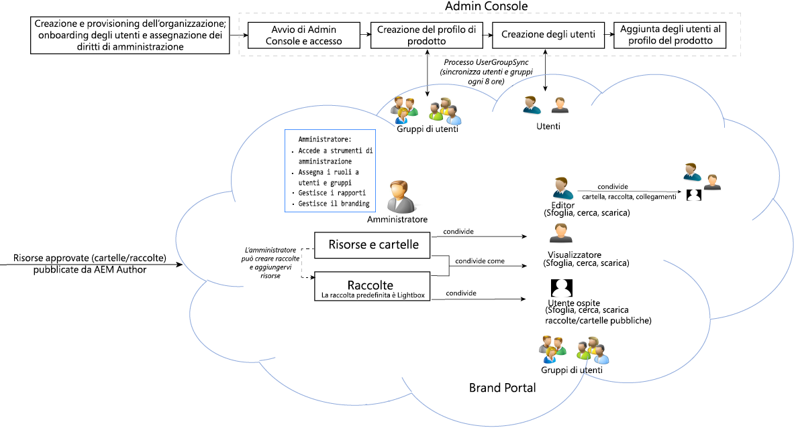

# Guida di Adobe Experience Manager Assets Brand Portal {#aem-brand-portal}

**Adobe Experience Manager Assets Brand Portal** aiuta le organizzazioni a soddisfare le esigenze di marketing grazie alla distribuzione in modo sicuro delle risorse di prodotti e brand approvati, per consentirne il download da parte di agenzie esterne, partner, team interni e rivenditori.

La mancanza di una soluzione sicura per la condivisione delle risorse può comportare:

* Condivisione manuale delle risorse tramite e-mail o cloud
* Problemi di conformità del marchio
* Mancanza di controllo sull’utilizzo delle risorse
* Ritardi nelle campagne e nei lanci di prodotti
* Duplicazione dei contenuti tra località geografiche e organizzazioni diverse
* Conservazione non protetta delle risorse prima del rilascio

Brand Portal garantisce la conformità al marchio consentendo si professionisti del marketing di collaborare con partner e utenti interni per creare, gestire e consegnare alle parti interessate linee guida di progettazione, loghi e risorse per le campagne.

Brand Portal è un’offerta SaaS basata su cloud. È disponibile come componente aggiuntivo del prodotto Adobe Experience Manager Assets (on premise o managed service). È possibile usufruire di Brand Portal con [!DNL Adobe Experience Manager Assets] come un [!DNL Cloud Service]. Una volta [configurate](https://experienceleague.adobe.com/it/docs/experience-manager-cloud-service/content/assets/brand-portal/configure-aem-assets-with-brand-portal), è possibile pubblicare le risorse approvate da [!DNL Adobe Experience Manager Assets] come istanza di [!DNL Cloud Service] su [!DNL Brand Portal] e distribuirle agli utenti di Brand Portal.

Il flusso di lavoro della soluzione Brand Portal è illustrato nell’immagine seguente.

## Guida utente di Adobe Experience Manager Brand Portal

Questa guida utente illustra in dettaglio le funzionalità offerte da Brand Portal e ne descrive i principali flussi di lavoro. Utilizza la barra a sinistra per navigare tra le varie funzionalità e approfondisci per ottenere informazioni sull’interazione delle diverse figure con il portale.

### Consulta anche

| Guida utente | Descrizione |
|--- |---|
| [Novità](whats-new.md) | Modifiche apportate in Brand Portal. |
| [Note sulla versione](brand-portal-release-notes.md) | Miglioramenti, problemi critici risolti e problemi noti presenti nella versione corrente. |
| [Configurare Experience Manager Assets con Brand Portal](../using/configure-aem-assets-with-brand-portal.md) | Come replicare Brand Portal con Experience Manager Assets per pubblicare le risorse. |
| [Risolvere i problemi relativi alla pubblicazione parallela](troubleshoot-parallel-publishing.md) | Risolvere i problemi di replica tra Brand Portal e Experience Manager Assets. |
| [Formati di file supportati](brand-portal-supported-formats.md) | Formati di file supportati in Brand Portal per l’anteprima e il download. |
| [Pubblicare le risorse in Brand Portal](brand-portal-sharing-folders.md) | Informazioni su come pubblicare cartelle, raccolte, collegamenti, predefiniti, schemi, facet e tag in Brand Portal. |
| [Fornitura di risorse in Brand Portal](brand-portal-asset-sourcing.md) | Come configurare la Fornitura di risorse in AEM Assets, caricare le risorse in Brand Portal e pubblicare nuovamente la cartella di contributi in AEM Assets. |
| [Video sulle funzioni di Brand Portal](https://experienceleague.adobe.com/it?lang=en&amp;tag=Brand+Portal#recommended/solutions/experience-manager) | Scopri come utilizzare Experience Manager Assets Brand Portal con l’aiuto di tutorial video. |

### Risorse utili

* [Informazioni su Brand Portal con AEM Assets](https://experienceleague.adobe.com/it/docs/experience-manager-brand-portal/using/home)
