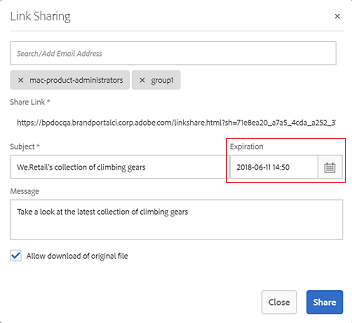

# Gestione dei diritti digitali delle risorse {#manage-digital-rights-of-assets}

Garantire la distribuzione e l'utilizzo sicuri delle risorse creative e il materiale del marchio sono essenziali per proteggere il marchio. Questo può essere applicato nell'organizzazione e all'esterno associando una data di scadenza (e un'ora) con risorse approvate pubblicate [!DNL AEM] , [!DNL Brand Portal]o tramite la licenza di tali risorse per uso condizionale. Inoltre, [!DNL Brand Portal] consente di specificare una data di scadenza per i collegamenti alle risorse condivise [!DNL Brand Portal].

Continuate a leggere per sapere in che modo le risorse sono protette e [!DNL Brand Portal] comprendere le autorizzazioni di utilizzo associate.

## Scadenza risorsa {#asset-expiration}

La scadenza delle risorse è un modo efficace per controllare l'utilizzo delle risorse approvate su Brand Portal all'interno di un'organizzazione. Tutte le risorse pubblicate da [!DNL AEM] Assets to Brand Portal possono avere una data di scadenza che limita l'utilizzo di tali risorse per ruoli utente diversi.

### Autorizzazioni di utilizzo correlate alle risorse scadute {#usage-permissions-expired-assets}

In [!DNL Brand Portal], gli amministratori possono visualizzare, scaricare e aggiungere risorse scadute alle raccolte. Mentre gli editor e i visualizzatori possono visualizzare e aggiungere solo risorse scadute alle raccolte.

Gli amministratori possono pubblicare risorse scadute da [!DNL AEM] Risorse a [!DNL Brand Portal]. Tuttavia, le risorse scadute non possono essere condivise tramite ink. [!DNL Brand Portal] Se selezionate una risorsa scaduta da una cartella contenente risorse scadute e non scadute, l'azione **[!UICONTROL Condividi collegamento]** non è disponibile. Tuttavia, se selezioni una cartella che contiene risorse scadute e non scadute, sono [!UICONTROL disponibili le azioni Condividi] e **[!UICONTROL Condividi collegamento]** .

>[!NOTE]
>
>Una cartella può essere condivisa come collegamento, anche se contiene risorse scadute. In questo caso, il collegamento non elenca le risorse scadute e vengono condivise solo le risorse non scadute.

Nella tabella seguente sono visualizzate le autorizzazioni di utilizzo delle risorse scadute:

|  | **Condivisione di collegamento** | **Scarica** | **Proprietà** | **Aggiungi alla raccolta** | **Elimina** |
|---|---|---|---|---|---|
| **Amministratore** | Non disponibile | Disponibile | Disponibile | Disponibile | Disponibile |
| **Editor** | Non disponibile | Non disponibile | Disponibile | Disponibile | Non disponibile |
| **Visualizzatore** | Non disponibile | Non disponibile | Disponibile | Disponibile | Non disponibile |
| **Utente ospite** | Non disponibile | Non disponibile | Disponibile | Disponibile | Non disponibile |

>[!NOTE]
>
>Se Visualizzatori e Editor scaricano una cartella contenente risorse scadute e non scadute, vengono scaricate solo le risorse non scadute. Se una cartella contiene solo risorse scadute, viene scaricata una cartella vuota.

### Stato di scadenza delle risorse {#expiration-status-of-assets}

Potete visualizzare lo stato di scadenza delle risorse nella vista a schede. Un flag rosso sulla scheda indica che la risorsa è scaduta.

>[!NOTE]
>
>Le visualizzazioni Elenco e Colonna non visualizzano lo stato di scadenza delle risorse.

## Scadenza collegamento risorsa {#asset-link-expiration}

Durante la condivisione di risorse tramite collegamenti, gli amministratori e gli editor possono impostare una data e un'ora della scadenza utilizzando il **[!UICONTROL campo Scadenza]** nella finestra **[!UICONTROL di]** dialogo Condivisione collegamenti. La scadenza predefinita del collegamento è di sette giorni dalla data in cui viene condiviso il collegamento.

Garantisce che le risorse condivise vengano condivise in base alla data e all'ora impostate da [!DNL Brand Portal] Amministratori e editor e non possono più essere visualizzate e scaricate oltre la data di scadenza. Poiché le risorse condivise mediante i collegamenti possono essere visualizzate anche da utenti esterni che non fanno parte dell'organizzazione, specificando la scadenza potete accertarvi che le risorse approvate siano protette e non esposte a entità sconosciute oltre un determinato intervallo di tempo.

Per ulteriori informazioni sulla condivisione di collegamenti, consulta [Condivisione di risorse come collegamento](../using/brand-portal-link-share.md).

## Risorse licenza {#licensed-assets}

Le risorse con licenza sono soggette all'accettazione di un contratto di licenza prima del download da Brand Portal. Questo contratto per le risorse con licenza viene fornito quando si scarica direttamente la risorsa da [!DNL Brand Portal] o tramite un collegamento condiviso. Se scaduta o meno, le risorse protette da licenza possono essere visualizzate da tutti gli utenti. Tuttavia, il download e l'utilizzo delle risorse scadute sono limitati. Per informazioni sul comportamento delle risorse scadute e sulle attività consentite basate sui ruoli utente, consultate le autorizzazioni [di utilizzo delle risorse scadute](../using/manage-digital-rights-of-assets.md#usage-permissions-expired-assets).

Alle risorse protette da licenza è [associato](https://helpx.adobe.com/experience-manager/6-5/assets/using/drm.html#DigitalRightsManagementinAssets) un contratto di licenza, che viene eseguito impostando la proprietà [dei metadati della risorsa](https://helpx.adobe.com/experience-manager/6-5/assets/using/drm.html#DigitalRightsManagementinAssets) in [!DNL AEM] Assets.

Se scegliete di scaricare le risorse protette da licenza, verrete reindirizzati alla [!UICONTROL pagina Gestione] copyright.

Qui è necessario selezionare la risorsa per scaricare e accettare il contratto di licenza associato. Se non accettate il contratto di licenza, il pulsante **[!UICONTROL Scarica]** non è abilitato.

Se la selezione contiene più risorse protette, selezionate una risorsa alla volta, accettate il contratto di licenza e continuate a scaricare la risorsa.

## Generare rapporti sulle risorse scadute {#generate-report-about-expired-assets}

Gli amministratori possono generare e scaricare un rapporto che elenca tutte le risorse scadute entro un intervallo specifico. Questo rapporto include informazioni dettagliate, quali dimensione, tipo, percorso che specifica la posizione della risorsa nella gerarchia delle risorse, quando la risorsa scade e quando è stata pubblicata la risorsa. Le colonne di questo rapporto possono essere personalizzate per visualizzare più dati in base ai requisiti utente.

Per ulteriori informazioni sulla funzione dei rapporti, consulta [Operazioni con i rapporti](../using/brand-portal-reports.md#work-with-reports).
