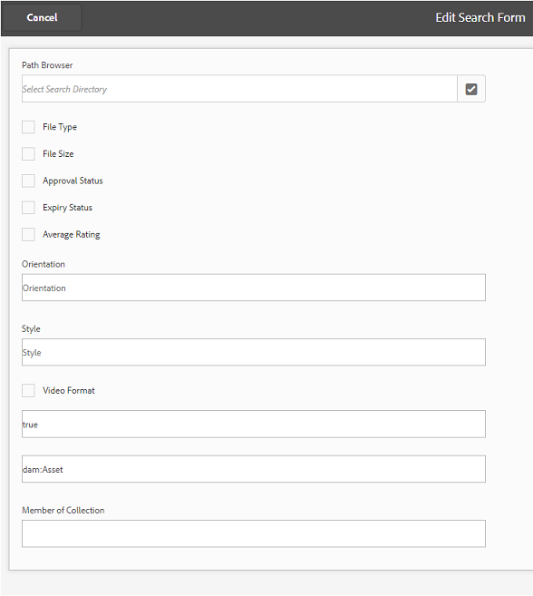

# Predefiniti, schemi e facet di Publish per Brand Portal {#publish-presets-schema-and-facets-to-brand-portal}

L’articolo si occupa della pubblicazione di predefiniti immagine, schemi di metadati e facet di ricerca personalizzata dall’istanza Autore AEM a Brand Portal. La funzionalità di pubblicazione consente alle organizzazioni di riutilizzare i predefiniti per immagini, gli schemi di metadati e i facet di ricerca creati o modificati in un’istanza Autore AEM. Questo approccio riduce gli sforzi di duplicazione.

>[!NOTE]
>
>La funzionalità per pubblicare i predefiniti immagine, lo schema metadati e i facet di ricerca dall’istanza di authoring dell’AEM a Brand Portal è disponibile a partire da AEM 6.2 SP1-CFP7 e AEM 6.3 SP 1-CFP 1 (6.3.1.1).

## Predefiniti immagine Publish per Brand Portal {#publish-image-presets-to-brand-portal}

I predefiniti per immagini sono un set di comandi di ridimensionamento e formattazione applicati all’immagine al momento della consegna. I predefiniti per immagini possono essere creati e modificati in Brand Portal. In alternativa, se un’istanza di AEM Author è in esecuzione in modalità Dynamic Medie, gli utenti possono creare predefiniti in AEM Author e pubblicarli in AEM Assets Brand Portal. Questo approccio evita di ricreare gli stessi predefiniti in Brand Portal.
Una volta creato, il predefinito viene elencato come rappresentazione dinamica nella barra delle rappresentazioni dei dettagli della risorsa e nella finestra di dialogo di download.

>[!NOTE]
>
>Se l&#39;istanza Autore AEM non è in esecuzione in **[!UICONTROL Modalità Dynamic Medie]** (il cliente non ha acquistato Dynamic Medie), la rappresentazione **[!UICONTROL Pyramid TIFF]** delle risorse non viene creata al momento del caricamento. I predefiniti immagine o le rappresentazioni dinamiche funzionano su **[!UICONTROL Pyramid TIFF]** di una risorsa. Pertanto, se **[!UICONTROL Pyramid TIFF]** non è disponibile nell&#39;istanza di creazione AEM, non sarà disponibile in Brand Portal. Di conseguenza, nella barra delle rappresentazioni della pagina dei dettagli della risorsa e della finestra di dialogo Scarica non sono presenti rappresentazioni dinamiche.

Per pubblicare i predefiniti immagine in Brand Portal:

1. Nell&#39;istanza Autore AEM, fai clic sul logo AEM per accedere alla console di navigazione globale, fai clic sull&#39;icona Strumenti e passa a **[!UICONTROL Assets > Predefiniti immagine]**.
1. Selezionare il predefinito immagine o più predefiniti immagine dall&#39;elenco dei predefiniti immagine e fare clic su **[!UICONTROL Da Publish a Brand Portal]**.

>[!NOTE]
>
>Quando gli utenti fanno clic su **[!UICONTROL Publish in Brand Portal]**, i predefiniti immagine sono in coda per la pubblicazione. Si consiglia agli utenti di monitorare il registro degli agenti di replica per verificare se la pubblicazione è stata eseguita correttamente.

Per annullare la pubblicazione di un predefinito immagine da Brand Portal:

1. Nell&#39;istanza Autore AEM, fai clic sul logo AEM per accedere alla console di navigazione globale, fai clic sull&#39;icona **[!UICONTROL Strumenti]** e passa a **[!UICONTROL Assets > Predefiniti immagine]**.
1. Selezionare un predefinito immagine e selezionare **[!UICONTROL Rimuovi da Brand Portal]** tra le opzioni disponibili nella parte superiore.

## Schema metadati Publish in Brand Portal {#publish-metadata-schema-to-brand-portal}

Lo schema metadati descrive il layout e le proprietà visualizzati nella pagina delle proprietà di risorse/raccolte.

 

Se gli utenti hanno modificato lo schema predefinito su un’istanza di AEM Author e desiderano utilizzare lo stesso schema predefinito su Brand Portal, pubblica i moduli schema metadati su Brand Portal. In questo caso, gli schemi predefiniti pubblicati dall’istanza di authoring dell’AEM sovrascrivono lo schema predefinito in Brand Portal.

Se nell’istanza Autore AEM è stato creato uno schema personalizzato, gli utenti possono pubblicarlo in Brand Portal anziché ricrearlo. Gli utenti possono quindi applicare questo schema personalizzato a qualsiasi cartella/raccolta in Brand Portal.

>[!NOTE]
>
>Gli schemi predefiniti non possono essere pubblicati in Brand Portal se sono stati bloccati nell’istanza AEM. In altre parole, non vengono modificati.

>[!NOTE]
>
>Se a una cartella è applicato uno schema nell’istanza Autore AEM, lo stesso schema deve esistere anche in Brand Portal. In questo modo è possibile mantenere la coerenza nella pagina delle proprietà delle risorse in AEM Author e Brand Portal.

Per pubblicare uno schema di metadati dall’istanza di authoring AEM a Brand Portal:

1. Nell&#39;istanza Autore AEM, fai clic sul logo AEM per accedere alla console di navigazione globale, fai clic sull&#39;icona Strumenti e passa a **[!UICONTROL Assets > Schemi di metadati]**.
1. Selezionare uno schema metadati e selezionare **[!UICONTROL Publish in Brand Portal]** tra le opzioni disponibili nella parte superiore.

>[!NOTE]
>
>Quando gli utenti fanno clic su **[!UICONTROL Publish in Brand Portal]**, gli schemi di metadati vengono messi in coda per la pubblicazione. Si consiglia agli utenti di monitorare il registro degli agenti di replica per verificare se la pubblicazione è stata eseguita correttamente.

Per annullare la pubblicazione di uno schema di metadati da Brand Portal:

1. Nell&#39;istanza Autore AEM, fai clic sul logo AEM per accedere alla console di navigazione globale, fai clic sull&#39;icona Strumenti e passa a **[!UICONTROL Assets > Schemi di metadati]**.
1. Selezionare uno schema metadati e selezionare **[!UICONTROL Rimuovi da Brand Portal]** tra le opzioni disponibili nella parte superiore.

## Facet di ricerca Publish in Brand Portal {#publish-search-facets-to-brand-portal}

I moduli di ricerca forniscono agli utenti di Brand Portal la funzionalità di [ricerca sfaccettata](../using/brand-portal-search-facets.md). I facet di ricerca conferiscono maggiore granularità alle ricerche su Brand Portal. Tutti i [predicati aggiunti](https://experienceleague.adobe.com/it/docs/experience-manager-65/content/assets/administer/search-facets) nel modulo di ricerca sono disponibili come facet di ricerca nei filtri di ricerca.

Per utilizzare un modulo di ricerca personalizzato nella **[!UICONTROL Barra di ricerca amministrazione di Assets]** dall&#39;istanza Autore AEM, pubblicarlo direttamente in Brand Portal, anziché ricrearlo.

>[!NOTE]
>
>Per pubblicare un modulo di ricerca bloccato su **[!UICONTROL Barra di ricerca amministrazione di Assets]** da AEM Assets a Brand Portal, devi prima modificarlo. Dopo la modifica e la pubblicazione, questo modulo di ricerca sostituisce il modulo di ricerca esistente in Brand Portal.

Per pubblicare il facet di ricerca modificato dall’istanza di creazione AEM in Brand Portal:

1. Fare clic sul logo dell&#39;AEM, quindi passare a **[!UICONTROL Strumenti > Generale > Cerca in Forms]**.
1. Selezionare il modulo di ricerca modificato e selezionare **[!UICONTROL Da Publish a Brand Portal]**.

   >[!NOTE]
   >
   >Quando gli utenti fanno clic su **[!UICONTROL Publish in Brand Portal]**, i facet di ricerca vengono messi in coda per la pubblicazione. Si consiglia agli utenti di monitorare il registro degli agenti di replica per verificare se la pubblicazione è stata eseguita correttamente.

Per annullare la pubblicazione dei moduli di ricerca da Brand Portal:

1. Nell&#39;istanza Autore AEM, fare clic sul logo AEM per accedere alla console di navigazione globale, quindi fare clic sull&#39;icona Strumenti e passare a **[!UICONTROL Generale > Cerca in Forms]**.
1. Selezionare il modulo di ricerca e selezionare **[!UICONTROL Rimuovi da Brand Portal]** tra le opzioni disponibili nella parte superiore.

>[!NOTE]
>
>L&#39;azione **[!UICONTROL Annulla pubblicazione da Brand Portal]** lascia il modulo di ricerca predefinito su Brand Portal e non ripristina l&#39;ultimo modulo di ricerca utilizzato prima della pubblicazione.

### Limitazioni {#limitations}

1. Pochi predicati di ricerca non sono applicabili ai filtri di ricerca sul Brand Portal. Quando questi predicati di ricerca vengono pubblicati come parte del modulo di ricerca dall’istanza di authoring AEM a Brand Portal, vengono filtrati. Gli utenti, pertanto, visualizzano meno predicati nel modulo pubblicato in Brand Portal. Vedi [predicati di ricerca applicabili ai filtri in Brand Portal](../using/brand-portal-search-facets.md#list-of-search-predicates).

1. Per il predicato [!UICONTROL Options], se un utente utilizza un percorso personalizzato per leggere le opzioni in un&#39;istanza dell&#39;istanza dell&#39;autore AEM, non funziona in Brand Portal. Questi percorsi e opzioni aggiuntivi non vengono pubblicati in Brand Portal con il modulo di ricerca. In questo caso, gli utenti possono selezionare l&#39;opzione **[!UICONTROL Manuale]** in **[!UICONTROL Aggiungi opzioni]** all&#39;interno di **[!UICONTROL Predicato opzioni]** per aggiungere queste opzioni manualmente in Brand Portal.

