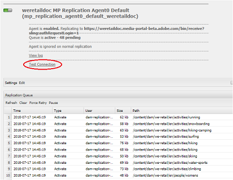

# Risolvere i problemi relativi alla pubblicazione parallela in Brand Portal {#troubleshoot-issues-in-parallel-publishing-to-brand-portal}

Brand Portal è configurato con Experience Manager Assets in modo che le risorse del brand approvate vengano acquisite (o pubblicate) direttamente dall’istanza di authoring di Experience Manager Assets. Una volta [configurata](../using/configure-aem-assets-with-brand-portal.md), Experience Manager Author utilizza un agente di replica per replicare una o più risorse selezionate in Brand Portal Cloud Service per l&#39;utilizzo approvato dagli utenti di Brand Portal. Per consentire la pubblicazione parallela ad alta velocità, vengono utilizzati più agenti di replica come Experience Manager 6.2 SP1-CFP5, Experience Manager CFP 6.3.0.2 e versioni successive.

>[!NOTE]
>
>Per garantire la corretta configurazione di Experience Manager Assets Brand Portal con Experience Manager Assets, l’Adobe consiglia di eseguire l’aggiornamento all’Experience Manager 6.4.1.0. Una limitazione nell’Experience Manager 6.4 genera un errore durante la configurazione di Experience Manager Assets con Brand Portal e la replica non riesce.

Durante la configurazione di un servizio cloud per Brand Portal in **[!UICONTROL /etc/cloudservice]**, tutti gli utenti e i token necessari vengono generati automaticamente e salvati nell&#39;archivio. Viene creata la configurazione del servizio cloud, vengono creati anche gli utenti del servizio necessari per gli agenti di replica e replica per replicare i contenuti. Vengono creati quattro agenti di replica. Quando si pubblicano numerose risorse da Experience Manager a Brand Portal, le risorse vengono messe in coda e distribuite tra gli agenti di replica tramite Round Robin.

Tuttavia, la pubblicazione può non riuscire in modo intermittente a causa di: processi sling di grandi dimensioni, aumento della rete e **[!UICONTROL I/O su disco]** nell&#39;istanza Autore Experience Manager o rallentamento delle prestazioni dell&#39;istanza Autore Experience Manager. L’Adobe consiglia di testare la connessione con uno o più agenti di replica prima di iniziare la pubblicazione.

## Risolvere i problemi relativi agli errori durante la prima pubblicazione: convalida della configurazione di pubblicazione {#troubleshoot-failures-in-first-time-publishing-validating-your-publish-configuration}

Per convalidare le configurazioni di pubblicazione:

1. Controlla i registri degli errori
1. Verifica se l’agente di replica è stato creato
1. Verifica connessione

**Registri code durante la creazione del Cloud Service**

Controlla i registri di coda. Controlla se l’agente di replica è stato creato o meno. Se la creazione dell’agente di replica non riesce, modifica il servizio Cloud apportando modifiche minori nel servizio Cloud. Convalida e verifica di nuovo se l’agente di replica è stato creato o meno. In caso contrario, modifica nuovamente il servizio.

Se durante la modifica ripetuta del servizio cloud non è configurato correttamente, segnala un ticket di Daycare.

**Verifica connessione con agenti di replica**

Visualizza registro, se nel registro di replica vengono rilevati errori:

1. Contatta l’Assistenza clienti.

1. Riprova [pulizia](../using/troubleshoot-parallel-publishing.md#clean-up-existing-config) e crea di nuovo la configurazione di pubblicazione.

<!--
Comment Type: remark
Last Modified By: Mini Gulati (mgulati)
Last Modified Date: 2018-06-21T22:56:21.256-0400

?? check and compare public key. At times public key is different

?? another thing to check in /useradmin

-->

## Pulisci configurazioni di pubblicazione Brand Portal esistenti {#clean-up-existing-config}

La pubblicazione spesso non riesce e viene restituito un errore &quot;401 unauthorized&quot; perché l’utente (ad esempio, `mac-<tenantid>-replication`) non dispone della chiave privata più recente e nei registri dell’agente di replica non viene segnalato alcun altro errore. In alternativa, potrebbe essere utile evitare la risoluzione dei problemi e creare una configurazione. Per il corretto funzionamento della nuova configurazione, ripulisci quanto segue dalla configurazione di Experience Manager Author:

1. Vai a `localhost:4502/crx/de/` (considerando che stai eseguendo l&#39;istanza di authoring su `localhost:4502:`)
i. Elimina `/etc/replication/agents.author/mp_replication`
ii. Elimina `/etc/cloudservices/mediaportal/<config_name>`

1. Vai a localhost:4502/useradmin:\
   i. Cerca l&#39;utente `mac-<tenantid>replication`
ii. Elimina questo utente

Ora, il sistema è tutto pulito. Ora è possibile tentare di creare una configurazione del servizio cloud e continuare a utilizzare l’applicazione JWT esistente. Non è necessario creare un’applicazione, ma devi aggiornare la chiave pubblica dalla nuova configurazione cloud creata.

>[!NOTE]
>
>Non modificare le impostazioni generate automaticamente.

## Problema di visibilità del tenant dell’applicazione JWT per Developer Connection {#developer-connection-jwt-application-tenant-visibility-issue}

Se il `https://legacy-oauth.cloud.adobe.io/`, vengono elencate tutte le organizzazioni (tenant) per le quali gli utenti correnti detengono l&#39;amministratore di sistema. Se non trovi il nome dell’organizzazione qui o non riesci a creare un’applicazione per un tenant richiesto qui, verifica di disporre di diritti sufficienti (per amministratori di sistema).

Nell’interfaccia utente è presente un problema noto a causa del quale per ogni tenant sono visibili solo le dieci applicazioni principali. Quando crei l’applicazione, resta su quella pagina e applica un segnalibro all’URL. Non andare alla pagina dell&#39;elenco dell&#39;applicazione e trovare l&#39;applicazione creata. Puoi premere direttamente questo URL con segnalibro e aggiornare o eliminare l’applicazione quando necessario.

L’applicazione JWT potrebbe non essere elencata correttamente. Pertanto, ti consigliamo di annotare o creare un segnalibro per l’URL durante la creazione di un’applicazione JWT.

## La configurazione in esecuzione smette di funzionare {#running-configuration-stops-working}

<!--
Comment Type: draft

If the running configuration stops working, either of the following two possibilities
<g class="gr_ gr_15 gr-alert gr_gramm gr_inline_cards gr_run_anim Grammar multiReplace" data-gr-id="15" id="15" style="font-size: 12px;">
are
</g> there:

1.
<g class="gr_ gr_14 gr-alert gr_gramm gr_inline_cards gr_run_anim Grammar only-ins doubleReplace replaceWithoutSep" data-gr-id="14" id="14">
Connection
</g> has failed, or

2. Publish has failed with permission to dam-replication-service denied, while connection has passed 

If the connection has failed [1], the
<g class="gr_ gr_10 gr-alert gr_spell gr_inline_cards gr_run_anim ContextualSpelling ins-del multiReplace" data-gr-id="10" id="10">
fail safe
</g> way to fix it is to <a href="../using/troubleshoot-parallel-publishing.md#main-pars-header-1664955658">clean up</a> the existing Brand Portal publish configuration and recreate a publish configuration. 

However, if the
<g class="gr_ gr_18 gr-alert gr_spell gr_inline_cards gr_run_anim ContextualSpelling" data-gr-id="18" id="18">
publish
</g> has failed with
<g class="gr_ gr_16 gr-alert gr_gramm gr_inline_cards gr_run_anim Grammar only-ins doubleReplace replaceWithoutSep" data-gr-id="16" id="16">
permission
</g> denied to dam-replication-service, raise a support ticket.

-->

Se un agente di replica (che stava effettuando la pubblicazione in Brand Portal al limite) interrompe l’elaborazione dei processi di pubblicazione, controlla i registri di replica. Experience Manager incorpora un nuovo tentativo automatico; pertanto, se una particolare risorsa non viene pubblicata correttamente, viene ritentata automaticamente. In caso di problemi intermittenti, ad esempio un errore di rete, l&#39;operazione potrebbe avere esito positivo durante un nuovo tentativo.

Se si verificano continui errori di pubblicazione e la coda è bloccata, controllare la **[!UICONTROL connessione di prova]**. Prova a risolvere gli errori segnalati.

In base agli errori, si consiglia di registrare un ticket di supporto, in modo che il team di progettazione Brand Portal possa aiutarti a risolvere i problemi.

## Token di configurazione IMS Brand Portal scaduto {#token-expired}

Se l’ambiente Brand Portal si arresta bruscamente, è possibile che le configurazioni IMS non funzionino correttamente. Il sistema mostra una configurazione IMS non integra e visualizza un messaggio di errore (simile al seguente) indicante che il token di accesso è scaduto.

`com.adobe.granite.auth.oauth.AccessTokenProvider failed to get access token from authorization server status: 400 response: Unknown macro: {"error"}`

Per risolvere questo problema, l’Adobe consiglia di salvare e chiudere manualmente la configurazione IMS e di controllare nuovamente lo stato di integrità. Se le configurazioni non funzionano, eliminale e creane una nuova.

## Configurare gli agenti di replica per evitare errori di timeout della connessione {#connection-timeout}

In genere, il processo di pubblicazione non riesce e genera un errore di timeout se nella coda di replica sono presenti più richieste in sospeso. Per risolvere questo problema, assicurati che gli agenti di replica siano configurati in modo da evitare il timeout.

Per configurare gli agenti di replica:

1. Accedi all’istanza Autore di AEM Assets.
1. Dal pannello **Strumenti**, passa a **[!UICONTROL Distribuzione]** > **[!UICONTROL Replica]**.
1. Nella pagina Replica fare clic su **[!UICONTROL `Agents on author`]**. Puoi vedere i quattro agenti di replica del tuo tenant Brand Portal.
1. Fai clic sull&#39;URL dell&#39;agente di replica e fai clic su **[!UICONTROL Modifica]**.
1. In Impostazioni agente fare clic sulla scheda **[!UICONTROL Esteso]**.
1. Selezionare la casella di controllo **[!UICONTROL Chiudi connessione]**.
1. Ripeti i passaggi da 4 a 7 per configurare tutti e quattro gli agenti di replica.
1. Riavviare il server.
