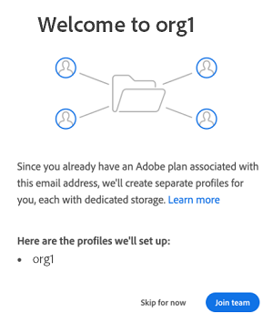
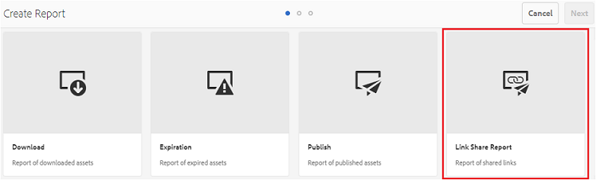
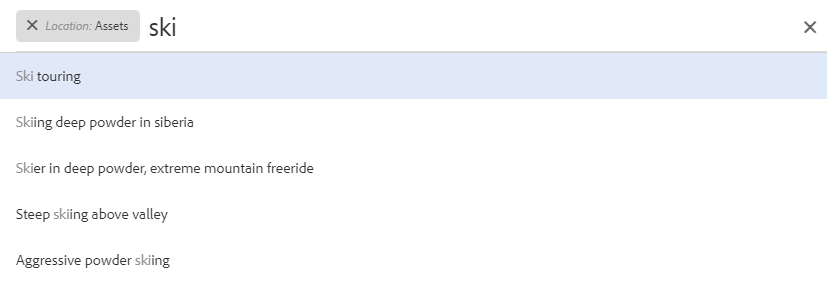

# Novità di Experience Manager Assets Brand Portal {#what-s-new-in-aem-assets-brand-portal}

Adobe Experience Manager Assets Brand Portal consente di acquisire facilmente, controllare e distribuire in modo sicuro risorse creative approvate a parti esterne e utenti aziendali interni su più dispositivi. Consente di migliorare l’efficienza della condivisione delle risorse, ne accelera il time-to-market e riduce il rischio di non conformità e accesso non autorizzato. Adobe si adopera per migliorare l’esperienza complessiva di Brand Portal. Ecco un’anteprima delle nuove funzioni e dei miglioramenti.

## Che cosa è cambiato nella versione 2024.10.0 {#what-changed-in-October-2024}

Brand Portal 2024.10.0 è una versione interna che include correzioni ai problemi critici. Consulta le [note sulla versione di Brand Portal](brand-portal-release-notes.md) più recenti.

## Che cosa è cambiato nella versione 2024.02.0 {#what-changed-in-February-2024}

Brand Portal 2024.02.0 è una versione interna che include correzioni ai problemi critici. Consulta le [note sulla versione di Brand Portal](brand-portal-release-notes.md) più recenti.

## Che cosa è cambiato nella versione 2023.10.0 {#what-changed-in-October-2023}

Brand Portal 2023.10.0 è una versione interna che include correzioni ai problemi critici. Consulta le [note sulla versione di Brand Portal](brand-portal-release-notes.md) più recenti.

## Che cosa è cambiato nella versione 2023.08.0 {#what-changed-in-August-2023}

Brand Portal 2023.08.0 è una versione interna che include correzioni ai problemi critici. Consulta le [note sulla versione di Brand Portal](brand-portal-release-notes.md) più recenti.

## Che cosa è cambiato nella versione 2023.05.0 {#what-changed-in-May-2023}

Brand Portal 2023.05.0 è una versione interna che include correzioni ai problemi critici. Consulta le [note sulla versione di Brand Portal](brand-portal-release-notes.md) più recenti.

## Che cosa è cambiato nella versione 2023.02.0 {#what-changed-in-February-2023}

Brand Portal 2023.02.0 è una versione interna che include correzioni ai problemi critici. Consulta le [note sulla versione di Brand Portal](brand-portal-release-notes.md) più recenti.

## Che cosa è cambiato nella versione 2022.10.0 {#what-changed-in-October-2022}

Brand Portal 2022.10.0 è una versione interna che include correzioni ai problemi critici. Consulta le [note sulla versione di Brand Portal](brand-portal-release-notes.md) più recenti.

## Che cosa è cambiato nella versione 2022.08.0 {#what-changed-in-August-2022}

Brand Portal 2022.08.0 è una versione interna che include correzioni ai problemi critici. Consulta le [note sulla versione di Brand Portal](brand-portal-release-notes.md) più recenti.

## Che cosa è cambiato nella versione 2022.05.0 {#what-changed-in-May-2022}

Brand Portal ora esegue processi automatici ogni dodici ore per eliminare tutte le risorse Brand Portal pubblicate in AEM. Di conseguenza, non è necessario eliminare le risorse manualmente nella cartella di contributi per mantenerne le dimensioni al di sotto del limite di soglia. È possibile monitorare anche lo stato dei processi di eliminazione eseguiti automaticamente utilizzando l’opzione **[!UICONTROL Strumenti]** > **[!UICONTROL Stato contributo risorse]** > **[!UICONTROL Rapporti di eliminazione]** in Brand Portal. Il rapporto di un processo fornisce i seguenti dettagli:

* Tempo di inizio del processo
* Ora di fine del processo
* Stato del processo
* Risorse totali incluse in un processo
* Risorse totali eliminate correttamente in un processo
* Archiviazione totale resa disponibile in seguito all’esecuzione del processo

È possibile anche approfondire ulteriormente per visualizzare i dettagli di ciascuna risorsa inclusa in un processo di eliminazione. Dettagli quali titolo della risorsa, dimensione, authoring, stato di eliminazione e tempo di eliminazione sono inclusi nel rapporto.

Inoltre, in Brand Portal 2022.05.0 sono incluse correzioni ai problemi critici. Consulta le [note sulla versione di Brand Portal](brand-portal-release-notes.md) più recenti.

## Che cosa è cambiato nella versione 2022.02.0 {#what-changed-in-Feb-2022}

Brand Portal 2022.02.0 è una versione interna che include correzioni ai problemi critici. Consulta le [note sulla versione di Brand Portal](brand-portal-release-notes.md) più recenti.

## Che cosa è cambiato nella versione 2021.10.0 {#what-changed-in-october-2021}

Brand Portal 2021.10.0 è una versione interna che include correzioni ai problemi critici. Consulta le [note sulla versione di Brand Portal](brand-portal-release-notes.md) più recenti.

## Che cosa è cambiato nella versione 2021.08.0 {#what-changed-in-august-2021}

Brand Portal 2021.08.0 è una versione interna che introduce profili aziendali per clientela team e aziendale, per consentire alle organizzazioni di controllare meglio le proprie risorse. Gli utenti ora dispongono di diritti specifici per le organizzazioni nuove e migrate. Durante la migrazione, tutti gli account Adobe ID esistenti vengono migrati agli ID business.

* ID business per tutte le organizzazioni nuove ed esistenti dopo la migrazione.
* Gli ID business non richiedono alcuna configurazione specifica, come la dichiarazione di un dominio o l’impostazione di un SSO.
* È possibile aggiungere utenti con qualsiasi indirizzo e-mail, compresi i domini di e-mail pubblici come gmail.com o outlook.com.

**Impatto sugli utenti di Brand Portal**

La migrazione non ha alcun impatto su set di dati, risorse, utenti o impostazioni esistenti. L’unica modifica interna che avviene durante la migrazione è l’adesione dell’organizzazione esistente ai profili business.

>[!NOTE]
>
>I profili aziendali sono attualmente applicabili per le nuove organizzazioni create dopo il 16 agosto 2021.
>
>Fino alla migrazione dell’organizzazione, è possibile continuare a utilizzare i tipi Adobe ID, Enterprise ID o Federated ID per accedere all’organizzazione.

### Articoli di riferimento {#reference-articles}

* [Introduzione ai profili Adobe](https://helpx.adobe.com/it/enterprise/kb/introducing-adobe-profiles.html)

* [Gestione dei profili Adobe](https://helpx.adobe.com/it/enterprise/using/manage-adobe-profiles.html)

* [Aggiornamento dell’esperienza di accesso per utenti e amministratori](https://helpx.adobe.com/it/enterprise/using/storage-for-business.html#new-admin-sign-in-exp)

* [Accesso limitato durante la migrazione](https://helpx.adobe.com/it/enterprise/kb/account-temporarily-unavailable.html)

* [Gestione degli utenti in Admin Console](https://helpx.adobe.com/it/enterprise/using/manage-users-individually.html)

* [Gestione dei profili di prodotto per gli utenti aziendali](https://helpx.adobe.com/it/enterprise/using/manage-product-profiles.html#assign-users)

* [Affidabilità del dominio](https://helpx.adobe.com/it/enterprise/admin-guide.html/enterprise/using/set-up-identity.html#directory-trusting)

<!--   
### Add new users to T2E organization   {#add-users-to-T2E-org}

On adding a new user in Admin Console for a new or migrated T2E organization, the user will have to perform an additional step **Join Team** to get entitled to the T2E organization. 

The user is entitled only if the user chooses to **Join Team**, otherwise the user won't get access to the selected T2E organization in Brand Portal. 

>[!NOTE]
>
>The workflow is not applicable to the existing Brand Portal users.

### Additional screen while navigating to Admin Console   {#navigate-to-admin-console}

The administrators will have to perform an additional step of selecting the T2E organization while navigating from Brand Portal to Admin Console. The workflow applies on the new and migrated T2E organizations.   

Selection of the T2E organization is a one-time activity and is not required everytime the administrator navigates from Brand Portal to Admin Console.

1. Log in to a T2E organization in Brand Portal as administrator.
1. Go to **[!UICONTROL Tools]** > **[!UICONTROL Users]** > **[!UICONTROL Management]** and click on the link **[!UICONTROL Launch Admin Console]**. 

   Or, go to **[!UICONTROL Unified Shell]** > **[!UICONTROL Administration]** and click on the link **[!UICONTROL Launch Admin Console]**. 
1. Search the T2E organization to login to Admin Console.

   

### Restriction during migration of an organization   {#login-restriction}

When an organization is undergoing T2E migration, the users of that organization will not be able to login to Brand Portal. The following error message appears on the screen. However, the migration won't impact the active user session until the token expires. 

Once the migration is complete, the users can login to Brand Portal. The users will receive an email notification containing the entitlement changes. If the users are entitled to more than one organization, they will have to select the organization at the time of login. 
-->

<!--
For a new or migrated T2E orgnization, the users will have an organization specific entitlement. A user can have multiple entitlements with the same email id for different T2E organizations. 
-->

## Che cosa è cambiato nella versione 2021.06.0 {#what-changed-in-june-2021}

Brand Portal 2021.06.0 è una versione interna che include correzioni ai problemi critici. Consulta le [note sulla versione di Brand Portal](brand-portal-release-notes.md) più recenti.

## Che cosa è cambiato nella versione 2021.02.0 {#what-changed-in-feb-2021}

Brand Portal 2021.02.0 migliora AEM Assets as a Cloud Service grazie al flusso di lavoro di attivazione e alla funzione Fornitura di risorse. Inoltre, migliora l’esperienza di download delle risorse e include correzioni critiche. Consente anche agli amministratori di configurare il comportamento predefinito di download di cartelle, raccolte e download in blocco di risorse a livello di tenant. Anche il **[!UICONTROL Rapporto utilizzo]** di Brand Portal è stato modificato per riflettere gli utenti attivi di Brand Portal.

>[!IMPORTANT]
>
> * Brand Portal è attualmente in manutenzione.
> * Puoi contattare il tuo rappresentante Adobe con i dettagli del caso d’uso e i requisiti specifici per attivare Brand Portal utilizzando Cloud Manager.
> * Brand Portal non è disponibile con Assets Prime o Assets Ultimate. Tuttavia, i clienti esistenti di Assets Cloud Services che hanno già accesso a Brand Portal possono mantenerlo quando passano ad Assets Ultimate.

<!--

### Activate Brand Portal on AEM Assets as a Cloud Service {#bp-automation-on-cloud-service}

AEM Assets as a Cloud Service is now entitled to have a pre-configured Brand Portal instance. The Cloud Manager user can activate Brand Portal on the AEM Assets as a Cloud Service instance.

Earlier, AEM Assets as a Cloud Service was manually configured with Brand Portal using Adobe Developer Console.

The Cloud Manager user triggers the activation workflow that creates the required configurations at the backend and activates Brand Portal on the same IMS org as of the AEM Assets as a Cloud Service instance. 

To activate Brand Portal on your AEM Assets as a Cloud Service instance:

1. Log in to Adobe Cloud Manager and navigate to **[!UICONTROL Environments]**.
1. Select the environments (one by one) from the list. Once you find the environment associated with Brand Portal, click on the **[!UICONTROL Activate Brand Portal]** button to begin the activation workflow. 
1. Once the Brand Portal tenant is activated, the status changes to Activated.

See [activate Brand Portal on AEM Assets as a Cloud Service](https://experienceleague.adobe.com/it/docs/experience-manager-cloud-service/content/assets/brand-portal/configure-aem-assets-with-brand-portal).

### Asset Sourcing on AEM Assets as a Cloud Service {#asset-sourcing-on-cloud-service}

The Asset Sourcing feature is now available on AEM Assets as a Cloud Service. The feature is by default enabled for all the cloud service users. The permitted Brand Portal users can contribute to Asset Sourcing by uploading new assets to the contribution folders and publish the contribution folder from Brand Portal to AEM Assets as a Cloud Service instance. Administrators can review and approve contributions from Brand Portal users before distributing them to other users.     

Earlier, Asset Sourcing was only available on AEM Assets (on premise and managed service). 

See [Asset Sourcing in Brand Portal](https://experienceleague.adobe.com/it/docs/experience-manager-brand-portal/using/asset-sourcing-in-brand-portal/brand-portal-asset-sourcing).
-->

### Download risorsa {#asset-download-setting}

Oltre alle **[!UICONTROL Impostazioni di download]** esistenti, gli amministratori di Brand Portal possono ora configurare l’impostazione **[!UICONTROL Download risorsa]**. Questa impostazione consente agli amministratori di gestire il comportamento predefinito di download di cartelle, raccolte e download in blocco di risorse (più di 20 risorse) a livello di tenant.

<!--
Earlier, all the asset renditions were directly downloaded in a zip folder in case of folder, collection, and bulk download of assets. As the **[!UICONTROL Download]** dialog box is skipped for folders or collections, there was no mechanism to control the downloading behaviour of the assets. Due to this, the users were finding it difficut to search for a particular asset rendition from a folder containing huge bunch of downloaded renditions. 
-->

In precedenza, tutte le rappresentazioni della risorsa venivano scaricate direttamente in una cartella zip. La finestra di dialogo **[!UICONTROL Download]** veniva ignorata per cartelle e raccolte. Inoltre, non esisteva alcun metodo per controllare il comportamento di download delle risorse, rendendo difficile la ricerca di una particolare rappresentazione da molti download.

L’impostazione **[!UICONTROL Download risorsa]** fornisce ora un’opzione per creare una cartella separata per ogni risorsa durante il download di cartelle, raccolte o risorse in blocco.

Se l’impostazione **[!UICONTROL Download risorsa]** è disabilitata, le cartelle o le raccolte vengono scaricate in una cartella zip contenente tutte le rappresentazioni delle risorsa nella stessa cartella, a eccezione del download delle risorsa che utilizza il collegamento di condivisione.

Accedi al tenant di Brand Portal come amministratore e passa a **[!UICONTROL Strumenti]** > **[!UICONTROL Download]**. Gli amministratori possono abilitare l’impostazione **[!UICONTROL Download risorsa]** per creare una cartella separata per ogni risorsa durante il download di cartelle, raccolte e risorse in blocco.

Consulta [scaricare risorse da Brand Portal](https://experienceleague.adobe.com/it/docs/experience-manager-brand-portal/using/download/brand-portal-download-assets).
<!--
### Download using Share link {#download-using-share-link}

The default behavior of downloading the assets using share link is now independent of the **[!UICONTROL Download Settings]**. A separate folder is created for each asset while downloading the assets using share link. 
-->

### Rapporto utilizzo {#usage-report}

Il **[!UICONTROL Rapporto utilizzo]** di Brand Portal è stato modificato per riflettere solo gli utenti attivi di Brand Portal. Gli utenti di Brand Portal che non sono assegnati ad alcun profilo di prodotto nell’Admin Console sono considerati utenti inattivi e non vengono riflessi nel **[!UICONTROL Report utilizzo]**.

In precedenza, sia gli utenti attivi che quelli inattivi venivano mostrati in Rapporto utilizzo.

## Che cosa è cambiato nella versione 2020.10.0 {#what-changed-in-oct-2020}

Brand Portal 2020.10.0 è una versione migliorata che si concentra sulla semplificazione dell’esperienza di download della risorsa e include correzioni critiche. Questo miglioramento introduce un flusso di lavoro nuovo e migliorato per i download della risorsa, con opzioni per escludere le rappresentazioni e i download diretti dal pannello **[!UICONTROL Rappresentazioni]**. Consente inoltre di configurare i diritti di accesso e download per gruppi di utenti specifici e offre un’esplorazione semplice tra file, raccolte e collegamenti condivisi da tutte le pagine di Brand Portal. Consulta le [note sulla versione di Brand Portal](brand-portal-release-notes.md).

### Esperienza di download semplificata {#download-dialog}

In precedenza, la finestra di dialogo **[!UICONTROL Download]** offriva più opzioni, come la creazione di cartelle separate per ogni risorsa, l’invio tramite e-mail delle risorse, la selezione delle risorse originali e altro ancora. Queste opzioni creavano confusione per gli utenti non tecnici o nuovi, in particolare durante il download di più risorse o cartelle. Inoltre, l’utente non poteva visualizzare tutte le rappresentazioni della risorsa o escludere una specifica rappresentazione personalizzata o dinamica.

La nuova finestra di dialogo **[!UICONTROL Download]** generalizza il processo di selezione e filtraggio della risorsa facilitando l’adozione di decisioni efficaci da parte degli utenti di Brand Portal durante il download delle rappresentazioni della risorsa. Elenca tutte le risorse selezionate e le relative rappresentazioni in base alla configurazione [**[!UICONTROL Download]**](brand-portal-download-assets.md) e alle impostazioni di **[!UICONTROL Download]**.

>[!NOTE]
>
>Per impostazione predefinita, tutti gli utenti dispongono del **[!UICONTROL Download rapido]** abilitato ed è necessario che IBM® [Aspera Connect 3.9.9](https://www.ibm.com/support/fixcentral/swg/selectFixes?parent=ibm~Other%20software&amp;product=ibm/Other+software/IBM+Aspera+Connect&amp;release=3.9.9&amp;platform=All&amp;function=all) sia installato nell’estensione del browser prima del download della risorsa da Brand Portal.

<!--
If any of the **[!UICONTROL Custom Rendition]** or **[!UICONTROL System Rendition]** is enabled in the [**[!UICONTROL Download]**](brand-portal-download-assets.md) configuration and **[!UICONTROL Download]** settings are enabled for the group users, the new **[!UICONTROL Download]** dialog box appears with all the renditions of the selected assets or folders containing assets in a List View. 
-->

Dalla finestra di dialogo **[!UICONTROL Download]** gli utenti possono:

* Visualizzare tutte le rappresentazioni disponibili di qualsiasi risorsa nell’elenco di download.
* Escludere le rappresentazioni della risorsa che non sono necessarie per il download.
* Applicare lo stesso set di rappresentazioni a tutti i tipi di risorse simili con un solo clic.
* Applicare un diverso set di rappresentazioni per diversi tipi di risorse.
* Creare una cartella separata per ogni risorsa.
* Scaricare le risorse selezionate e le relative rappresentazioni.

Il flusso di lavoro di download è coerente per le risorse autonome, le risorse multiple, le cartelle con risorse, le risorse con o senza licenza e quando si scaricano le risorse tramite un collegamento di condivisione. Consulta i [passaggi per scaricare le risorse da Brand Portal](https://experienceleague.adobe.com/it/docs/experience-manager-brand-portal/using/download/brand-portal-download-assets).

### Navigazione rapida {#quick-navigation}

In precedenza, l’opzione per visualizzare **[!UICONTROL file]**, **[!UICONTROL raccolte]** e **[!UICONTROL collegamenti condivisi]** era nascosta e richiedeva più clic ogni volta che l’utente desiderava passare a un’altra visualizzazione.

In Brand Portal 2020.10.0, gli utenti possono passare a **[!UICONTROL file]**, **[!UICONTROL raccolte]** e **[!UICONTROL collegamenti condivisi]** da tutte le pagine di Brand Portal con un solo clic, utilizzando i collegamenti di navigazione rapida.

### Pannello rappresentazione migliorato {#rendition-panel}

In precedenza, gli utenti potevano visualizzare la risorsa originale e le relative rappresentazioni nel pannello **[!UICONTROL Rappresentazioni]** solo se una delle **[!UICONTROL rappresentazioni personalizzate]** o **[!UICONTROL rappresentazioni di sistema]** era abilitata nella configurazione di **[!UICONTROL Download]**. Inoltre, gli utenti dovevano scaricare tutte le rappresentazioni della risorsa, poiché non esisteva alcun filtro per escludere rappresentazioni personalizzate o dinamiche specifiche che non erano necessarie.

<!--
Earlier, if any of the custom or system renditions was enabled in the **[!UICONTROL Download]** settings, an additional **[!UICONTROL Download]** dialog box appeared on clicking the **[!UICONTROL Download]** button wherein the user had to manually select the set of renditions (original asset, custom renditions, dynamic renditions) to download.
There was no filter to exclude specific custom or dynamic renditions which were not required for download.
-->

In Brand Portal 2020.10.0, gli utenti possono escludere rappresentazioni specifiche e [scaricare direttamente le rappresentazioni selezionate dal pannello Rappresentazioni](brand-portal-download-assets.md#download-assets-from-asset-details-page) nella pagina dei dettagli risorsa senza dover aprire la finestra di dialogo **[!UICONTROL Download]**.

<!-- 
In Brand Portal 2020.10.0, direct download and exclude renditions features are introduced in the **[!UICONTROL Renditions]** panel on the asset details page. All the renditions (original asset, custom renditions, dynamic renditions) under the rendition panel are now associated with a check box and are enabled by default. 

The user can clear the check boxes to exclude the renditions which are not required for download. And can click on the **[!UICONTROL Download]** button in the **[!UICONTROL Renditions]** panel to directly download the selected set of renditions in a zip folder without having to open the **[!UICONTROL Download]** dialog box.
-->

### Configurare le impostazioni di download {#download-permissions}

Gli amministratori di Brand Portal ora possono configurare le impostazioni affinché i gruppi di utenti possano visualizzare o scaricare risorse e rappresentazioni originali, o entrambe, dalla pagina dei dettagli risorsa, oltre alle configurazioni esistenti di **[!UICONTROL download]**.

Accedi al tenant di Brand Portal come amministratore e passa a **[!UICONTROL Strumenti]** > **[!UICONTROL Utenti]**.

Nella pagina **[!UICONTROL Ruoli utente]**, passa alla scheda **[!UICONTROL Gruppi]** per configurare le impostazioni di visualizzazione e/o download per i gruppi di utenti.

In precedenza, le impostazioni erano disponibili solo per impedire agli utenti del gruppo di scaricare la risorsa originale.

La scheda **[!UICONTROL Gruppi]** nella pagina **[!UICONTROL Ruoli utente]** consente agli amministratori di configurare le impostazioni di visualizzazione e download:

* Se entrambe le impostazioni **[!UICONTROL Download originale]** e **[!UICONTROL Download rappresentazioni]** sono attivate, gli utenti del gruppo selezionato possono visualizzare e scaricare le risorse originali e le relative rappresentazioni.
* Se entrambe le impostazioni sono disattivate, gli utenti possono visualizzare solo le risorse originali. Le rappresentazioni della risorsa non sono visibili agli utenti nella pagina dei dettagli risorsa.
* Se è attivata solo l’impostazione **[!UICONTROL Download originale]**, gli utenti potranno visualizzare e scaricare solo le risorse originali dalla pagina dei dettagli risorsa.
* Se è attivata solo l’impostazione **[!UICONTROL Download rappresentazioni]**, gli utenti potranno visualizzare la risorsa originale ma non potranno scaricarla. Tuttavia, l’utente può visualizzare e scaricare le rappresentazioni della risorsa.

Consulta [configurare il download della risorsa](https://experienceleague.adobe.com/it/docs/experience-manager-brand-portal/using/download/brand-portal-download-assets#configure-download-permissions).

>[!NOTE]
>
>Se un utente viene aggiunto a più gruppi e uno di questi ha delle restrizioni, queste si applicano all’utente.

<!--
>Restrictions to access the original asset and their renditions do not apply to administrators even if they are members of restricted groups.
 >
 >The users can always download assets and their renditions from the repository using a `curl` request even if the download configurations are turned-off.
 >
-->

## Che cosa è cambiato nella versione 6.4.7 {#what-changed-in-647}

La versione di Brand Portal 6.4.7 apporta il visualizzatore di documenti, migliora l’esperienza di download delle risorse e include correzioni critiche. Consulta le [note sulla versione di Brand Portal](brand-portal-release-notes.md) più recenti.

<!--
Brand Portal 6.4.7 release brings in the Document Viewer, leverages the Brand Portal administrators to configure asset download, and centers top customer requests. See latest [Brand Portal Release Notes](brand-portal-release-notes.md).
-->

### Visualizzatore di documenti {#doc-viewer}

Il visualizzatore di documenti migliora l’esperienza di visualizzazione di PDF. Offre un’esperienza simile a quella di Adobe Document Cloud quando si visualizzano i file PDF in Brand Portal.

In precedenza erano disponibili opzioni limitate per visualizzare i file PDF.

Gli utenti di Brand Portal possono utilizzare il visualizzatore di documenti per visualizzare pagine e segnalibri, cercare testo, ingrandire, ridurre e navigare tra le pagine. Possono passare a una pagina specifica, adattare a una finestra o a una schermata e attivare o disattivare la visibilità della barra degli strumenti.

>[!NOTE]
>
>L’esperienza di visualizzazione per altri formati di documento rimane invariata.

### Esperienza di download {#download-configurations}

Il processo di download della risorsa è stato rinnovato, offrendo un’esperienza utente semplificata durante il [download di risorse da Brand Portal](brand-portal-download-assets.md).

Il flusso di lavoro esistente per il download di risorse da Brand Portal è inevitabilmente seguito dalla visualizzazione di una finestra di dialogo **[!UICONTROL Download]** con più opzioni di download tra cui scegliere.

In Brand Portal 6.4.7, gli amministratori possono configurare le impostazioni di **[!UICONTROL download]** della risorsa. Le configurazioni disponibili sono:

* **[!UICONTROL Download veloce]**
* **[!UICONTROL Rappresentazioni personalizzate]**
* **[!UICONTROL Rappresentazioni di sistema]**

L’amministratore di Brand Portal può abilitare qualsiasi combinazione per configurare il download delle risorsa.

<!--In Brand Portal 6.4.7, fast download, custom renditions, and system renditions are the three configurations available.-->

* Se entrambe le configurazioni **[!UICONTROL Rappresentazioni personalizzate]** e **[!UICONTROL Rappresentazioni di sistema]** sono disattivate, le rappresentazioni originali delle risorse vengono scaricate senza ulteriori finestre di dialogo, per semplificare l’esperienza di download per gli utenti di Brand Portal.

* Se è abilitata una delle configurazioni **[!UICONTROL Rappresentazioni personalizzate]** o **[!UICONTROL Rappresentazioni di sistema]**, viene visualizzata la finestra di dialogo **[!UICONTROL Scarica]** e vengono scaricate la risorsa originale e le relative rappresentazioni. L’abilitazione della configurazione **[!UICONTROL Download rapido]** accelera il processo di download.

In base alla configurazione, il flusso di lavoro di download rimane costante per singole risorse, risorse multiple e cartelle contenenti risorse. Sono incluse anche le risorse con licenza o senza licenza e il download di risorse tramite un collegamento di condivisione.

## Modifiche apportate alla versione 6.4.6 {#what-changed-in-646}

In Brand Portal 6.4.6, è stato cambiato il canale delle autorizzazioni tra AEM Assets e Brand Portal. Brand Portal è ora supportato da AEM Assets as a Cloud Service, AEM Assets 6.3 e versioni successive. In AEM Assets 6.3 e versioni successive, Brand Portal era inizialmente configurato nell’interfaccia classica utilizzando il gateway OAuth precedente. Questo gateway utilizza lo scambio di token JWT per ottenere un token di accesso IMS per l’autorizzazione. AEM Assets è ora configurato con Brand Portal tramite Adobe Developer Console, che fornisce un token IMS per l’autorizzazione del tenant di Brand Portal.

<!-- The steps to configure integration are different depending on your AEM version, and whether you are configuring for the first-time, or upgrading the existing integration:
-->

<!--
  
   | **AEM Version** |**New Integration** |**Upgrade Integration** |
|---|---|---|
| **AEM 6.5** |[Create new integration](../using/brand-portal-configure-integration-65.md) |[Upgrade existing integration](../using/brand-portal-configure-integration-65.md#upgrade-integration-65) | 
| **AEM 6.4** |[Create new integration](../using/brand-portal-configure-integration-64.md) |[Upgrade existing integration](../using/brand-portal-configure-integration-64.md#upgrade-integration-64) | 
| **AEM 6.3** |[Create new integration](../using/brand-portal-configure-integration-63.md) |[Upgrade existing integration](../using/brand-portal-configure-integration-63.md#upgrade-integration-63) | 
| **AEM 6.2** | | 

   -->

Per configurare AEM Assets con Brand Portal si seguono passaggi diversi a seconda della versione di AEM in uso e se si tratta della prima configurazione o dell’aggiornamento di configurazioni esistenti:

<!--| **AEM Version** |**New Configuration** |**Upgrade Configuration** |
|---|---|---|
| **AEM 6.5 (6.5.4.0 and above)** |[Create configuration](../using/brand-portal-configure-integration-65.md) |[Upgrade configuration](../using/brand-portal-configure-integration-65.md#upgrade-integration-65) | 
| **AEM 6.4 (6.4.8.0 and above)** |[Create configuration](../using/brand-portal-configure-integration-64.md) |[Upgrade configuration](../using/brand-portal-configure-integration-64.md#upgrade-integration-64) | 
| **AEM 6.3 (6.3.3.8 and above)** |[Create configuration](../using/brand-portal-configure-integration-63.md) |[Upgrade configuration](../using/brand-portal-configure-integration-63.md#upgrade-integration-63) | 

-->

<!-- AEM Assets configuration with Brand Portal on Adobe I/O is supported on:
* AEM 6.5.4.0 and above
* AEM 6.4.8.0 and above
* AEM 6.3.3.8 and above -->

| **Versione di AEM** | **Nuova configurazione** | **Aggiornamento della configurazione** |
|---|---|---|
| **AEM Assets as a Cloud Service** | [Creare una configurazione](https://experienceleague.adobe.com/it/docs/experience-manager-cloud-service/content/assets/brand-portal/configure-aem-assets-with-brand-portal) | - |
| **AEM 6.5 (6.5.4.0 e versioni successive)** | [Creare una configurazione](https://experienceleague.adobe.com/it/docs/experience-manager-65/content/assets/brandportal/configure-aem-assets-with-brand-portal) | [Aggiornare una configurazione](https://experienceleague.adobe.com/it/docs/experience-manager-65/content/assets/brandportal/configure-aem-assets-with-brand-portal#upgrade-integration-65) |

>[!NOTE]
>
>Adobe consiglia di aggiornare l’istanza di AEM con il service pack più recente.

Consulta le [note sulla versione di Brand Portal](brand-portal-release-notes.md).

Consulta [Domande frequenti su Brand Portal](brand-portal-faqs.md).

## Modifiche apportate alla versione 6.4.5 {#what-changed-in-645}

Brand Portal 6.4.5 consente ad agenzie e team esterni di caricare contenuti in Brand Portal e pubblicarli in AEM Assets, senza dover accedere all’ambiente di authoring. Questa funzione è denominata **[Fornitura di risorse in Brand Portal](brand-portal-asset-sourcing.md)** e migliora l’esperienza della clientela grazie a un meccanismo bidirezionale che consente agli utenti di contribuire e condividere risorse con altri utenti di Brand Portal distribuiti a livello globale.

### Fornitura di risorse in Brand Portal {#asset-sourcing-in-bp}

La funzione Fornitura di risorse consente agli utenti di AEM (amministratori e utenti non amministratori) di creare cartelle con una proprietà **Contributo risorse** aggiuntiva, in modo che la nuova cartella creata sia aperta all’invio di risorse da parte degli utenti di Brand Portal. Attiva automaticamente un flusso di lavoro che crea due sottocartelle aggiuntive, denominate NEW e SHARED (NUOVO e CONDIVISO), all’interno della cartella **Contribution** (Contributi) appena creata.

L’utente di AEM carica un briefing e risorse di riferimento nella cartella **SHARED** (CONDIVISO). Definisce i tipi di risorse necessarie nella cartella dei contributi, e si assicura che gli utenti di Brand Portal abbiano tutte le informazioni di riferimento necessarie. L’amministratore può quindi concedere agli utenti attivi di Brand Portal l’accesso alla cartella dei contributi prima di pubblicare in Brand Portal la cartella **Contribution** (Contributi) appena creata.

Dopo aver aggiunto i contenuti nella cartella **NEW** (NUOVO), l’utente può pubblicare la cartella dei contributi verso l’ambiente di authoring di AEM. Potrebbero essere necessari alcuni minuti prima che l’importazione sia completata e che i contenuti appena pubblicati siano disponibili in AEM Assets.

Inoltre, tutte le funzionalità esistenti rimangono invariate. Gli utenti di Brand Portal possono visualizzare, cercare e scaricare le risorse dalla cartella dei contributi e dalle altre cartelle consentite. Gli amministratori possono inoltre condividere ulteriormente la cartella dei contributi, modificarne le proprietà e aggiungere risorse alle raccolte.

>[!NOTE]
>
>La funzione Fornitura di risorse in Brand Portal è supportata in AEM 6.5.2.0 e versioni successive.
>
>Questa funzione non è supportata nelle versioni precedenti, in AEM 6.3 e in AEM 6.4.

### Caricare risorse nella cartella dei contributi {#upload-assets-in-bp}

Gli utenti di Brand Portal con le autorizzazioni appropriate possono caricare singole risorse o cartelle (file .zip) contenenti più risorse nella cartella dei contributi. Un utente può caricare più risorse in una cartella di contributi di risorse. Tuttavia, è possibile creare una sola cartella alla volta.

Gli utenti di Brand Portal possono caricare risorse solo nella sottocartella **NEW** (NUOVO). La cartella **SHARED** (CONDIVISO) è destinata alla distribuzione dei requisiti e delle risorse di riferimento.

### Pubblicare la cartella dei contributi in AEM Assets {#publish-assets-to-aem}

Una volta completato il caricamento nella cartella **NEW** (NUOVO), gli utenti di Brand Portal possono pubblicare la cartella dei contributi verso AEM. Potrebbero essere necessari alcuni minuti prima che l’importazione sia completata e che i contenuti o le risorse pubblicate siano disponibili in AEM Assets. Consulta [Pubblicare la cartella dei contributi in AEM Assets](brand-portal-publish-contribution-folder-to-aem-assets.md).

## Che cosa è cambiato nella versione 6.4.4 {#what-changed-in-644}

La versione di Brand Portal 6.4.4 si concentra sui miglioramenti della ricerca testuale e sulle principali richieste della clientela. Consulta le [note sulla versione di Brand Portal](brand-portal-release-notes.md) più recenti.

### Miglioramenti della ricerca

In Brand Portal 6.4.4 e versioni successive è supportata la ricerca testuale parziale in Predicato proprietà, nel riquadro di filtraggio. Per consentire la ricerca testuale parziale, abilita **Ricerca parziale** in Predicato proprietà nel modulo di ricerca.

Continua a leggere per ulteriori informazioni sulla ricerca testuale parziale e di caratteri jolly.

#### Ricerca per frase parziale {#partial-phrase-search}

È ora possibile cercare le risorse specificando solo una parte, ovvero una parola o due, della frase cercata nel riquadro di filtraggio.

**Caso d’uso**
La ricerca per frase parziale è utile quando non si è sicuri della combinazione esatta di parole presenti nella frase cercata.

Ad esempio, se nel modulo di ricerca di Brand Portal viene utilizzato il Predicato proprietà per eseguire una ricerca parziale nel titolo delle risorse, specificando il termine **campo** verranno restituite tutte le risorse il cui titolo contiene il termine campo.

#### Ricerca caratteri jolly {#wildcard-search}

Brand Portal consente di utilizzare l’asterisco (&#42;) con parte di una parola nella query di ricerca.

Se non sei sicuro delle parole esatte presenti nella frase cercata, è possibile utilizzare una ricerca con caratteri jolly per colmare le lacune nella query di ricerca.

Ad esempio, specificando **salita&#42;**, verranno restituite tutte le risorse con parole che iniziano con i caratteri **salita** nella frase del titolo se il modulo di ricerca di Brand Portal utilizza il Predicato proprietà per la ricerca parziale nel titolo delle risorse.

Analogamente, specificando:

* **&#42;Salita** restituisce tutte le risorse con parole che terminano con i caratteri **salita** nella frase del titolo.

* **&#42;Salita&#42;** restituisce tutte le risorse contenenti parole che comprendono i caratteri **salita** nella frase del titolo.

>[!NOTE]
>
>Selezionando la casella di controllo **Ricerca parziale**, l’opzione **Ignora maiuscole/minuscole** è selezionata per impostazione predefinita.

## Che cosa è cambiato nella versione 6.4.3 {#what-changed-in}

Brand Portal 6.4.3 introduce un alias alternativo per gli URL di accesso, una nuova gerarchia di cartelle e miglioramenti al supporto video. Inoltre, introduce una pubblicazione pianificata da AEM Author a Brand Portal, miglioramenti operativi e soddisfa le richieste della clientela.

### Navigazione nella gerarchia di cartelle per non amministratori

Ora gli amministratori possono configurare il modo in cui le cartelle vengono mostrate agli utenti non amministratori (editor, visualizzatori e utenti ospiti) al momento dell’accesso. La configurazione [Abilita gerarchia cartelle](../using/brand-portal-general-configuration.md) è stata aggiunta in **Impostazioni generali**, nel pannello Strumenti di amministrazione. Se la configurazione è:

* **abilitata**, la struttura delle cartelle a partire dalla cartella principale è visibile agli utenti non amministratori. In questo modo, viene garantita loro un’esperienza di navigazione simile a quella degli amministratori.
* **disabilitata**, nella pagina di destinazione vengono visualizzate solo le cartelle condivise.

La funzionalità [Abilita gerarchia cartelle](../using/brand-portal-general-configuration.md) (se abilitata) consente di distinguere le cartelle condivise con gli stessi nomi da gerarchie diverse. Al momento dell’accesso, gli utenti non amministratori ora visualizzano le cartelle principali virtuali (e precedenti) delle cartelle condivise.

Le cartelle condivise sono organizzate nelle rispettive directory in cartelle virtuali. Queste cartelle virtuali sono riconoscibili dall’icona del lucchetto.

La miniatura predefinita delle cartelle virtuali è l’immagine miniatura della prima cartella condivisa.

### Ricerca in una specifica gerarchia di cartelle o in un percorso

Il predicato **browser percorsi** è stato introdotto nel modulo di ricerca per consentire la ricerca di risorse in una directory specifica. Il percorso di ricerca predefinito del predicato di ricerca per il Browser percorsi è `/content/dam/mac/<tenant-id>/`, che può essere configurato modificando il modulo di ricerca predefinito.

* Gli utenti amministratori possono utilizzare il Browser percorsi per passare a qualsiasi directory di cartelle su Brand Portal.
* Gli utenti non amministratori possono utilizzare il Browser percorsi per passare solo alle cartelle condivise con loro (e tornare alle cartelle principali).

  Ad esempio, `/content/dam/mac/<tenant-id>/folderA/folderB/folderC` è condiviso con un utente non amministratore. L’utente può cercare le risorse all’interno di folderC utilizzando il Browser percorsi. Questo utente può anche passare a folderB e folderA (poiché sono predecessori di folderC condiviso con l’utente).

Ora è possibile limitare la ricerca delle risorse all’interno di una cartella specifica che hai esplorato, invece di iniziare dalla cartella principale.

La ricerca in queste cartelle restituisce i risultati solo dalle risorse condivise con l’utente.

### Supporto delle rappresentazioni video Dynamic Media

Gli utenti la cui istanza di authoring AEM è in modalità ibrida di Dynamic Media, possono scaricare e visualizzare in anteprima le rappresentazioni di elementi multimediali dinamici, oltre ai file video originali.

Per abilitare l’anteprima e il download di rappresentazioni di elementi multimediali dinamici su determinati account tenant, gli amministratori specificano una **configurazione di Dynamic Media**. Questo passaggio include l’URL del servizio video e l’ID di registrazione nella configurazione **Video** dal pannello strumenti di amministrazione.

I video Dynamic Media possono essere visualizzati in anteprima su:

* Pagina dettagli risorsa
* Vista a schede della risorsa
* Pagina di anteprima del collegamento di condivisione

Le codifiche video Dynamic Media possono essere scaricate da:

* Brand Portal
* Collegamento condiviso

### Pubblicazione pianificata in Brand Portal

Il flusso di lavoro per la pubblicazione di risorse (e cartelle) dall’istanza di authoring di AEM 6.4.2.0 a Brand Portal può essere pianificato per una data/ora successiva.

Allo stesso modo, le risorse pubblicate possono essere rimosse dal portale in un secondo momento, pianificando il flusso di lavoro Annulla pubblicazione da Brand Portal.

### Alias tenant configurabile nell’URL

Le organizzazioni possono personalizzare l’URL del portale con un prefisso alternativo nell’URL. Per ottenere un alias per il nome del tenant nell’URL del portale esistente, è necessario contattare l’Assistenza clienti.

È possibile personalizzare solo il prefisso dell’URL di Brand Portal e non l’intero URL.\
Ad esempio, un’organizzazione con un dominio esistente **geomettrix.brand-portal.adobe.com** può ottenere su richiesta **geomettrixinc.brand-portal.adobe.com**.

Tuttavia, l’istanza di authoring di AEM può essere [configurata](https://experienceleague.adobe.com/it/docs/experience-manager-65/content/assets/brandportal/configure-aem-assets-with-brand-portal) solo con l’URL dell’ID del tenant e non con l’URL alias (alternativo) del tenant.

Le organizzazioni possono soddisfare le proprie esigenze di branding richiedendo che l’URL del portale venga personalizzando, anziché mantenere l’URL fornito da Adobe.

### Miglioramenti all’esperienza di download

Questa versione offre un’esperienza di download semplificata con un numero ridotto di clic e avvisi, quando si sceglie di:

* Scaricare solo le rappresentazioni (e non le risorse originali).
* Scaricare le risorse nel caso in cui vi sono restrizioni di accesso alle rappresentazioni originali.

## Modifiche apportate alla versione 6.4.2 {#what-changed-in-1}

Brand Portal 6.4.2 introduce funzionalità che soddisfano le esigenze di distribuzione delle risorse delle organizzazioni, consentendo una portata globale mediante l’accesso come ospite e download più veloci. Offre inoltre un controllo avanzato con nuove configurazioni di amministrazione, un rapporto aggiuntivo e soddisfa alcune richieste ricevute dalla nostra clientela.

### Accesso come ospite

AEM Brand Portal consente l’accesso come ospite al portale. Un utente ospite non deve necessariamente disporre di credenziali per entrare nel portale e può accedere e scaricare tutte le cartelle e le raccolte pubbliche. Gli utenti ospiti possono aggiungere risorse alla propria lightbox (raccolta privata) e scaricarle. Possono inoltre visualizzare i predicati di ricerca e ricerca di tag avanzati impostati dagli amministratori. La sessione ospite non consente agli utenti di creare raccolte e ricerche salvate o di condividerle ulteriormente, di accedere alle impostazioni delle cartelle e delle raccolte e di condividere le risorse come collegamenti.

In un’organizzazione sono consentite più sessioni ospite simultanee, con un limite pari al 10% della quota totale di utenti per organizzazione.

Una sessione ospite rimane attiva per due ore. Pertanto, anche lo stato della lightbox viene mantenuto fino a due ore dall’inizio della sessione. Dopo due ore, la sessione ospite deve essere riavviata, pertanto lo stato della lightbox viene perso.

### Download accelerati

Gli utenti di Brand Portal possono applicare download rapidi basati su IBM® Aspera Connect per ottenere velocità fino a 25 volte maggiori e godere di un’esperienza di download fluida indipendentemente da dove si trovano. Per scaricare le risorse più rapidamente da Brand Portal o dal collegamento condiviso, gli utenti devono selezionare l’opzione **Abilita accelerazione di download** nella finestra di dialogo di download, a condizione che l’accelerazione di download sia abilitata nella propria organizzazione.

Per abilitare il download accelerato basato su IBM® Aspera per l’organizzazione, gli amministratori devono **abilitare l’opzione di accelerazione del download** (disabilitata per impostazione predefinita) dalle [Impostazioni generali](brand-portal-general-configuration.md#allow-download-acceleration) nel pannello degli strumenti di amministrazione.

Per i prerequisiti e i passaggi di risoluzione dei problemi per scaricare più rapidamente i file di risorse da Brand Portal e dai collegamenti condivisi, consulta [Guida per accelerare i download da Brand Portal](../using/accelerated-download.md#main-pars-header).

### Rapporto sugli accessi utente

È stato introdotto un nuovo rapporto per il tracciamento degli accessi degli utenti. Il rapporto **Accessi utente** può essere utile per consentire alle organizzazioni di controllare gli amministratori delegati e altri utenti di Brand Portal.

I registri del rapporto mostrano nome, ID e-mail, tipo di utente (amministratore, visualizzatore, editor, ospite), gruppi, ultimo accesso, stato attività e numero di accessi di ogni utente dall’implementazione di Brand Portal 6.4.2 fino al momento della generazione del rapporto. Gli amministratori possono esportare il rapporto come .csv. Insieme ad altri rapporti, il rapporto sugli accessi degli utenti consente alle organizzazioni di monitorare attentamente le interazioni degli utenti con le risorse del brand approvate, ed è utile a scopo di conformità agli standard aziendali.

### Accesso a rappresentazioni originali

Gli amministratori possono limitare l’accesso ai file immagine originali e consentire invece di scaricare delle rappresentazioni a bassa risoluzione da Brand Portal o da collegamenti condivisi. Questo accesso può essere controllato a livello di gruppo di utenti dalla scheda Gruppi della pagina Ruoli utente.

* Per impostazione predefinita, tutti gli utenti possono scaricare le rappresentazioni originali poiché l’accesso all’originale è abilitato per tutti.
* Gli amministratori devono deselezionare le rispettive caselle di controllo per impedire a un gruppo di utenti di accedere alle rappresentazioni originali.
* Se un utente è membro di più gruppi, ma solo uno di essi ha delle restrizioni, le restrizioni si applicano a tale utente.
* Le restrizioni non si applicano agli amministratori, anche se sono membri di gruppi con restrizioni.
* Le autorizzazioni dell’utente che condivide risorse come collegamento si applicano agli utenti che scaricano risorse utilizzando collegamenti condivisi.

### Percorso gerarchia di cartelle in Vista a schede e Vista a elenco

In Vista a schede, le schede delle cartelle visualizzano ora le informazioni sulla gerarchia di cartelle per gli utenti non amministratori (editor, visualizzatore e utente ospite). Questa funzionalità consente agli utenti di conoscere la posizione delle cartelle a cui accedono rispetto alla gerarchia principale.

Le informazioni sulla gerarchia di cartelle sono particolarmente utili per differenziarle. Ovvero, una cartella con nomi simili ad altre cartelle condivise da una gerarchia di cartelle diversa. Se gli utenti non amministratori non sono a conoscenza della struttura di cartelle delle risorse condivise con loro, le risorse o cartelle con nomi simili sembrano generare confusione.

* I percorsi mostrati sulle rispettive schede vengono troncati per adattarsi alle dimensioni della scheda. Tuttavia, gli utenti possono visualizzare il percorso completo come una descrizione dei comandi passando il puntatore sul percorso troncato.

In Vista a elenco viene visualizzato un percorso della cartella delle risorse in una colonna destinata a tutti gli utenti di Brand Portal.

### Opzione Panoramica per visualizzare le proprietà della risorsa

Brand Portal fornisce un’opzione Panoramica agli utenti non amministratori (editor, visualizzatori, utenti ospiti) per visualizzare le Proprietà risorsa delle risorse e cartelle selezionate. L’opzione Panoramica è visibile:

1. Nella barra degli strumenti, nella parte superiore, selezionando una risorsa o una cartella.
2. Nel menu a discesa, selezionando il selettore della barra.

Selezionando l’opzione Panoramica, mentre è selezionata una risorsa o una cartella, gli utenti possono visualizzare il titolo, il percorso e l’ora di creazione della risorsa. Nella pagina dei dettagli della risorsa, invece, la selezione dell’opzione Panoramica consente agli utenti di visualizzare i metadati della risorsa.

## Nuove configurazioni

Sono state aggiunte sei nuove configurazioni che consentono agli amministratori di abilitare o disabilitare le seguenti funzionalità su tenant specifici:

* Consenti accesso come ospite
* Consenti agli utenti di richiedere l’accesso a Brand Portal
* Consenti agli amministratori di eliminare le risorse da Brand Portal
* Consenti creazione di raccolte pubbliche
* Consenti creazione di raccolte avanzate pubbliche
* Consenti l’accelerazione del download

Le configurazioni di cui sopra sono disponibili nelle impostazioni Accesso e Generali nel pannello Strumenti di amministrazione.

### `Adobe I/O` Interfaccia utente per configurare le integrazioni OAuth

In Brand Portal versione 6.4.2 e successive viene utilizzata l’interfaccia OAuth precedente (`https://legacy-oauth.cloud.adobe.io/`) per creare l’applicazione JWT, che abilita la configurazione delle integrazioni OAuth per consentire l’integrazione di AEM Assets con Brand Portal. In precedenza, l’interfaccia utente per la configurazione delle integrazioni OAuth era ospitata in `https://marketing.adobe.com/developer/`. Per ulteriori informazioni sull’integrazione di AEM Assets con Brand Portal per la pubblicazione di risorse e raccolte in Brand Portal, consulta [Configurare l’integrazione di AEM Assets con Brand Portal](https://experienceleague.adobe.com/it/docs/experience-manager-65/content/assets/brandportal/configure-aem-assets-with-brand-portal).

## Miglioramenti della ricerca

Gli amministratori possono fare in modo che i predicati di proprietà non facciano distinzione tra maiuscole e minuscole utilizzando il Predicato di proprietà aggiornato, che prevede un controllo per l’opzione Ignora maiuscole/minuscole. Questa opzione è disponibile per Predicato di proprietà e Predicato di proprietà con più valori.\
Tuttavia, la ricerca senza distinzione tra maiuscole e minuscole è relativamente più lenta della ricerca predefinita per Predicato di proprietà. Se nel filtro di ricerca sono presenti troppi predicati senza distinzione tra maiuscole e minuscole, la ricerca può subire rallentamenti. Adobe consiglia di utilizzare la ricerca senza distinzione tra maiuscole e minuscole in modo non eccessivo.

## Che cosa è cambiato nella versione 6.4.1 {#what-changed-in-2}

Brand Portal 6.4.1 è una versione con aggiornamento della piattaforma. Introduce diverse nuove funzioni e miglioramenti fondamentali come navigazione, ricerca e prestazioni.

### Sfoglia miglioramenti

* La nuova barra Struttura contenuto consente agli utenti di navigare rapidamente in una gerarchia di risorsa.

* Nuove scelte rapide da tastiera, ad esempio _(p)_ per la navigazione alla pagina delle proprietà, _(e)_ per Modifica e _(ctrl+c)_ per le operazioni di copia.
* È stata migliorata l’esperienza di scorrimento con caricamento lento nella vista a schede e a elenco, per navigare in un numero elevato di risorse.
* Vista a schede avanzata con supporto per schede di dimensioni diverse in base all’impostazione di visualizzazione.

* Nella Vista a schede è ora visibile un indicatore di data e ora, al passaggio del mouse sopra l’etichetta della data.

* È stata migliorata la vista a colonne con **altri dettagli** nell’istantanea della risorsa, che consente di passare alla pagina dei dettagli di una risorsa.

* Nella Vista a elenco ora per impostazione predefinita vengono visualizzati i nomi dei file delle risorse nella prima colonna. Vengono inoltre visualizzate informazioni su lingua, tipo di risorsa, dimensioni, misure, valutazione e pubblicazione. Le nuove **Impostazioni di visualizzazione** possono essere utilizzate per configurare la quantità di dettagli da visualizzare nella vista a elenco.

* È stata migliorata l’esperienza di dettaglio della risorsa con la possibilità di spostarsi avanti e indietro tra le risorse utilizzando nuovi pulsanti di navigazione e di visualizza il conteggio delle risorse.

* Nuova funzionalità per mostrare l’anteprima dei file audio, caricati da AEM, nella pagina dettagli della risorsa.
* In Proprietà risorsa è disponibile la nuova funzionalità Risorse correlate. Le risorse correlate pubblicate su Brand Portal da AEM ora mantengono le loro relazioni, grazie ai collegamenti a queste risorse correlate disponibili sulla pagina delle proprietà.
* È stata introdotta una nuova configurazione per limitare la creazione di raccolte pubbliche per gli utenti non amministratori. Le organizzazioni possono collaborare con il team dell’Assistenza clienti per configurare questa funzionalità su account specifici.

### Miglioramenti della ricerca

* È stata introdotta la funzionalità di tornare nella stessa posizione nei risultati di ricerca, dopo essere passati a un elemento di ricerca, senza eseguire nuovamente la query di ricerca.
* È stato fornito un nuovo conteggio dei risultati di ricerca per visualizzare il numero di risultati di ricerca.
* Il filtro Ricerca per tipo di file migliorato ora consente di filtrare i risultati di ricerca per tipi MIME specifici come .jpg, .png e .psd, anziché solo per categorie ampie come immagini, documenti e file multimediali.
* Filtri di ricerca migliorati per le raccolte, con marche temporali precise invece della precedente funzionalità di cursore temporale.
* Sono stati introdotti nuovi filtri di tipo Accesso per eseguire la ricerca delle raccolte che sono pubbliche o non pubbliche.

### Ottimizzazioni del download

* Un singolo file di grandi dimensioni viene scaricato direttamente, senza la creazione di un file zip, migliorando la velocità e la produttività.
* Il limite di download per dimensione di file per la funzionalità di condivisione del collegamento è di **1** GB.

* Ora gli utenti possono scegliere di eseguire il download solo di file personalizzati e originali e di evitare rappresentazioni predefinite durante il download di risorse da Brand Portal o tramite la funzione dei collegamenti condivisi.

### Miglioramenti nelle prestazioni

* Miglioramento fino al 100% della velocità di download delle risorse.
* Miglioramento fino al 40% nella risposta della ricerca per risorse.
* Miglioramento fino al 40% delle prestazioni di navigazione.

**Nota**: i miglioramenti citati corrispondono ai test eseguiti nel laboratorio.

### Funzionalità di generazione di rapporti migliorate

**Introdotto il rapporto di condivisione collegamenti**
È stato introdotto un nuovo rapporto che fornisce informazioni sui collegamenti condivisi. Il rapporto di condivisione collegamenti elenca tutti gli URL delle risorse condivise con utenti interni ed esterni. Genera rapporti per gli utenti dell’organizzazione nell’arco temporale specificato. Inoltre, informa quando il collegamento è stato condiviso, da chi e la scadenza.

**Punto di ingresso modificato per accedere al rapporto di utilizzo**
Il rapporto di utilizzo è ora consolidato con altri rapporti e può essere visualizzato dalla console Rapporti su risorse. Per raggiungere la console Rapporti su risorse, passa a **Crea/gestisci rapporti** dal pannello degli strumenti di amministrazione.

**Esperienza utente migliorata per la generazione di rapporti**
L’interfaccia della generazione di rapporti su Brand Portal è diventata più intuitiva e offre un maggiore controllo alle organizzazioni. Oltre a creare vari rapporti, gli amministratori ora possono rivedere quelli generati, eseguire il download o eliminarli, poiché vengono salvati in Brand Portal.

È possibile personalizzare ciascuno dei rapporti creati, aggiungendo o rimuovendo colonne predefinite. Inoltre, è possibile aggiungere colonne personalizzate ai rapporti Download, Scadenza e Pubblicazione per controllarne il grado di granularità.

### Strumenti di amministrazione migliorati

È stato migliorato il selettore Proprietà in Strumenti di amministrazione per metadati, ricerca e rapporti, con funzionalità di completamento automatico e navigazione per semplificare l’esperienza di amministrazione.

### Altri miglioramenti

* È ora possibile rendere disponibile al pubblico le risorse pubblicate in Brand Portal da AEM 6.3.2.1 e 6.4, selezionando la casella Pubblicazione cartella pubblica nella finestra di dialogo Replica di AEM Assets Brand Portal.

* Gli amministratori ricevono una notifica tramite e-mail di richiesta di accesso, oltre a quelle nell’area di notifica di Brand Portal, se qualcuno ha richiesto l’accesso a Brand Portal.

## Che cosa è cambiato nella versione 6.3.2 {#what-changed-in-3}

Brand Portal 6.3.2 include funzionalità nuove e migliorate orientate alle principali richieste della clientela e ai miglioramenti delle prestazioni generali.

### Richiedere l’accesso a Brand Portal {#request-access-to-brand-portal}

Gli utenti possono ora richiedere l’accesso a Brand Portal utilizzando la nuova funzionalità **accesso necessario** disponibile nella schermata di accesso di Brand Portal.

A seconda che gli utenti dispongano di un Adobe ID o debbano crearlo, possono seguire il flusso di lavoro appropriato per inviare una richiesta. Gli amministratori di prodotti Brand Portal ricevono tali richieste nella propria area di notifica e concedono l’accesso tramite Adobe Admin Console.

Per ulteriori informazioni, consulta [Richiedere l’accesso a Brand Portal](../using/brand-portal.md#requestaccesstobrandportal).

### Miglioramento nel rapporto delle risorse scaricate {#enhancement-in-the-assets-downloaded-report}

Il rapporto delle risorse scaricate ora include il numero di download delle risorse per utente all’interno dell’intervallo di data e ora specificato. Gli utenti possono scaricare questo rapporto in formato .csv per compilare dati come il numero totale di download relativo a una risorsa con licenza.

Per ulteriori informazioni, consulta i passaggi 3 e 6 in [Creare e gestire rapporti aggiuntivi](../using/brand-portal-reports.md#createandmanageadditionalreports).

### Notifica della manutenzione di Brand Portal {#brand-portal-maintenance-notification}

Brand Portal ora visualizza un banner di notifica alcuni giorni prima di una attività di manutenzione in prossimità. Una notifica di esempio:

Per ulteriori informazioni, consulta la [notifica della manutenzione di Brand Portal](https://experienceleague.adobe.com/it/docs/experience-manager-brand-portal/using/introduction/brand-portal).

### Miglioramento per le risorse con licenza condivise tramite la funzione di condivisione del collegamento {#enhancement-for-licensed-assets-shared-using-the-link-share-feature}

Durante il download di risorse con licenza utilizzando la funzione di condivisione del collegamento, ora viene richiesto di accettare il contratto di licenza per tali risorse.

Per ulteriori informazioni, consulta il passaggio 12 in [Condividere risorse come collegamento](../using/brand-portal-link-share.md#shareassetsasalink).

### Miglioramento del selettore utente {#user-picker-enhancement}

Le prestazioni del selettore utente sono ora migliorate per soddisfare le esigenze della clientela con una base di utenti ampia.

### Modifiche al branding di Experience Cloud {#experience-cloud-branding-changes}

Brand Portal è ora conforme al nuovo branding Adobe Experience Cloud.

## Che cosa è cambiato nella versione 6.3.1 {#what-changed-in-4}

Brand Portal 6.3.1 include funzionalità nuove e migliorate orientate all’allineamento di Brand Portal con AEM.

### Interfaccia utente aggiornata {#upgraded-user-interface}

Per allineare l’esperienza utente di Brand Portal con AEM, Adobe sta passando all’interfaccia utente di Coral 3. Questa modifica migliora l’usabilità complessiva, inclusa la navigazione e l’aspetto.

#### Esperienza di navigazione migliorata {#enhanced-navigational-experience}

* Accesso rapido agli strumenti di amministrazione tramite il nuovo logo Adobe:

* Navigazione nel prodotto tramite una sovrapposizione:

* Navigazione rapida alle cartelle principali:

* Ricerca rapida e navigazione ai contenuti e agli strumenti richiesti:

### Esperienza di navigazione migliorata {#enhanced-browsing-experience}

* Nuova vista a colonne per sfogliare le cartelle nidificate:

 

* Nell’elenco delle risorse di una cartella, la risorsa caricata più recentemente viene visualizzata nella parte superiore.

### Esperienza di ricerca avanzata {#enhanced-search-experience}

* La nuova funzione di ricerca Omni facilita l’accesso rapido a contenuti, funzionalità o tag rilevanti tramite suggerimenti automatici durante la digitazione delle parole chiave di ricerca. La ricerca Omni è disponibile in tutte le funzioni di ricerca.

* È possibile anche aggiungere filtri di ricerca a ricerca Omni per restringere ulteriormente la ricerca e velocizzarla.

* La nuova ricerca basata sulla valutazione delle risorse consente di cercare le risorse con valutazioni, se pubblicate da AEM Assets.
* La nuova funzione di ricerca con più valori accetta più parole chiave con l’operatore AND per individuare più rapidamente le risorse.
* La nuova funzionalità di incremento della ricerca consente di migliorarne la rilevanza in modo che risorse specifiche vengano visualizzate nella parte superiore dei risultati di ricerca.
* La nuova funzione di ricerca basata sul percorso consente di fornire il percorso di una cartella nidificata per poter cercare le risorse in tale cartella.

#### Nuova ricerca basata su tag avanzati {#new-smart-tags-based-search}

Se vengono pubblicate immagini con tag avanzati da AEM Assets in Brand Portal, è possibile eseguirne la ricerca in Brand Portal utilizzando i nomi dei tag avanzati come parole chiave di ricerca. La funzione è disponibile solo per i file.

### Esperienza di download migliorata {#enhanced-downloading-experience}

Dopo il download di una cartella nidificata, è possibile mantenere la gerarchia delle cartelle originale. È possibile eseguire il download delle risorse all’interno di una cartella nidificata in un’unica cartella anziché in cartelle separate.

### Prestazioni migliorate {#improved-performance}

I miglioramenti apportati alle funzionalità di navigazione, ricerca e download migliorano notevolmente le prestazioni di Brand Portal.

### Nuovo Digital Rights Management per le risorse {#new-digital-rights-management-for-assets}

Gli amministratori possono impostare la data e l’ora di scadenza delle risorse prima di condividerle. Dopo la scadenza, una risorsa è visibile a visualizzatori ed editor, ma non è scaricabile. Alla scadenza di una risorsa, gli amministratori ricevono una notifica.

### Ordinamento delle risorse migliorato {#enhanced-asset-sorting}

L’ordinamento delle risorse in una cartella nella vista a elenco non è più limitato al numero di risorse visualizzate nella prima pagina. Tutte le risorse di una cartella vengono ordinate, indipendentemente dal fatto che siano elencate o meno nella prima pagina.

### Generazione di rapporti migliorata {#reporting-capabilities}

Gli amministratori possono creare e gestire tre tipi di rapporti: risorse scaricate, scadute e pubblicate. È possibile inoltre configurare le colonne in un rapporto ed esportare i rapporti in formato CSV.

### Metadati aggiuntivi {#additional-metadata}

Brand Portal 6.3.1 introduce metadati aggiuntivi, equivalenti a AEM Assets 6.3. È possibile utilizzare il modulo Editor schema per controllare i metadati che devono essere visibili nella pagina Proprietà delle risorse. I metadati delle risorse non sono visibili agli utenti di condivisioni di collegamento esterno, che possono solo visualizzare in anteprima e scaricare le risorse utilizzando l’URL di condivisione del collegamento.

### Funzionalità aggiuntive per amministratori {#additional-capabilities-for-administrators}

* Prima di finalizzare le personalizzazioni dello sfondo della schermata di accesso, gli amministratori possono visualizzare in anteprima le modifiche.

* Quando un amministratore aggiunge nuovi utenti, questi vengono automaticamente inclusi in Brand Portal senza dover accettare alcun invito.

### Nuove funzionalità di pubblicazione in AEM Assets 6.3 {#new-publishing-capabilities-in-aem-assets}

* Gli amministratori di AEM possono pubblicare lo schema metadati da AEM Assets a Brand Portal utilizzando AEM 6.3 SP 1-CFP 1 (6.3.1.1), disponibile nel quarto trimestre del 2017.

* Gli amministratori di AEM possono pubblicare tutti i tag da AEM Assets a Brand Portal utilizzando AEM 6.2 SP1-CFP7 e AEM 6.3 SP 1-CFP 1 (6.3.1.1).

* Da AEM Assets, puoi pubblicare risorse e raccolte con tag, inclusi i tag avanzati. È possibile quindi cercare queste risorse o raccolte utilizzando questi tag come parole chiave di ricerca in Brand Portal.
