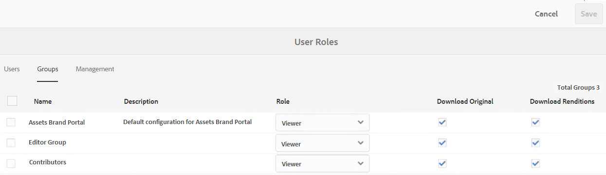
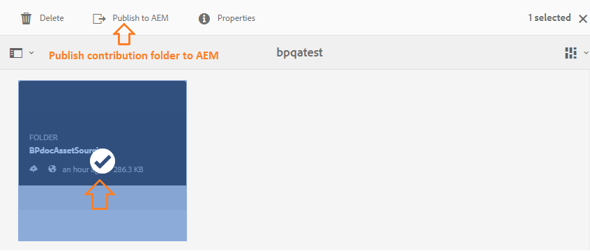
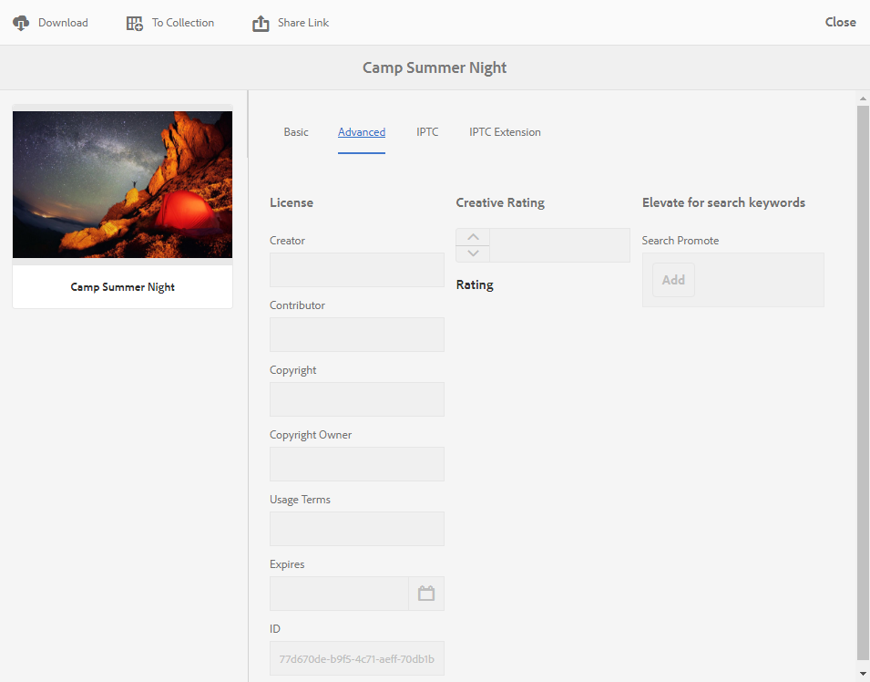

# Novità di Experience Manager Assets Brand Portal {#what-s-new-in-aem-assets-brand-portal}

Adobe Experience Manager Assets Brand Portal ti consente di acquisire, controllare e distribuire in modo sicuro le risorse creative approvate a parti esterne e utenti aziendali interni tra i dispositivi. Consente di migliorare l’efficienza della condivisione delle risorse, accelera il time-to-market delle risorse e riduce il rischio di non conformità e di accesso non autorizzato. Adobe sta lavorando per migliorare l’esperienza complessiva di Brand Portal. Ecco una panoramica delle nuove funzioni e dei miglioramenti apportati.

## Cosa è cambiato in 2024.02.0 {#what-changed-in-February-2024}

Brand Portal 2024.02.0 è una versione interna che include correzioni ai problemi critici. Consulta le ultime [note sulla versione di Brand Portal](brand-portal-release-notes.md).

## Cosa è cambiato nel 2023.10.0 {#what-changed-in-October-2023}

Brand Portal 2023.10.0 è una versione interna che include correzioni ai problemi critici. Consulta le ultime [note sulla versione di Brand Portal](brand-portal-release-notes.md).

## Cosa è cambiato nel 2023.08.0 {#what-changed-in-August-2023}

Brand Portal 2023.08.0 è una versione interna che include correzioni ai problemi critici. Consulta le ultime [note sulla versione di Brand Portal](brand-portal-release-notes.md).

## Cosa è cambiato nel 2023.05.0 {#what-changed-in-May-2023}

Brand Portal 2023.05.0 è una versione interna che include correzioni ai problemi critici. Consulta le ultime [note sulla versione di Brand Portal](brand-portal-release-notes.md).

## Cosa è cambiato nel 2023.02.0 {#what-changed-in-February-2023}

Brand Portal 2023.02.0 è una versione interna che include correzioni ai problemi critici. Consulta le ultime [note sulla versione di Brand Portal](brand-portal-release-notes.md).

## Cosa è cambiato nella versione 2022.10.0 {#what-changed-in-October-2022}

Brand Portal 2022.10.0 è una versione interna che include correzioni ai problemi critici. Consulta le ultime [note sulla versione di Brand Portal](brand-portal-release-notes.md).

## Cosa è cambiato nel 2022.08.0 {#what-changed-in-August-2022}

Brand Portal 2022.08.0 è una versione interna che include correzioni ai problemi critici. Consulta le ultime [note sulla versione di Brand Portal](brand-portal-release-notes.md).

## Cosa è cambiato nel 2022.05.0 {#what-changed-in-May-2022}

Brand Portal ora esegue automaticamente processi ogni dodici ore per eliminare tutte le risorse Brand Portal pubblicate nell’AEM. Di conseguenza, non è necessario eliminare manualmente le risorse nella cartella Contributo per mantenere la dimensione della cartella al di sotto del limite di soglia. Puoi anche monitorare lo stato dei processi di eliminazione eseguiti automaticamente utilizzando l&#39;opzione **[!UICONTROL Strumenti]** > **[!UICONTROL Stato contributo risorsa]** > **[!UICONTROL Rapporti eliminazione]** in Brand Portal. Il rapporto di un job fornisce i dettagli riportati di seguito.

* Ora di inizio processo
* Ora di fine processo
* Stato processo
* Totale risorse incluse in un processo
* Totale risorse eliminate correttamente in un processo
* Memoria totale resa disponibile in seguito all&#39;esecuzione del processo

Puoi anche approfondire la ricerca per visualizzare i dettagli di ciascuna risorsa inclusa in un processo di eliminazione. Dettagli quali titolo della risorsa, dimensione, autore, stato di eliminazione e ora di eliminazione sono inclusi nel rapporto.

Inoltre, in Brand Portal 2022.05.0 sono incluse correzioni ai problemi critici. Consulta le ultime [note sulla versione di Brand Portal](brand-portal-release-notes.md).

## Cosa è cambiato nel 2022.02.0 {#what-changed-in-Feb-2022}

Brand Portal 2022.02.0 è una versione interna che include correzioni ai problemi critici. Consulta le ultime [note sulla versione di Brand Portal](brand-portal-release-notes.md).

## Cosa è cambiato nel 2021.10.0 {#what-changed-in-october-2021}

Brand Portal 2021.10.0 è una versione interna che include correzioni ai problemi critici. Consulta le ultime [note sulla versione di Brand Portal](brand-portal-release-notes.md).

## Cosa è cambiato nel 2021.08.0 {#what-changed-in-august-2021}

Brand Portal 2021.08.0 è una versione interna che introduce i profili aziendali per i clienti aziendali e i team per consentire alle organizzazioni di controllare meglio le proprie risorse. Gli utenti ora dispongono di diritti specifici per l’organizzazione nelle organizzazioni nuove e migrate. Durante la migrazione, tutti gli account Adobe ID esistenti vengono trasferiti agli Business ID.

* Business ID per tutte le organizzazioni nuove ed esistenti dopo la migrazione.
* Gli ID business non richiedono alcuna configurazione specifica, ad esempio per richiedere un dominio o impostare un SSO.
* Puoi aggiungere utenti con qualsiasi indirizzo e-mail, compresi i domini e-mail pubblici come gmail.com o outlook.com.

**Impatto sugli utenti di Brand Portal**

La migrazione non ha alcun impatto su set di dati, risorse, utenti o impostazioni esistenti. L’unica modifica interna che avviene durante la migrazione è l’adesione dell’organizzazione esistente ai profili aziendali.

>[!NOTE]
>
>I profili aziendali sono attualmente applicabili per le nuove organizzazioni create dopo il 16 agosto 2021.
>
>Fino a quando la tua organizzazione non viene migrata, puoi continuare a utilizzare i tipi Adobe ID, Enterprise ID o Federated ID per accedere all’organizzazione.

### Articoli di riferimento {#reference-articles}

* [Introduzione ai profili Adobe](https://helpx.adobe.com/enterprise/kb/introducing-adobe-profiles.html)

* [Gestisci profili Adobi](https://helpx.adobe.com/enterprise/using/manage-adobe-profiles.html)

* [Aggiornamento dell&#39;esperienza di accesso per utenti e amministratori](https://helpx.adobe.com/enterprise/using/storage-for-business.html#new-admin-sign-in-exp)

* [Accesso limitato durante la migrazione](https://helpx.adobe.com/enterprise/kb/account-temporarily-unavailable.html)

* [Gestione utenti in Admin Console](https://helpx.adobe.com/enterprise/using/manage-users-individually.html)

* [Gestione dei profili di prodotto per gli utenti aziendali](https://helpx.adobe.com/enterprise/using/manage-product-profiles.html#assign-users)

* [Trust di dominio](https://helpx.adobe.com/enterprise/admin-guide.html/enterprise/using/set-up-identity.html#directory-trusting)

<!--   
### Add new users to T2E organization   {#add-users-to-T2E-org}

On adding a new user in Admin Console for a new or migrated T2E organization, the user will have to perform an additional step **Join Team** to get entitled to the T2E organization. 

The user is entitled only if the user chooses to **Join Team**, otherwise the user won't get access to the selected T2E organization in Brand Portal. 

>[!NOTE]
>
>The workflow is not applicable to the existing Brand Portal users.

### Additional screen while navigating to Admin Console   {#navigate-to-admin-console}

The administrators will have to perform an additional step of selecting the T2E organization while navigating from Brand Portal to Admin Console. The workflow applies on the new and migrated T2E organizations.   

Selection of the T2E organization is a one-time activity and is not required everytime the administrator navigates from Brand Portal to Admin Console.

1. Log in to a T2E organization in Brand Portal as administrator.
1. Go to **[!UICONTROL Tools]** > **[!UICONTROL Users]** > **[!UICONTROL Management]** and click on the link **[!UICONTROL Launch Admin Console]**. 

   Or, go to **[!UICONTROL Unified Shell]** > **[!UICONTROL Administration]** and click on the link **[!UICONTROL Launch Admin Console]**. 
1. Search the T2E organization to login to Admin Console.

   

### Restriction during migration of an organization   {#login-restriction}

When an organization is undergoing T2E migration, the users of that organization will not be able to login to Brand Portal. The following error message appears on the screen. However, the migration won't impact the active user session until the token expires. 

Once the migration is complete, the users can login to Brand Portal. The users will receive an email notification containing the entitlement changes. If the users are entitled to more than one organization, they will have to select the organization at the time of login. 
-->

<!--
For a new or migrated T2E orgnization, the users will have an organization specific entitlement. A user can have multiple entitlements with the same email id for different T2E organizations. 
-->

## Cosa è cambiato in 2021.06.0 {#what-changed-in-june-2021}

Brand Portal 2021.06.0 è una versione interna che include correzioni ai problemi critici. Consulta le ultime [note sulla versione di Brand Portal](brand-portal-release-notes.md).

## Cosa è cambiato nel 2021.02.0 {#what-changed-in-feb-2021}

La versione 2021.02.0 di Brand Portal migliora AEM Assets as a Cloud Service con il flusso di lavoro di attivazione e la funzione Asset Sourcing. Inoltre, migliora l’esperienza di download delle risorse e include correzioni critiche. Consente inoltre agli amministratori di configurare il comportamento predefinito di download di cartelle, raccolte e download in blocco di risorse a livello di tenant. Anche il **[!UICONTROL report sull&#39;utilizzo]** di Brand Portal è stato modificato per riflettere gli utenti Brand Portal attivi.

### Attivare Brand Portal su AEM Assets as a Cloud Service {#bp-automation-on-cloud-service}

AEM Assets as a Cloud Service ora dispone di un’istanza Brand Portal preconfigurata. L’utente di Cloud Manager può attivare Brand Portal nell’istanza as a Cloud Service di AEM Assets.

In precedenza, AEM Assets as a Cloud Service era configurato manualmente con Brand Portal utilizzando Adobe Developer Console.

L’utente di Cloud Manager attiva il flusso di lavoro di attivazione che crea le configurazioni richieste nel backend e attiva Brand Portal nella stessa organizzazione IMS dell’istanza di AEM Assets as a Cloud Service.

Per attivare Brand Portal nell’istanza as a Cloud Service di AEM Assets:

1. Accedi ad Adobe Cloud Manager e passa a **[!UICONTROL Ambienti]**.
1. Seleziona gli ambienti (uno alla volta) dall’elenco. Dopo aver individuato l&#39;ambiente associato a Brand Portal, fare clic sul pulsante **[!UICONTROL Attiva Brand Portal]** per avviare il flusso di lavoro di attivazione.
1. Una volta attivato il tenant Brand Portal, lo stato diventa Attivato.

Consulta [attivare Brand Portal su AEM Assets as a Cloud Service](https://experienceleague.adobe.com/it/docs/experience-manager-cloud-service/content/assets/brand-portal/configure-aem-assets-with-brand-portal).

### Asset Sourcing su AEM Assets as a Cloud Service {#asset-sourcing-on-cloud-service}

La funzione Asset Sourcing è ora disponibile su AEM Assets as a Cloud Service. Per impostazione predefinita, questa funzione è abilitata per tutti gli utenti del servizio cloud. Gli utenti Brand Portal autorizzati possono contribuire a Asset Sourcing caricando nuove risorse nelle cartelle dei contributi e pubblicando la cartella dei contributi da Brand Portal all’istanza di AEM Assets as a Cloud Service. Gli amministratori possono rivedere e approvare i contributi degli utenti di Brand Portal prima di distribuirli ad altri utenti.

In precedenza, Asset Sourcing era disponibile solo su AEM Assets (on-premise e Managed Service).

Vedi [Origine risorse in Brand Portal](https://experienceleague.adobe.com/en/docs/experience-manager-brand-portal/using/asset-sourcing-in-brand-portal/brand-portal-asset-sourcing).

### Download risorse {#asset-download-setting}

Oltre alle **[!UICONTROL impostazioni di download]** esistenti, gli amministratori di Brand Portal possono ora configurare l&#39;impostazione **[!UICONTROL Download risorse]**. Questa impostazione consente agli amministratori di gestire il comportamento di download predefinito di cartelle, raccolte e download in blocco di risorse (più di 20 risorse) a livello di tenant.

<!--
Earlier, all the asset renditions were directly downloaded in a zip folder in case of folder, collection, and bulk download of assets. As the **[!UICONTROL Download]** dialog box is skipped for folders or collections, there was no mechanism to control the downloading behaviour of the assets. Due to this, the users were finding it difficut to search for a particular asset rendition from a folder containing huge bunch of downloaded renditions. 
-->

In precedenza, tutte le rappresentazioni delle risorse venivano scaricate direttamente in una cartella zip. La finestra di dialogo **[!UICONTROL Scarica]** è stata ignorata per cartelle e raccolte. Inoltre, non esisteva alcun metodo per controllare il comportamento di download delle risorse, rendendo difficile la ricerca di una particolare rappresentazione da molti download.

L&#39;impostazione **[!UICONTROL Download risorse]** fornisce ora un&#39;opzione per creare una cartella separata per ogni risorsa durante il download di cartelle, raccolte o risorse in blocco.

Se l&#39;impostazione **[!UICONTROL Download risorse]** è disabilitata, le cartelle o le raccolte vengono scaricate in una cartella zip contenente tutte le rappresentazioni delle risorse nella stessa cartella, ad eccezione del download delle risorse tramite il collegamento di condivisione.

Accedi al tuo tenant Brand Portal come amministratore e passa a **[!UICONTROL Strumenti]** > **[!UICONTROL Scarica]**. Gli amministratori possono abilitare l&#39;impostazione **[!UICONTROL Download risorse]** per creare una cartella separata per ogni risorsa durante il download di cartelle, raccolte e risorse in blocco.

Vedi [scarica risorse da Brand Portal](https://experienceleague.adobe.com/en/docs/experience-manager-brand-portal/using/download/brand-portal-download-assets).
<!--
### Download using Share link {#download-using-share-link}

The default behavior of downloading the assets using share link is now independent of the **[!UICONTROL Download Settings]**. A separate folder is created for each asset while downloading the assets using share link. 
-->

### Rapporto utilizzo {#usage-report}

Il **[!UICONTROL report sull&#39;utilizzo]** di Brand Portal è stato modificato in modo da riflettere solo gli utenti Brand Portal attivi. Gli utenti di Brand Portal che non sono assegnati ad alcun profilo di prodotto nell&#39;Admin Console sono considerati utenti inattivi e non sono inclusi nel **[!UICONTROL Report utilizzo]**.

In precedenza, gli utenti attivi e inattivi venivano mostrati nel Rapporto di utilizzo.

## Cosa è cambiato in 2020.10.0 {#what-changed-in-oct-2020}

Brand Portal 2020.10.0 è una versione migliorata che si concentra sulla semplificazione dell’esperienza di download delle risorse e include correzioni critiche. Questo miglioramento introduce un flusso di lavoro nuovo e migliorato per i download delle risorse, con opzioni per escludere le rappresentazioni e i download diretti dal pannello **[!UICONTROL Rappresentazioni]**. Consente inoltre di configurare i diritti di accesso e download per gruppi di utenti specifici e di accedere facilmente a file, raccolte e collegamenti condivisi da tutte le pagine di Brand Portal. Consulta le [note sulla versione di Brand Portal](brand-portal-release-notes.md).

### Esperienza di download semplificata {#download-dialog}

In precedenza, la finestra di dialogo **[!UICONTROL Scarica]** offriva più opzioni come la creazione di cartelle separate per ogni risorsa, l&#39;invio di e-mail alle risorse, la selezione delle risorse originali e altro ancora. Queste opzioni creavano confusione per gli utenti non tecnici o nuovi, in particolare durante il download di più risorse o cartelle. Inoltre, l’utente non poteva visualizzare tutte le rappresentazioni delle risorse o escludere una specifica rappresentazione personalizzata o dinamica.

La nuova finestra di dialogo **[!UICONTROL Scarica]** genera il processo di selezione e filtraggio delle risorse che semplifica l&#39;adozione di decisioni efficaci da parte degli utenti di Brand Portal durante il download delle rappresentazioni delle risorse. Elenca tutte le risorse selezionate e le relative rappresentazioni in base alla configurazione [**[!UICONTROL Download]**](brand-portal-download-assets.md) e alle impostazioni **[!UICONTROL Download]**.

>[!NOTE]
>
>Per impostazione predefinita, tutti gli utenti dispongono di **[!UICONTROL Download rapido]** abilitato e richiede IBM® [Aspera Connect 3.9.9](https://www.ibm.com/support/fixcentral/swg/selectFixes?parent=ibm~Other%20software&amp;product=ibm/Other+software/IBM+Aspera+Connect&amp;release=3.9.9&amp;platform=All&amp;function=all) installato nell&#39;estensione del browser prima di scaricare le risorse da Brand Portal.

<!--
If any of the **[!UICONTROL Custom Rendition]** or **[!UICONTROL System Rendition]** is enabled in the [**[!UICONTROL Download]**](brand-portal-download-assets.md) configuration and **[!UICONTROL Download]** settings are enabled for the group users, the new **[!UICONTROL Download]** dialog box appears with all the renditions of the selected assets or folders containing assets in a List View. 
-->

Dalla finestra di dialogo **[!UICONTROL Scarica]** gli utenti possono:

* Visualizza tutte le rappresentazioni disponibili di qualsiasi risorsa nell’elenco di download.
* Escludi le rappresentazioni delle risorse che non sono necessarie per il download.
* Applica lo stesso set di rappresentazioni a tutti i tipi di risorse simili con un solo clic.
* Applica un diverso set di rappresentazioni per diversi tipi di risorse.
* Crea una cartella separata per ogni risorsa.
* Scarica le risorse selezionate e le relative rappresentazioni.

Il flusso di lavoro di download è coerente per le risorse autonome, le risorse multiple, le cartelle con risorse, le risorse con o senza licenza e quando si scaricano le risorse tramite un collegamento di condivisione. Consulta [passaggi per scaricare risorse da Brand Portal](https://experienceleague.adobe.com/en/docs/experience-manager-brand-portal/using/download/brand-portal-download-assets).

### Navigazione rapida {#quick-navigation}

In precedenza, l&#39;opzione per visualizzare **[!UICONTROL File]**, **[!UICONTROL Raccolte]** e **[!UICONTROL Collegamenti condivisi]** era nascosta e richiedeva più clic ogni volta che l&#39;utente desiderava passare a un&#39;altra visualizzazione.

In Brand Portal 2020.10.0, gli utenti possono passare a **[!UICONTROL File]**, **[!UICONTROL Raccolte]** e **[!UICONTROL Collegamenti condivisi]** da tutte le pagine di Brand Portal con un solo clic utilizzando i collegamenti di navigazione rapida.

### Pannello rappresentazione migliorato {#rendition-panel}

In precedenza, gli utenti potevano visualizzare la risorsa originale e le relative rappresentazioni nel pannello **[!UICONTROL Rappresentazioni]** solo se una delle **[!UICONTROL Rappresentazioni personalizzate]** o **[!UICONTROL Rappresentazioni di sistema]** era abilitata nella configurazione **[!UICONTROL Scarica]**. Inoltre, gli utenti dovevano scaricare tutte le rappresentazioni delle risorse, poiché non esisteva alcun filtro per escludere rappresentazioni personalizzate o dinamiche specifiche che non erano necessarie.

<!--
Earlier, if any of the custom or system renditions was enabled in the **[!UICONTROL Download]** settings, an additional **[!UICONTROL Download]** dialog box appeared on clicking the **[!UICONTROL Download]** button wherein the user had to manually select the set of renditions (original asset, custom renditions, dynamic renditions) to download.
There was no filter to exclude specific custom or dynamic renditions which were not required for download.
-->

In Brand Portal 2020.10.0, gli utenti possono escludere rappresentazioni specifiche e [scaricare direttamente le rappresentazioni selezionate dal pannello Rappresentazioni](brand-portal-download-assets.md#download-assets-from-asset-details-page) nella pagina dei dettagli della risorsa senza dover aprire la finestra di dialogo **[!UICONTROL Scarica]**.

<!-- 
In Brand Portal 2020.10.0, direct download and exclude renditions features are introduced in the **[!UICONTROL Renditions]** panel on the asset details page. All the renditions (original asset, custom renditions, dynamic renditions) under the rendition panel are now associated with a check box and are enabled by default. 

The user can clear the check boxes to exclude the renditions which are not required for download. And can click on the **[!UICONTROL Download]** button in the **[!UICONTROL Renditions]** panel to directly download the selected set of renditions in a zip folder without having to open the **[!UICONTROL Download]** dialog box.
-->

### Configurare le impostazioni di download {#download-permissions}

Gli amministratori di Brand Portal ora possono configurare le impostazioni per i gruppi di utenti per visualizzare o scaricare risorse e rappresentazioni originali, o entrambe, dalla pagina dei dettagli delle risorse, oltre alle configurazioni esistenti di **[!UICONTROL Scarica]**.

Accedi al tuo tenant Brand Portal come amministratore e passa a **[!UICONTROL Strumenti]** > **[!UICONTROL Utenti]**.

Nella pagina **[!UICONTROL Ruoli utente]**, passa alla scheda **[!UICONTROL Gruppi]** per configurare le impostazioni di visualizzazione e/o download per i gruppi di utenti.

In precedenza, le impostazioni erano disponibili solo per impedire agli utenti del gruppo di scaricare la risorsa originale.

La scheda **[!UICONTROL Gruppi]** nella pagina **[!UICONTROL Ruoli utente]** consente agli amministratori di configurare le impostazioni di visualizzazione e download:

* Se entrambe le impostazioni **[!UICONTROL Scarica originali]** e **[!UICONTROL Scarica rappresentazioni]** sono attivate, gli utenti del gruppo selezionato possono visualizzare e scaricare le risorse originali e le relative rappresentazioni.
* Se entrambe le impostazioni sono disattivate, gli utenti possono visualizzare solo le risorse originali. I rendering delle risorse non sono visibili agli utenti nella pagina dei dettagli delle risorse.
* Se è attivata solo l&#39;impostazione **[!UICONTROL Scarica originale]**, gli utenti potranno visualizzare e scaricare solo le risorse originali dalla pagina dei dettagli della risorsa.
* Se è attivata solo l&#39;impostazione **[!UICONTROL Scarica rappresentazioni]**, gli utenti potranno visualizzare la risorsa originale ma non potranno scaricarla. Tuttavia, l’utente può visualizzare e scaricare le rappresentazioni delle risorse.

Vedi [configurare il download delle risorse](https://experienceleague.adobe.com/en/docs/experience-manager-brand-portal/using/download/brand-portal-download-assets#configure-download-permissions).

>[!NOTE]
>
>Se un utente viene aggiunto a più gruppi e uno di questi ha delle restrizioni, le restrizioni si applicano all’utente.

<!--
>Restrictions to access the original asset and their renditions do not apply to administrators even if they are members of restricted groups.
 >
 >The users can always download assets and their renditions from the repository using a `curl` request even if the download configurations are turned-off.
 >
-->

## Cosa è cambiato in 6.4.7 {#what-changed-in-647}

La versione di Brand Portal 6.4.7 include il visualizzatore di documenti, migliora l’esperienza di download delle risorse e include correzioni critiche. Consulta le ultime [note sulla versione di Brand Portal](brand-portal-release-notes.md).

<!--
Brand Portal 6.4.7 release brings in the Document Viewer, leverages the Brand Portal administrators to configure asset download, and centers top customer requests. See latest [Brand Portal Release Notes](brand-portal-release-notes.md).
-->

### Visualizzatore documenti {#doc-viewer}

Il Visualizzatore documenti migliora l&#39;esperienza di visualizzazione dei PDF. Offre un’esperienza simile a quella di Adobe Document Cloud durante la visualizzazione dei file PDF in Brand Portal.

In precedenza erano disponibili opzioni limitate per visualizzare i file PDF.

Gli utenti di Brand Portal possono utilizzare il Visualizzatore documenti per visualizzare pagine e segnalibri, cercare testo, ingrandire e ridurre e navigare nelle pagine. Possono passare a una pagina specifica, adattarsi a una finestra o a uno schermo e attivare o disattivare la visibilità della barra degli strumenti.

>[!NOTE]
>
>L&#39;esperienza di visualizzazione per altri formati di documento rimane invariata.

### Scarica esperienza {#download-configurations}

Il processo di download delle risorse è stato rinnovato, offrendo un&#39;esperienza utente semplificata durante il [download di risorse da Brand Portal](brand-portal-download-assets.md).

Il flusso di lavoro esistente per il download di risorse da Brand Portal è inevitabilmente seguito dalla visualizzazione di una finestra di dialogo **[!UICONTROL Scarica]** con più opzioni di download tra cui scegliere.

In Brand Portal 6.4.7, gli amministratori di Brand Portal possono configurare le impostazioni della risorsa **[!UICONTROL Scarica]**. Le configurazioni disponibili sono:

* **[!UICONTROL Download rapido]**
* **[!UICONTROL Rappresentazioni personalizzate]**
* **[!UICONTROL Rappresentazioni di sistema]**

L’amministratore di Brand Portal può abilitare qualsiasi combinazione per configurare il download delle risorse.

<!--In Brand Portal 6.4.7, fast download, custom renditions, and system renditions are the three configurations available.-->

* Se entrambe le configurazioni **[!UICONTROL Rappresentazioni personalizzate]** e **[!UICONTROL Rappresentazioni di sistema]** sono disattivate, le rappresentazioni originali delle risorse vengono scaricate senza alcuna finestra di dialogo aggiuntiva, il che semplifica l&#39;esperienza di download per gli utenti di Brand Portal.

* Se una delle **[!UICONTROL Rappresentazioni personalizzate]** o **[!UICONTROL Rappresentazioni di sistema]** è abilitata, viene visualizzata la finestra di dialogo **[!UICONTROL Scarica]** e la risorsa originale e le relative rappresentazioni vengono scaricate. L&#39;abilitazione della configurazione di **[!UICONTROL Download rapido]** accelera il processo di download.

In base alla configurazione, il flusso di lavoro di download rimane costante per le risorse autonome, le risorse multiple e le cartelle contenenti risorse. Sono incluse anche le risorse concesse in licenza o non concesse in licenza e il download di risorse tramite un collegamento di condivisione.

## Modifiche apportate alla versione 6.4.6 {#what-changed-in-646}

In Brand Portal 6.4.6, il canale di autorizzazione tra AEM Assets e Brand Portal viene modificato. Brand Portal è ora supportato da AEM Assets as a Cloud Service, AEM Assets 6.3 e versioni successive. In AEM Assets 6.3 e versioni successive, Brand Portal era inizialmente configurato nell’interfaccia classica utilizzando il gateway OAuth legacy. Questo gateway utilizza lo scambio di token JWT per ottenere un token di accesso IMS per l’autorizzazione. AEM Assets ora è configurato con Brand Portal tramite Adobe Developer Console, che fornisce un token IMS per l’autorizzazione del tenant Brand Portal.

<!-- The steps to configure integration are different depending on your AEM version, and whether you are configuring for the first-time, or upgrading the existing integration:
-->

<!--
  
   | **AEM Version** |**New Integration** |**Upgrade Integration** |
|---|---|---|
| **AEM 6.5** |[Create new integration](../using/brand-portal-configure-integration-65.md) |[Upgrade existing integration](../using/brand-portal-configure-integration-65.md#upgrade-integration-65) | 
| **AEM 6.4** |[Create new integration](../using/brand-portal-configure-integration-64.md) |[Upgrade existing integration](../using/brand-portal-configure-integration-64.md#upgrade-integration-64) | 
| **AEM 6.3** |[Create new integration](../using/brand-portal-configure-integration-63.md) |[Upgrade existing integration](../using/brand-portal-configure-integration-63.md#upgrade-integration-63) | 
| **AEM 6.2** | | 

   -->

I passaggi per configurare AEM Assets con Brand Portal variano a seconda della versione dell’AEM in uso e dell’esecuzione della prima configurazione o dell’aggiornamento delle configurazioni esistenti:

<!--| **AEM Version** |**New Configuration** |**Upgrade Configuration** |
|---|---|---|
| **AEM 6.5 (6.5.4.0 and above)** |[Create configuration](../using/brand-portal-configure-integration-65.md) |[Upgrade configuration](../using/brand-portal-configure-integration-65.md#upgrade-integration-65) | 
| **AEM 6.4 (6.4.8.0 and above)** |[Create configuration](../using/brand-portal-configure-integration-64.md) |[Upgrade configuration](../using/brand-portal-configure-integration-64.md#upgrade-integration-64) | 
| **AEM 6.3 (6.3.3.8 and above)** |[Create configuration](../using/brand-portal-configure-integration-63.md) |[Upgrade configuration](../using/brand-portal-configure-integration-63.md#upgrade-integration-63) | 

-->

<!-- AEM Assets configuration with Brand Portal on Adobe I/O is supported on:
* AEM 6.5.4.0 and above
* AEM 6.4.8.0 and above
* AEM 6.3.3.8 and above -->

| **Versione AEM** | **Nuova configurazione** | **Configurazione aggiornamento** |
|---|---|---|
| **AEM Assets as a Cloud Service** | [Crea configurazione](https://experienceleague.adobe.com/it/docs/experience-manager-cloud-service/content/assets/brand-portal/configure-aem-assets-with-brand-portal) | - |
| **AEM 6.5 (6.5.4.0 e versioni successive)** | [Crea configurazione](https://experienceleague.adobe.com/it/docs/experience-manager-65/content/assets/brandportal/configure-aem-assets-with-brand-portal) | [Aggiorna configurazione](https://experienceleague.adobe.com/en/docs/experience-manager-65/content/assets/brandportal/configure-aem-assets-with-brand-portal#upgrade-integration-65) |

>[!NOTE]
>
>L’Adobe consiglia di aggiornare l’istanza AEM per utilizzare il service pack più recente.

Consulta le [note sulla versione di Brand Portal](brand-portal-release-notes.md).

Consulta [Domande frequenti su Brand Portal](brand-portal-faqs.md).

## Modifiche apportate alla versione 6.4.5 {#what-changed-in-645}

Brand Portal 6.4.5 consente ad agenzie e team esterni di caricare contenuti in Brand Portal e pubblicarli in AEM Assets, senza dover accedere all’ambiente di authoring. Questa funzione si chiama **[Asset Sourcing in Brand Portal](brand-portal-asset-sourcing.md)** e migliora l&#39;esperienza dei clienti grazie a un meccanismo bidirezionale che consente agli utenti di contribuire e condividere risorse con altri utenti di Brand Portal distribuiti a livello globale.

### Asset Sourcing in Brand Portal {#asset-sourcing-in-bp}

Asset Sourcing consente agli utenti AEM (amministratori/utenti non amministratori) di creare cartelle con una proprietà **Asset Contribution** aggiuntiva, in modo che la nuova cartella creata sia aperta all&#39;invio di risorse da parte degli utenti Brand Portal. Attiva automaticamente un flusso di lavoro che crea due sottocartelle aggiuntive, denominate NEW e SHARED, all&#39;interno della cartella **Contribution** appena creata.

L&#39;utente AEM carica una breve risorsa e una risorsa di base nella cartella **SHARED**. Essi definiscono i tipi di risorse necessarie nella cartella dei contributi, garantendo agli utenti di Brand Portal le informazioni di riferimento necessarie. L&#39;amministratore può quindi concedere agli utenti Brand Portal attivi l&#39;accesso alla cartella dei contributi prima di pubblicare in Brand Portal la cartella **Contribution** appena creata.

Dopo aver aggiunto il contenuto nella cartella **NEW**, l&#39;utente può ripubblicare la cartella Contributi nell&#39;ambiente di creazione AEM. Potrebbero essere necessari alcuni minuti per completare l’importazione e riflettere il contenuto appena pubblicato in AEM Assets.

Inoltre, tutte le funzionalità esistenti rimangono invariate. Gli utenti di Brand Portal possono visualizzare, cercare e scaricare le risorse dalla cartella dei contributi e dalle altre cartelle consentite. Gli amministratori possono inoltre condividere ulteriormente la cartella dei contributi, modificare le proprietà e aggiungere risorse alle raccolte.

>[!NOTE]
>
>Asset Sourcing in Brand Portal è supportato in AEM 6.5.2.0 e versioni successive.
>
>Questa funzione non è supportata nelle versioni precedenti, AEM 6.3 e AEM 6.4.

### Carica risorse nella cartella dei contributi {#upload-assets-in-bp}

Gli utenti di Brand Portal con le autorizzazioni appropriate possono caricare singole risorse o cartelle (file .zip) contenenti più risorse nella cartella Contributi. Un utente può caricare più risorse in una cartella di contributi risorse. Tuttavia, è possibile creare una sola cartella alla volta.

Gli utenti di Brand Portal possono caricare solo risorse nella sottocartella **NEW**. La cartella **SHARED** è destinata alla distribuzione dei requisiti e delle risorse di base.

### Cartella dei contributi di Publish ad AEM Assets {#publish-assets-to-aem}

Una volta completato il caricamento nella cartella **NEW**, gli utenti di Brand Portal potranno quindi ripubblicare la cartella dei contributi nell&#39;AEM. Potrebbero essere necessari alcuni minuti per importare e riflettere il contenuto/le risorse pubblicato in AEM Assets. Vedi [pubblicare la cartella dei contributi in AEM Assets](brand-portal-publish-contribution-folder-to-aem-assets.md).

## Modifiche apportate alla versione 6.4.4 {#what-changed-in-644}

La versione di Brand Portal 6.4.4 si concentra sui miglioramenti apportati alla ricerca di testo e alle principali richieste dei clienti. Consulta le ultime [note sulla versione di Brand Portal](brand-portal-release-notes.md).

### Miglioramenti alla ricerca

In Brand Portal 6.4.4 e versioni successive è supportata la ricerca di testo parziale nel predicato Proprietà nel riquadro di filtraggio. Per consentire la ricerca di testo parziale, abilitare **Ricerca parziale** nel predicato Proprietà nel modulo di ricerca.

Ulteriori informazioni sulla ricerca parziale di testo e caratteri jolly.

#### Ricerca frase parziale {#partial-phrase-search}

È ora possibile cercare le risorse specificando solo una parte, ovvero una parola o due, della frase cercata nel riquadro di filtraggio.

**Caso d&#39;uso**
La ricerca per frase parziale è utile quando non si è sicuri della combinazione esatta di parole che si verificano nella frase cercata.

Se, ad esempio, nel modulo di ricerca di Brand Portal viene utilizzato il predicato Proprietà per eseguire una ricerca parziale nel titolo delle risorse, specificando il termine **camp** verranno restituite tutte le risorse il cui titolo contiene il termine camp.

#### Ricerca con caratteri jolly {#wildcard-search}

Brand Portal consente di utilizzare l&#39;asterisco (&#42;) con parte di una parola nella query di ricerca.

Se non si è certi delle parole esatte presenti nella frase cercata, è possibile utilizzare una ricerca con caratteri jolly per colmare le lacune nella query di ricerca.

Se ad esempio si specifica **climb&#42;**, verranno restituite tutte le risorse con parole che iniziano con i caratteri **climb** nella frase del titolo se il modulo di ricerca di Brand Portal utilizza il predicato Proprietà per la ricerca parziale nel titolo delle risorse.

Analogamente, specificando:

* **&#42;climb** restituisce tutte le risorse con parole che terminano con i caratteri **climb** nella frase del titolo.

* **&#42;climb&#42;** restituisce tutte le risorse contenenti parole contenenti i caratteri **climb** nella frase del titolo.

>[!NOTE]
>
>Quando si seleziona la casella di controllo **Ricerca parziale**, **Ignora maiuscole/minuscole** è selezionato per impostazione predefinita.

## Modifiche apportate alla versione 6.4.3 {#what-changed-in}

In Brand Portal 6.4.3 è stato introdotto un alias alternativo per gli URL di accesso, una nuova gerarchia di cartelle e miglioramenti al supporto video. Inoltre, introduce una pubblicazione pianificata dall’istanza di authoring dell’AEM a Brand Portal, miglioramenti operativi e soddisfa le richieste dei clienti.

### Navigazione nella gerarchia di cartelle per non amministratori

Ora gli amministratori possono configurare il modo in cui le cartelle vengono mostrate agli utenti non amministratori (editor, visualizzatori e utenti ospiti) al momento dell’accesso. [La configurazione Abilita gerarchia cartelle](../using/brand-portal-general-configuration.md) è stata aggiunta in **Impostazioni generali**, nel pannello Strumenti di amministrazione. Se la configurazione è:

* **enabled**, la struttura di cartelle che inizia dalla cartella principale è visibile agli utenti non amministratori. In questo modo, puoi offrire loro un’esperienza di navigazione simile a quella degli amministratori.
* **disabilitato**, nella pagina di destinazione vengono visualizzate solo le cartelle condivise.

La funzionalità [Abilita gerarchia cartelle](../using/brand-portal-general-configuration.md) (se abilitata) consente di distinguere le cartelle con gli stessi nomi condivise da gerarchie diverse. Al momento dell’accesso, gli utenti non amministratori ora visualizzano le cartelle principali virtuali (e precedenti) delle cartelle condivise.

Le cartelle condivise sono organizzate nelle rispettive directory in cartelle virtuali. È possibile riconoscere queste cartelle virtuali con un&#39;icona di blocco.

La miniatura predefinita delle cartelle virtuali è quella della prima cartella condivisa.

### Cerca in una gerarchia di cartelle o un percorso specifico

Il predicato **Browser percorso** è stato introdotto nel modulo di ricerca per consentire la ricerca di risorse in una directory specifica. Il percorso di ricerca predefinito del predicato di ricerca per il browser percorsi è `/content/dam/mac/<tenant-id>/`, che può essere configurato modificando il modulo di ricerca predefinito.

* Gli utenti amministratori possono utilizzare il browser percorsi per passare a qualsiasi directory di cartelle su Brand Portal.
* Gli utenti non amministratori possono utilizzare il browser Percorsi per passare solo alle cartelle condivise con loro (e tornare alle cartelle principali).

  `/content/dam/mac/<tenant-id>/folderA/folderB/folderC` ad esempio è condiviso con un utente non amministratore. L’utente può cercare le risorse all’interno di folderC utilizzando il browser percorsi. Questo utente può anche passare a folderB e folderA (poiché sono predecessori di folderC condiviso con l’utente).

Ora puoi limitare la ricerca delle risorse all’interno di una cartella specifica a cui hai effettuato l’esplorazione, invece di iniziare dalla cartella principale.

La ricerca in queste cartelle restituisce i risultati solo dalle risorse condivise con l’utente.

### Supporto delle rappresentazioni video di Dynamic Medie

Gli utenti la cui istanza di AEM Author è in modalità ibrida Dynamic Medie possono visualizzare in anteprima e scaricare le rappresentazioni Dynamic Media, oltre ai file video originali.

Per abilitare l&#39;anteprima e il download delle rappresentazioni Dynamic Media in account tenant specifici, gli amministratori specificano una **configurazione Dynamic Medie**. Questo passaggio include l&#39;URL del servizio video e l&#39;ID di registrazione nella configurazione **Video** dal pannello Strumenti di amministrazione.

I video Dynamic Medie possono essere visualizzati in anteprima su:

* Pagina dettagli risorsa
* Vista a schede della risorsa
* Pagina di anteprima condivisione collegamenti

Le codifiche video Dynamic Medie possono essere scaricate da:

* Brand Portal
* Collegamento condiviso

### Pubblicazione pianificata in Brand Portal

Il flusso di lavoro di pubblicazione di Assets (e cartelle) dall’istanza Autore AEM 6.4.2.0 a Brand Portal può essere pianificato per una data e un’ora successive.

Allo stesso modo, le risorse pubblicate possono essere rimosse dal portale in un secondo momento, pianificando il flusso di lavoro Annulla pubblicazione da Brand Portal.

### Alias tenant configurabile nell’URL

Le organizzazioni possono personalizzare l’URL del portale con un prefisso alternativo nell’URL. Per ottenere un alias per il nome tenant nell’URL del portale esistente, le organizzazioni devono contattare l’Assistenza clienti.

È possibile personalizzare solo il prefisso dell’URL di Brand Portal e non l’intero URL.\
Ad esempio, un&#39;organizzazione con un dominio esistente **geomettrix.brand-portal.adobe.com** può ottenere **geomettrixinc.brand-portal.adobe.com** creato su richiesta.

Tuttavia, l&#39;istanza Autore AEM può essere [configurata](https://experienceleague.adobe.com/it/docs/experience-manager-65/content/assets/brandportal/configure-aem-assets-with-brand-portal) solo con l&#39;URL dell&#39;ID tenant e non con l&#39;URL dell&#39;alias (alternativo) tenant.

Le organizzazioni possono soddisfare le proprie esigenze di branding personalizzando l’URL del portale, anziché attenersi all’URL fornito da Adobe.

### Miglioramenti all’esperienza di download

Questa versione offre un’esperienza di download semplificata con un numero ridotto di clic e avvisi, su:

* Scelta di scaricare solo le rappresentazioni (e non le risorse originali).
* Il download delle risorse quando l’accesso alle rappresentazioni originali è limitato.

## Modifiche apportate alla versione 6.4.2 {#what-changed-in-1}

Brand Portal 6.4.2 introduce funzionalità che soddisfano le esigenze di distribuzione delle risorse delle organizzazioni, consentendo una portata globale mediante l&#39;accesso come ospite e download più veloci. Offre inoltre un controllo avanzato con nuove configurazioni di amministrazione, un rapporto aggiunto e soddisfa le richieste dei clienti.

### Accesso come ospite

AEM Brand Portal consente l’accesso come ospite al portale. Un utente ospite non richiede credenziali per accedere al portale e può accedere e scaricare tutte le cartelle e le raccolte pubbliche. Gli utenti ospiti possono aggiungere risorse alla propria lightbox (raccolta privata) e scaricarle. Possono inoltre visualizzare i predicati di ricerca e ricerca di tag avanzati impostati dagli amministratori. La sessione guest non consente agli utenti di creare raccolte e ricerche salvate o di condividerle ulteriormente, di accedere alle impostazioni delle cartelle e delle raccolte e di condividere le risorse come collegamenti.

In un’organizzazione sono consentite più sessioni simultanee come ospite, il che è limitato al 10% della quota totale di utenti per organizzazione.

Una sessione ospite rimane attiva per due ore. Pertanto, anche lo stato del lightbox viene mantenuto fino a due ore dall’ora di inizio della sessione. Dopo due ore, la sessione guest deve essere riavviata, quindi lo stato lightbox viene perso.

### Download accelerati

Gli utenti di Brand Portal possono applicare download rapidi basati su IBM® Aspera Connect per ottenere velocità fino a 25 volte più veloci e godere di un&#39;esperienza di download fluida indipendentemente dalla loro posizione in tutto il mondo. Per scaricare le risorse più rapidamente da Brand Portal o dal collegamento condiviso, gli utenti devono selezionare l&#39;opzione **Abilita accelerazione di download** nella finestra di dialogo di download, a condizione che l&#39;accelerazione di download sia abilitata nella propria organizzazione.

Per abilitare il download accelerato basato su IBM® Aspera per l&#39;organizzazione, gli amministratori **abilitano l&#39;opzione Accelerazione download** (disabilitata per impostazione predefinita) dalle [Impostazioni generali](brand-portal-general-configuration.md#allow-download-acceleration) nel pannello degli strumenti di amministrazione.

Per i prerequisiti e i passaggi di risoluzione dei problemi per scaricare più rapidamente i file di risorse da Brand Portal e dai collegamenti condivisi, consulta [Guida per accelerare i download da Brand Portal](../using/accelerated-download.md#main-pars-header).

### Rapporto sugli accessi utente

È stato introdotto un nuovo rapporto per il tracciamento degli accessi degli utenti. Il report **Accessi utente** può essere utile per consentire alle organizzazioni di eseguire il controllo degli amministratori delegati e degli altri utenti di Brand Portal.

I registri del rapporto mostrano nomi, ID e-mail, utenti tipo (amministratore, visualizzatore, editor, ospite), gruppi, ultimo accesso, stato attività e conteggio di ogni utente dalla distribuzione di Brand Portal 6.4.2 fino al momento della generazione del rapporto. Gli amministratori possono esportare il rapporto come .csv. Insieme ad altri rapporti, il rapporto sugli accessi degli utenti consente alle organizzazioni di monitorare attentamente le interazioni degli utenti con le risorse del marchio approvate, garantendo la conformità agli uffici di conformità aziendali.

### Accesso alle rappresentazioni originali

Gli amministratori possono limitare l’accesso ai file immagine originali e fornire accesso alle rappresentazioni a bassa risoluzione per il download da Brand Portal o da collegamenti condivisi. Questo accesso può essere controllato a livello di gruppo di utenti dalla scheda Gruppi della pagina Ruoli utente.

* Per impostazione predefinita, tutti gli utenti possono scaricare le rappresentazioni originali poiché l’accesso all’originale è abilitato per tutti.
* Gli amministratori devono deselezionare le rispettive caselle di controllo per impedire a un gruppo di utenti di accedere alle rappresentazioni originali.
* Se un utente è membro di più gruppi, ma solo uno di essi ha delle restrizioni, le restrizioni si applicano a tale utente.
* Le restrizioni non si applicano agli amministratori, anche se sono membri di gruppi con restrizioni.
* Le autorizzazioni dell’utente che condivide risorse come collegamento si applicano agli utenti che scaricano risorse utilizzando collegamenti condivisi.

### Percorso gerarchia cartelle nelle visualizzazioni a schede e a elenco

In Vista a schede, le schede delle cartelle visualizzano ora le informazioni sulla gerarchia delle cartelle per gli utenti non amministratori (editor, visualizzatore e utente ospite). Questa funzionalità consente agli utenti di conoscere la posizione delle cartelle a cui accedono rispetto alla gerarchia principale.

Le informazioni sulla gerarchia delle cartelle sono particolarmente utili per differenziarle. In altre parole, una cartella con nomi simili ad altre cartelle condivise da una gerarchia di cartelle diversa. Se gli utenti non amministratori non sono a conoscenza della struttura delle cartelle delle risorse condivise con loro, le risorse o cartelle con nomi simili sembrano confuse.

* I percorsi mostrati sulle rispettive schede vengono troncati per adattarsi alle dimensioni delle schede. Tuttavia, gli utenti possono vedere il percorso completo come una descrizione passando con il mouse sopra il percorso troncato.

Nella Vista a elenco viene mostrata una cartella Percorso delle risorse in una colonna destinata a tutti gli utenti di Brand Portal.

### Opzione Panoramica per visualizzare le proprietà della risorsa

Brand Portal fornisce un’opzione Panoramica agli utenti non amministratori (Editor, Visualizzatori, Utenti ospiti) per visualizzare le Proprietà delle risorse e cartelle selezionate. L’opzione Panoramica è visibile:

1. Nella barra degli strumenti, nella parte superiore, seleziona una risorsa o una cartella.
2. Nel menu a discesa, seleziona il Selettore della barra.

Quando selezioni l’opzione Panoramica, mentre è selezionata una risorsa o una cartella, gli utenti possono visualizzare il titolo, il percorso e l’ora della creazione della risorsa. Nella pagina dei dettagli della risorsa, invece, la selezione dell’opzione Panoramica consente agli utenti di visualizzare i metadati della risorsa.

## Nuove configurazioni

Sono state aggiunte sei nuove configurazioni che consentono agli amministratori di abilitare o disabilitare le seguenti funzionalità su tenant specifici:

* Consenti accesso come ospite
* Consenti agli utenti di richiedere l’accesso a Brand Portal
* Consenti agli amministratori di eliminare le risorse da Brand Portal
* Consenti creazione di raccolte pubbliche
* Consenti creazione di raccolte avanzate pubbliche
* Consenti accelerazione di download

Le configurazioni di cui sopra sono disponibili nelle impostazioni Accesso e Generale nel pannello Strumenti di amministrazione.

### `Adobe I/O` interfaccia utente per configurare le integrazioni OAuth

In Brand Portal versione 6.4.2 e successive viene utilizzata l&#39;interfaccia legacy OAuth (`https://legacy-oauth.cloud.adobe.io/`) per creare l&#39;applicazione JWT, che consente la configurazione delle integrazioni OAuth per consentire l&#39;integrazione di AEM Assets con Brand Portal. In precedenza, l&#39;interfaccia utente per la configurazione delle integrazioni OAuth era ospitata in `https://marketing.adobe.com/developer/`. Per ulteriori informazioni sull&#39;integrazione di AEM Assets con Brand Portal per la pubblicazione di risorse e raccolte in Brand Portal, fare riferimento a [Configurare l&#39;integrazione di AEM Assets con Brand Portal](https://experienceleague.adobe.com/it/docs/experience-manager-65/content/assets/brandportal/configure-aem-assets-with-brand-portal).

## Miglioramenti alla ricerca

Gli amministratori possono fare in modo che i predicati delle proprietà non facciano distinzione tra maiuscole e minuscole utilizzando il predicato delle proprietà aggiornato, che prevede un controllo per Ignora maiuscole/minuscole. Questa opzione è disponibile per il predicato proprietà e il predicato proprietà con più valori.\
Tuttavia, la ricerca senza distinzione tra maiuscole e minuscole è relativamente più lenta della ricerca predefinita per Predicato proprietà. Se nel filtro di ricerca sono presenti troppi predicati senza distinzione tra maiuscole e minuscole, la ricerca può subire rallentamenti. L’Adobe consiglia di utilizzare la ricerca senza distinzione tra maiuscole e minuscole in modo giudizioso.

## Modifiche apportate alla versione 6.4.1 {#what-changed-in-2}

Brand Portal 6.4.1 è una versione con aggiornamento della piattaforma. Introduce diverse nuove funzioni e miglioramenti fondamentali come navigazione, ricerca e prestazioni.

### Sfoglia miglioramenti

* La nuova barra Struttura contenuto consente agli utenti di navigare rapidamente in una gerarchia di risorse.

* Nuove scelte rapide da tastiera, ad esempio _(p)_ per la navigazione alla pagina delle proprietà, _(e)_ per Modifica e _(ctrl+c)_ per le operazioni di copia.
* È stata migliorata l’esperienza di scorrimento lento nella vista a schede e a elenco, per la navigazione in un numero elevato di risorse.
* Visualizzazione avanzata delle schede con supporto per schede di dimensioni diverse in base all’impostazione di visualizzazione.

* Nella Vista a schede è ora visibile un timestamp o una data al passaggio del mouse sopra l’etichetta della data.

* È stata migliorata la vista a colonne con **ulteriori dettagli** nello snapshot della risorsa, che consente di passare alla pagina dei dettagli di una risorsa.

* Nella Vista a elenco ora per impostazione predefinita vengono visualizzati i nomi dei file delle risorse nella prima colonna. Vengono inoltre visualizzate informazioni su impostazioni internazionali, tipo di risorsa, dimensioni, dimensioni, valutazione e pubblicazione. Le nuove **Impostazioni visualizzazione** possono essere utilizzate per configurare la quantità di dettagli da visualizzare nella visualizzazione elenco.

* È stata migliorata l’esperienza di dettaglio delle risorse con la possibilità di spostarsi avanti e indietro tra le risorse utilizzando nuovi pulsanti di navigazione e visualizzare il conteggio delle risorse.

* Nuova funzionalità per l’anteprima dei file audio caricati dall’AEM nella pagina dei dettagli della risorsa.
* In Proprietà risorsa è disponibile la nuova funzionalità Assets correlata. Le risorse correlate pubblicate su Brand Portal dall’AEM ora mantengono le loro relazioni, con i collegamenti a tali risorse correlate disponibili nella pagina delle proprietà.
* È stata introdotta una nuova configurazione per impedire agli utenti non amministratori di creare raccolte pubbliche. Le organizzazioni possono collaborare con il team di assistenza clienti per configurare questa funzionalità su account specifici.

### Miglioramenti alla ricerca

* È stata introdotta la possibilità di tornare nella stessa posizione nei risultati di ricerca, dopo aver individuato un elemento di ricerca, senza eseguire nuovamente la query di ricerca.
* È stato fornito un nuovo conteggio dei risultati di ricerca per visualizzare il numero di risultati di ricerca.
* Il filtro di ricerca per tipo di file migliorato ora consente di filtrare i risultati di ricerca per tipi MIME specifici come .jpg, .png e .psd, anziché solo per categorie ampie come immagini, documenti e multimedia.
* Filtri di ricerca migliorati per le raccolte, con marche temporali precise invece della precedente funzionalità del cursore temporale.
* Sono stati introdotti nuovi filtri di tipo Accesso per cercare le raccolte pubbliche o non pubbliche.

### Ottimizzazioni dei download

* Un singolo file di grandi dimensioni viene scaricato direttamente, senza la creazione di un file zip, migliorando la velocità e la velocità effettiva.
* Il limite di download per la dimensione file per la funzionalità di condivisione dei collegamenti è di **1** GB.

* Ora gli utenti possono scegliere di scaricare solo i file personalizzati e originali e di evitare rappresentazioni predefinite durante il download di risorse da Brand Portal o tramite la funzione dei collegamenti condivisi.

### Miglioramenti delle prestazioni

* Miglioramento fino al 100% della velocità di download delle risorse.
* Miglioramento fino al 40% nella risposta di ricerca per le risorse.
* Miglioramento fino al 40% delle prestazioni di navigazione.

**Nota**: i miglioramenti citati corrispondono ai test eseguiti nel laboratorio.

### Funzionalità di reporting migliorate

**Introduzione al report Condivisione collegamenti**
È stato introdotto un nuovo rapporto che fornisce informazioni sui collegamenti condivisi. Il rapporto Condivisione collegamenti elenca tutti gli URL delle risorse condivise con utenti interni ed esterni. Genera report per gli utenti dell’organizzazione nell’intervallo di tempo specificato. Inoltre, indica quando il collegamento è stato condiviso, da chi e quando scade.

**Il punto di ingresso è stato modificato per accedere al report sull&#39;utilizzo**
Il rapporto sull’utilizzo è ora consolidato con altri rapporti e può essere visualizzato dalla console Rapporti sulle risorse. Per raggiungere la console Rapporti su risorse, passa a **Crea/gestisci rapporti** dal pannello degli strumenti di amministrazione.

**Esperienza utente migliorata per il reporting**
L’interfaccia di reporting su Brand Portal è diventata più intuitiva e offre un maggiore controllo alle organizzazioni. Oltre a creare vari rapporti, gli amministratori ora possono rivedere i rapporti generati e scaricarli o eliminarli, in quanto questi rapporti vengono salvati in Brand Portal.

È possibile personalizzare ciascuno dei rapporti creati aggiungendo o rimuovendo colonne predefinite. Inoltre, è possibile aggiungere colonne personalizzate ai rapporti Scarica, Scadenza e Publish per controllarne il grado di granularità.

### Strumenti di amministrazione migliorati

È stato migliorato il selettore delle proprietà in Strumenti di amministrazione per metadati, ricerca e rapporti, con funzionalità di completamento automatico e navigazione per semplificare l’esperienza di amministrazione.

### Altri miglioramenti

* È ora possibile rendere disponibile al pubblico l’Assets pubblicato su Brand Portal a partire dalle versioni AEM 6.3.2.1 e 6.4 selezionando la casella Publish delle cartelle pubbliche nella finestra di dialogo Replica di AEM Assets Brand Portal.

* Gli amministratori ricevono una notifica tramite e-mail di richiesta di accesso, oltre alle notifiche nell’area di notifica di Brand Portal, se qualcuno ha richiesto l’accesso a Brand Portal.

## Modifiche apportate alla versione 6.3.2 {#what-changed-in-3}

Brand Portal 6.3.2 include funzionalità nuove e migliorate orientate alle principali richieste dei clienti e ai miglioramenti generali delle prestazioni.

### Richiedi accesso a Brand Portal {#request-access-to-brand-portal}

Gli utenti possono ora richiedere l&#39;accesso a Brand Portal utilizzando la nuova funzionalità **accesso necessario** disponibile nella schermata di accesso di Brand Portal.

A seconda che gli utenti dispongano di un’Adobe ID o debbano creare un Adobe ID, possono seguire il flusso di lavoro appropriato per inviare una richiesta. Gli amministratori di prodotti Brand Portal ricevono tali richieste nella propria area di notifica e concedono l’accesso tramite Adobe Admin Console.

Per ulteriori informazioni, vedere [Richiedere l&#39;accesso a Brand Portal](../using/brand-portal.md#requestaccesstobrandportal).

### Miglioramento nel rapporto delle risorse scaricate {#enhancement-in-the-assets-downloaded-report}

Il rapporto delle risorse scaricate ora include il numero di download delle risorse per utente all’interno dell’intervallo di date e ore specificato. Gli utenti possono scaricare questo rapporto in formato .csv per compilare dati come il numero totale di download per una risorsa concessa in licenza.

Per ulteriori informazioni, vedere i passaggi 3 e 6 in [Creare e gestire report aggiuntivi](../using/brand-portal-reports.md#createandmanageadditionalreports).

### Notifica di manutenzione Brand Portal {#brand-portal-maintenance-notification}

Brand Portal ora visualizza un banner di notifica alcuni giorni prima di una prossima attività di manutenzione. Esempio di notifica:

Per ulteriori informazioni, vedere la [notifica di manutenzione di Brand Portal](https://experienceleague.adobe.com/en/docs/experience-manager-brand-portal/using/introduction/brand-portal).

### Miglioramento delle risorse concesse in licenza e condivise tramite la funzione di condivisione dei collegamenti {#enhancement-for-licensed-assets-shared-using-the-link-share-feature}

Durante il download di risorse concesse in licenza utilizzando la funzione di condivisione dei collegamenti, ora viene richiesto di accettare il contratto di licenza per tali risorse.

Per ulteriori informazioni, vedere il passaggio 12 in [Condividere risorse come collegamento](../using/brand-portal-link-share.md#shareassetsasalink).

### Miglioramento del selettore utenti {#user-picker-enhancement}

Le prestazioni del selettore utenti sono ora migliorate per soddisfare le esigenze dei clienti con una base di utenti ampia.

### Modifiche al branding Experience Cloud {#experience-cloud-branding-changes}

Brand Portal è ora conforme al nuovo branding Adobe Experience Cloud.

## Modifiche apportate alla versione 6.3.1 {#what-changed-in-4}

Brand Portal 6.3.1 include funzionalità nuove e migliorate orientate all’allineamento di Brand Portal con AEM.

### Interfaccia utente aggiornata {#upgraded-user-interface}

Per allineare l&#39;esperienza utente di Brand Portal con l&#39;AEM, Adobe sta passando all&#39;interfaccia utente di Coral 3. Questa modifica migliora l’usabilità generale, inclusa la navigazione e l’aspetto.

#### Esperienza di navigazione migliorata {#enhanced-navigational-experience}

* Accesso rapido agli strumenti di amministrazione tramite il nuovo logo di Adobe:

* Navigazione del prodotto attraverso una sovrapposizione:

* Navigazione rapida alle cartelle principali:

* Ricerca rapida e navigazione per i contenuti e gli strumenti richiesti:

### Esperienza di navigazione migliorata {#enhanced-browsing-experience}

* Nuova vista a colonne per sfogliare le cartelle nidificate:

 

* Nell’elenco delle risorse di una cartella, l’ultima risorsa caricata viene visualizzata nella parte superiore.

### Esperienza di ricerca avanzata {#enhanced-search-experience}

* La nuova funzione di ricerca Omni facilita l’accesso rapido a contenuti, funzionalità o tag rilevanti tramite suggerimenti automatici durante la digitazione delle parole chiave di ricerca. La ricerca Omni è disponibile in tutte le funzioni di ricerca.

* Puoi anche aggiungere filtri di ricerca a Ricerca Omni per restringere ulteriormente la ricerca e velocizzarla.

* La nuova ricerca basata sui rating delle risorse consente di cercare le risorse con i rating, se pubblicate da AEM Assets.
* La nuova funzione di ricerca con più valori accetta più parole chiave con l’operatore AND per individuare più rapidamente le risorse.
* La nuova funzionalità di aumento della ricerca consente di migliorare la rilevanza della ricerca in modo che risorse specifiche vengano visualizzate nella parte superiore dei risultati di ricerca.
* La nuova funzione di ricerca basata sul percorso consente di fornire il percorso di una cartella nidificata per poter cercare le risorse in tale cartella.

#### Nuova ricerca basata su smart tag {#new-smart-tags-based-search}

Se le immagini con gli smart tag vengono pubblicate da AEM Assets a Brand Portal, è possibile eseguirne la ricerca in Brand Portal utilizzando i nomi degli smart tag come parole chiave di ricerca. Questa funzione è disponibile solo per i file.

### Esperienza di download migliorata {#enhanced-downloading-experience}

Dopo aver scaricato una cartella nidificata, puoi mantenere la gerarchia di cartelle originale. Assets all’interno di una cartella nidificata può essere scaricato in un’unica cartella anziché in cartelle separate.

### Prestazioni migliorate {#improved-performance}

I miglioramenti apportati alle funzionalità di navigazione, ricerca e download migliorano notevolmente le prestazioni di Brand Portal.

### Nuovo Digital Rights Management per le risorse {#new-digital-rights-management-for-assets}

Gli amministratori possono impostare la data e l’ora di scadenza delle risorse prima di condividerle. Dopo la scadenza, una risorsa è visibile a visualizzatori ed editor, ma non può essere scaricata. Alla scadenza di una risorsa, gli amministratori ricevono una notifica.

### Ordinamento delle risorse migliorato {#enhanced-asset-sorting}

L’ordinamento delle risorse in una cartella nella vista a elenco non è più limitato al numero di risorse visualizzate nella prima pagina. Tutte le risorse di una cartella vengono ordinate, indipendentemente dal fatto che siano elencate o meno nella prima pagina.

### Generazione rapporti migliorata {#reporting-capabilities}

Gli amministratori possono creare e gestire tre tipi di report: risorse scaricate, scadute e pubblicate. È inoltre possibile configurare le colonne in un rapporto ed esportare i rapporti in formato CSV.

### Metadati aggiuntivi {#additional-metadata}

Brand Portal 6.3.1 introduce metadati aggiuntivi, equivalenti a AEM Assets 6.3. È possibile utilizzare il modulo Editor schema per controllare i metadati che devono essere visibili nella pagina Proprietà di Assets. I metadati delle risorse non sono visibili agli utenti di condivisioni di collegamenti esterni, che possono solo visualizzare in anteprima e scaricare le risorse utilizzando l’URL di condivisione dei collegamenti.

### Funzionalità aggiuntive per gli amministratori {#additional-capabilities-for-administrators}

* Prima di finalizzare le personalizzazioni dello sfondo della schermata di accesso, gli amministratori possono visualizzare in anteprima le modifiche.

* Quando un amministratore aggiunge nuovi utenti, questi vengono automaticamente inclusi in Brand Portal senza dover accettare alcun invito.

### Nuove funzionalità di pubblicazione in AEM Assets 6.3 {#new-publishing-capabilities-in-aem-assets}

* Gli amministratori AEM possono pubblicare lo schema metadati da AEM Assets a Brand Portal utilizzando AEM 6.3 SP 1-CFP 1 (6.3.1.1), disponibile nel quarto trimestre del 2017.

* Gli amministratori AEM possono pubblicare tutti i tag da AEM Assets a Brand Portal utilizzando AEM 6.2 SP1-CFP7 e AEM 6.3 SP 1-CFP 1 (6.3.1.1).

* Da AEM Assets, puoi pubblicare risorse e raccolte con tag, inclusi i tag avanzati. Puoi quindi cercare queste risorse o raccolte utilizzando questi tag come parole chiave di ricerca in Brand Portal.
